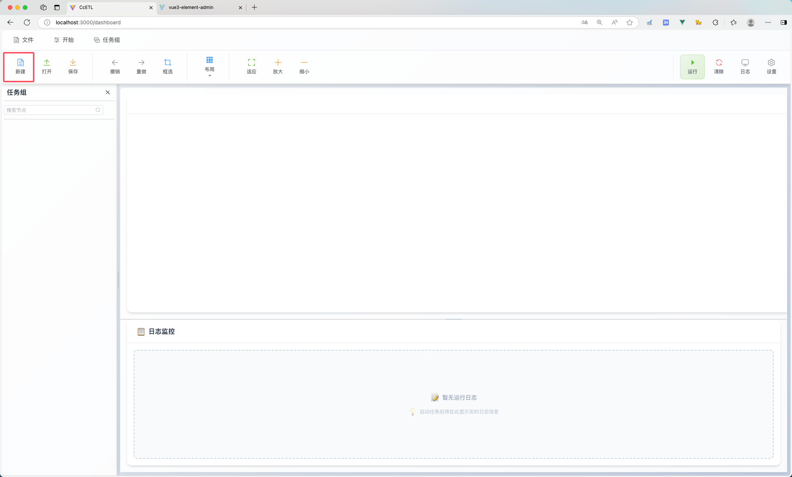
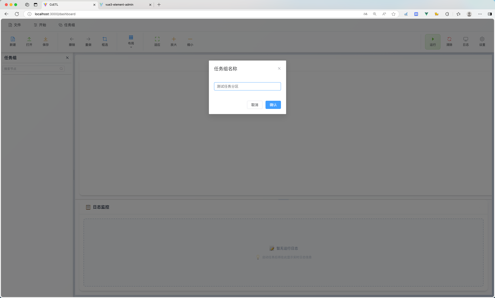
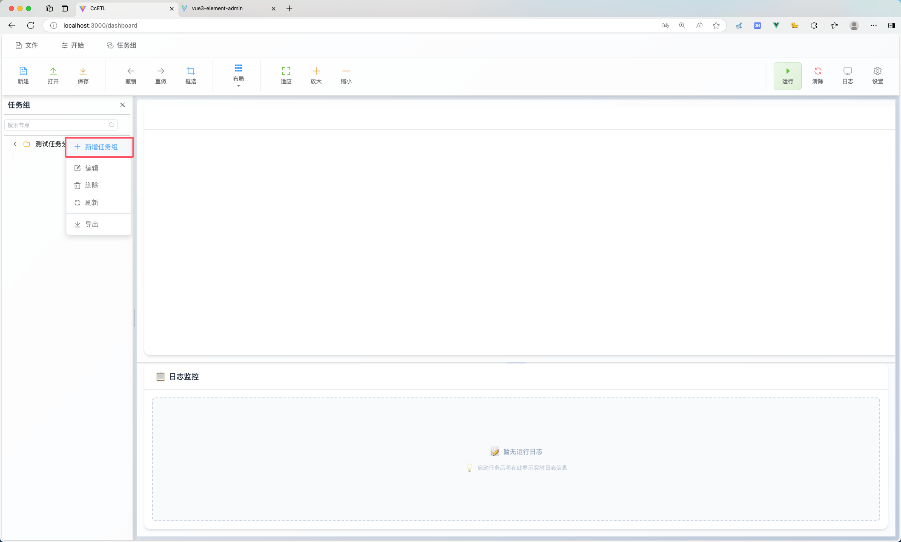
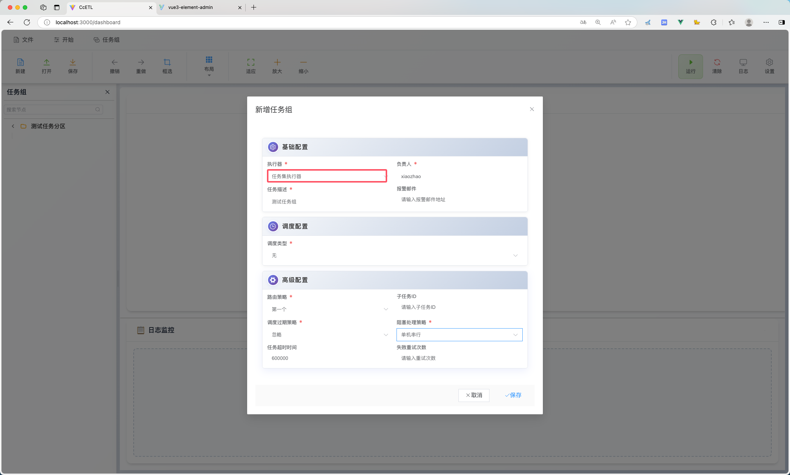
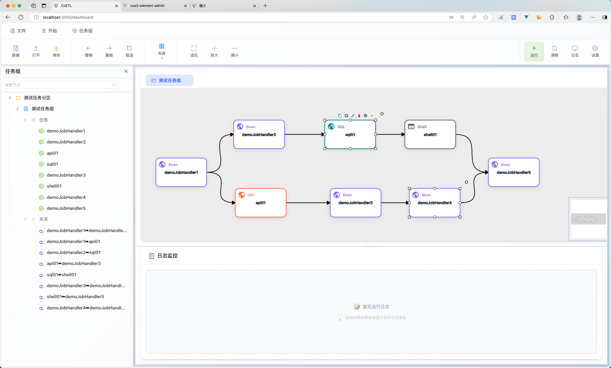
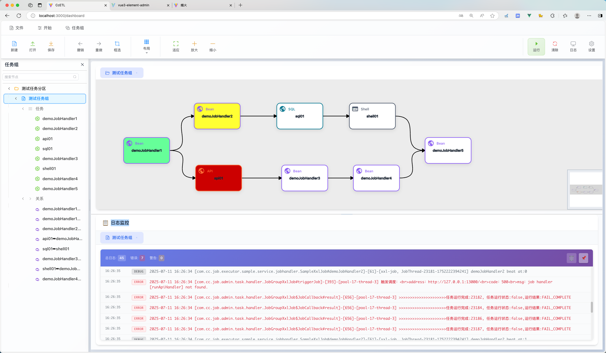
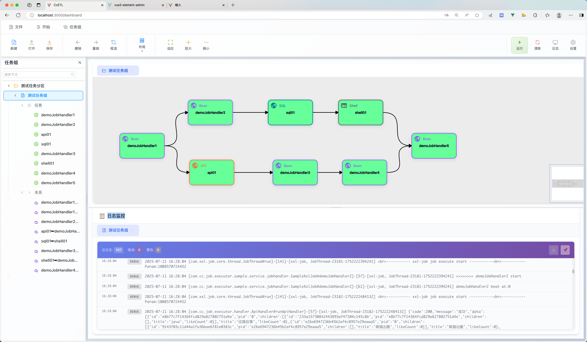

# Cc-ETL

<p align="center">
    <b>基于 XXL-Job 改造的可视化任务调度平台</b>
</p>

---

## 项目简介

Cc-ETL 是一款基于 XXL-Job 深度改造的可视化定时任务调度工具。它支持任务可视化编排、任务失败重试、任务暂停、任务预测、超时控制等高级特性，并集成 DataX 实现多数据源间的数据同步。平台支持单任务、多任务串并联运行，运行状态可视化展示，极大提升了任务调度的易用性和可观测性。

---

## 主要特性

- **任务编排前端重构**：支持任务与任务组的可视化编辑与拖拽编排
- **简洁**：只需数据库，不需要其他中间件即可使用
- **pc端**：使用electron实现pc端可视化任务调度
- **兼容 XXL-Job 全部功能**
- **集成 DataX 数据同步**：
  - 支持 MySQL、Oracle 数据的全量与增量同步
  - 后续将支持更多数据源
- **支持存储过程与 SQL 调用**
- **支持 API 任务调度**
- **任务编排高级特性**：
  - 预测任务节点的开始与完成时间
  - 任务节点可暂停
  - 支持任务超时设置
  - 任务失败自动重试
  - 支持失败任务忽略继续执行
  - 任务节点运行状态可视化
  - 支持任务组节点串并联运行

---
## 项目展示

### 1.启动pc端和web端
分别启动pc端和web端，后端启动（启动方式后续会介绍）

|||
|-----------------------|-----------------------|
|  |  |

### 2.在web端配置好执行器和数据源（如果需要执行sql任务）
|||
|-----------------------|-----------------------|
|  |  |

### 3.配置任务并执行
#### 1.创建任务分区
点击`新建`创建任务分区，一个任务分区下对应多个任务组
|||
|-----------------------|-----------------------|
|  |  |
#### 2.创建任务组
⚠️任务组中任务执行器需要选择`任务集执行器`，此执行器需要在web端进行配置
|||
|-----------------------|-----------------------|
|  |  |
#### 3.新建任务
支持创建多个任务
- bean任务
- api任务
- sql任务
- shell任务
创建好不同的任务节点，并建立联系

|||
|-----------------------|-----------------------|
|  |  |
|  |  |
#### 4.运行任务组
点击右上角`运行`，观察任务的运行日志和状态\
运行成功的任务颜色会显示`绿色`，失败的任务显示`红色`，运行中的任务显示`黄色`\
运行中的日志信息会展示到下方

|||
|-----------------------|-----------------------|
|  |  |
---

## 快速开始

### 1. 数据库初始化

请先执行数据库脚本：  
`/doc/cc_job_admin.sql`

### 2. 配置说明

#### 执行器配置（以 xxl-job-executor-sample-springboot 为例）

```yaml
xxl.job.admin.addresses=http://127.0.0.1:8989/xxl-job-admin
xxl.job.accessToken=default_token
xxl.job.executor.appname=xxl-job-executor-sample
xxl.job.executor.address=
xxl.job.executor.ip=
xxl.job.executor.port=10000
xxl.job.executor.logpath= # 路径地址
xxl.job.executor.logretentiondays=30
```

#### 管理端配置（admin）

```yaml
xxl:
  job:
    i18n: zh_CN
    accessToken: default_token
    triggerpool:
      fast:
        max: 200
      slow:
        max: 200
    logretentiondays: 30
    logpath:  # 日志路径，建议与 executor 保持一致
```

> ⚠️ 注意：`admin.addresses` 端口需为 `8989`，执行器端口不能为 `9999`。

---

## 模块说明
- **cc_job_pc**：桌面端（PC端）管理界面，便于本地运维和管理。
- **cc-job/cc-async-tool**：异步任务调度工具，支持任务的重复调用与超时处理。
- **cc-job/cc-job-admin**：任务注册中心，负责任务与任务组的注册管理。
- **cc-job/cc-job-core**：任务执行的核心模块，负责调度和执行任务。
- **cc-job/cc-job-executor**：任务执行器，支持多种任务类型（如DataX、API、JDBC等）。
- **cc-job/cc-job-executor-samples**：任务执行器的示例工程，便于开发和测试。
- **cc-job/cc-job-xo**：数据存储与实体映射模块。
- **cc-job-web**：Web端管理界面，提供可视化的任务管理与监控。

---

## DataX 数据同步演示

以 MySQL 到 MySQL 全量同步为例：

1. 创建两个 MySQL 数据源（test1、test2），test2 的 `stu` 表为空。
2. 在 cc-job 中创建 DataX 任务，配置 reader、writer 及数据源同步参数。
3. 在任务列表点击执行，查看日志与同步结果。
4. 验证目标库数据同步成功。

---

## 项目文档

- [在线文档](http://175.178.249.190/blog/post/298)
- [本地文档](/doc/cc-job)
  - [01 项目介绍](doc/cc-job/01项目介绍.md)
  - [02 快速开始](doc/cc-job/02快速开始.md)
  - [03 功能介绍](doc/cc-job/03功能介绍.md)

---

## License

本项目遵循 [MIT License](./LICENSE)。

---

如需更多帮助或有任何建议，欢迎提交 Issue 或 PR！

