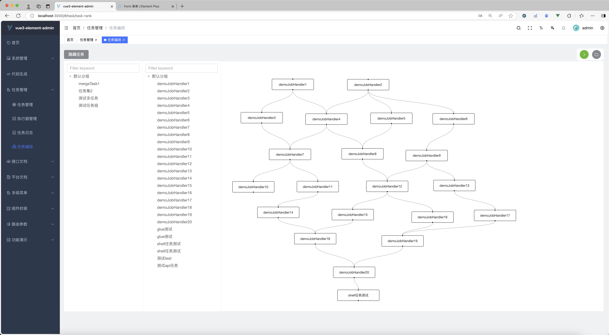
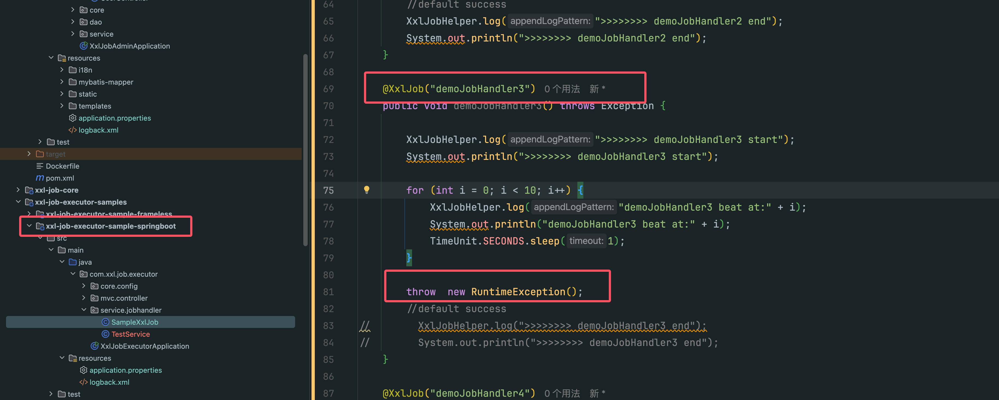
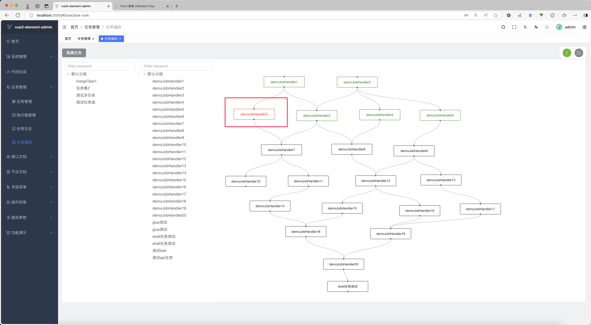
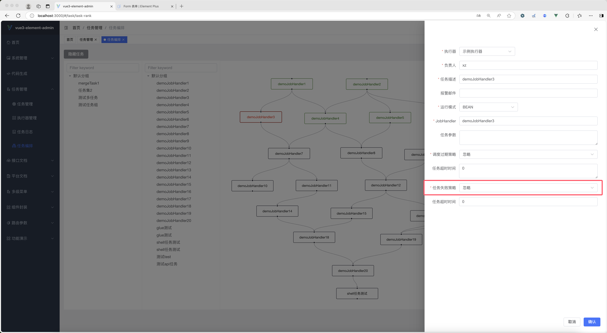
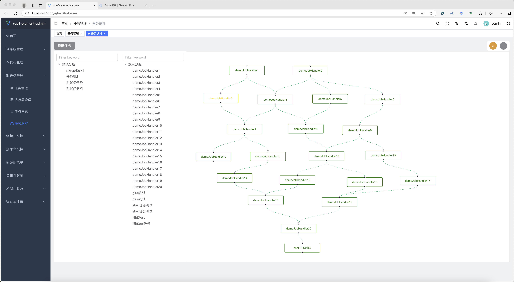

# vue3-xxl-job

<p align=center>
    基于xxl-job设计的一个可视化任务编排工具
</p>
<p align="center">

## 项目介绍
使用vue3对xxl-job-admin模块进行重构，并集成datax工具实现不同数据源的数据同步，支持glue模式，并新增api任务调度和可视化任务编排，支持单任务-单任务串并联，单任务-任务集串并联和单任务-任务集-任务集串并联
## 数据库地址
/doc/cc_job_admin.sql

## 项目功能
- xxl-job的所有功能都已集成
- 新增datax数据同步功能
- 支持存储过程调用和sql调用
- 支持api任务调度
- 可视化任务编排


## 项目介绍
https://www.yuque.com/xiaozhao-igpfn/kb/six39vboy38eaq87?singleDoc# 《vue3-xxl-job-admin》
### 修改配置
与xxl-job后端的配置一样，只不过`admin.addresses`地址要换成`8989`，并且执行器端口不能为`9999`
路径地址也需要进行配置

示例配置（这是xxl-job-executor-sample-springboot的配置）
```yaml
### xxl-job admin address list, such as "http://address" or "http://address01,http://address02"
xxl.job.admin.addresses=http://127.0.0.1:8989/xxl-job-admin

### xxl-job, access token
xxl.job.accessToken=default_token

### xxl-job executor appname
xxl.job.executor.appname=xxl-job-executor-sample
### xxl-job executor registry-address: default use address to registry , otherwise use ip:port if address is null
xxl.job.executor.address=
### xxl-job executor server-info
xxl.job.executor.ip=
xxl.job.executor.port=10000
### xxl-job executor log-path
xxl.job.executor.logpath= #路径地址
### xxl-job executor log-retention-days
xxl.job.executor.logretentiondays=30
```

admin模块配置 !!! 需要配置日志路径，最好与executor的路径一致
```yaml
# xxl-job 定时任务配置
xxl:
  job:
    i18n: zh_CN
    accessToken: default_token
    triggerpool:
      fast:
        max: 200
      slow:
        max: 200
    logretentiondays: 30
    logpath:  #日志路径
```
## 可视化任务调度模块
支持xxl-job任务可视化编排，并可以实时观察到多任务运行的情况

例子：
当demoJobHandler3任务失败时，后面的任务会阻塞不会运行


如果我们此时修改任务失败的情况为`忽略`，这后面的任务不会阻塞，继续运行


## 项目截图

|                                 |                                 |
|:-------------------------------:|:-------------------------------:|
|  |  |
|  |  |
|  |  |
|  |  |

