# cc-job

<p align=center>
    基于xxl-job,datax设计的一个可视化任务编排工具和数据同步工具
</p>
<p align="center">

## 项目介绍
使用vue3对xxl-job-admin模块进行重构，并集成datax工具实现不同数据源的数据同步，支持glue模式，并新增api任务调度和可视化任务编排，支持单任务-单任务串并联，单任务-任务集串并联和单任务-任务集-任务集串并联
## 数据库地址
/doc/cc_job_admin.sql

## 项目功能
- **devops_20250105对任务编排模块前端进行重写，可能会有bug，有兴趣的小伙伴可以下载尝试，支持任务和任务组的编辑**
- xxl-job的所有功能都已集成
- 新增datax数据同步功能(增量同步正在紧急开发中...工程量巨大，全量同步目前没有问题)
- 支持存储过程调用和sql调用
- 支持api任务调度
- 可视化任务编排

## 新的任务编排功能
- 新建任务或任务组，支持拖拽的形式创建任务和任务组，**选择节点后要点击编辑选择任务或任务组**
  - 支持任意编排改变大小

|                                                 |                                                 |
|:-----------------------------------------------:|:-----------------------------------------------:|
| 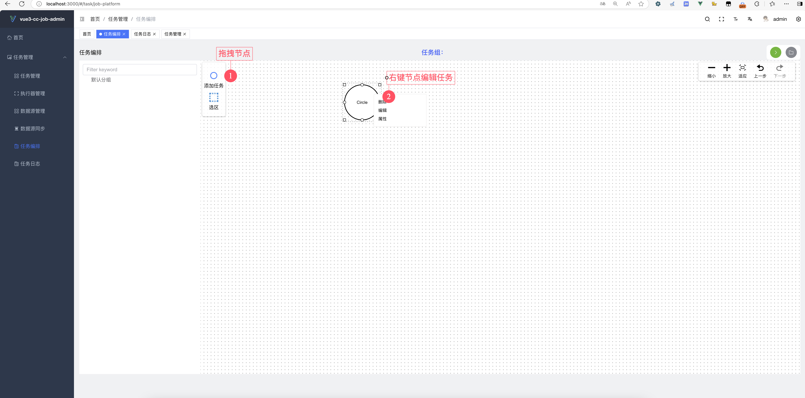 | 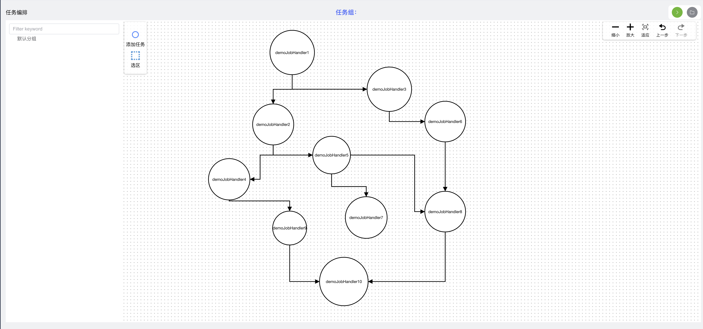 |
| 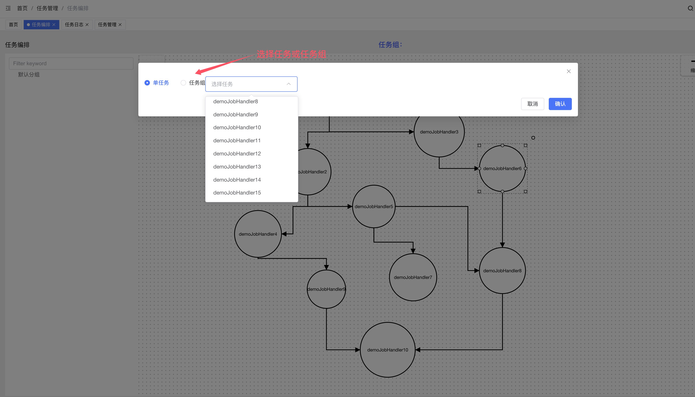 | 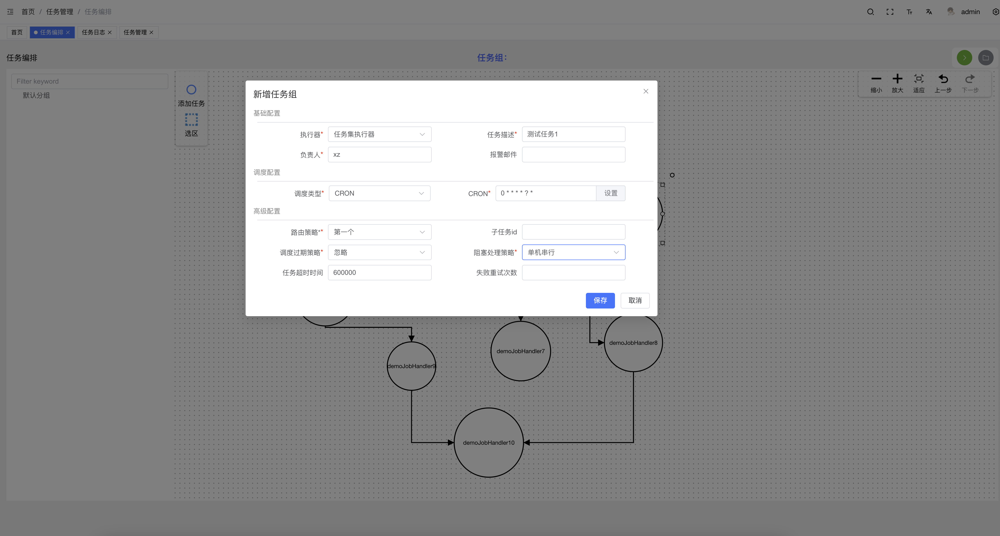 |
- 点击运行
  - 运行中的任务背景颜色会变成**黄色**，运行成功的任务背景颜色会变成**绿色**，运行失败的任务背景颜色会变成**红色**

|                                                 |                                                 |
|:-----------------------------------------------:|:-----------------------------------------------:|
| 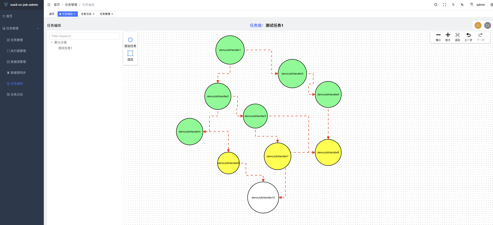 | 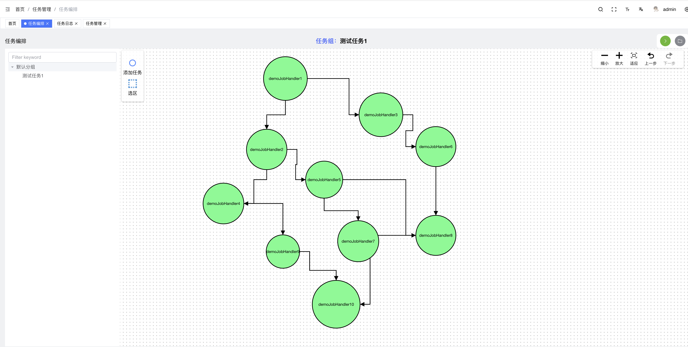 |
- 任务组运行
   - 选择任务组运行，任务组支持展开和缩放
   - 运行中的任务组边框颜色会发生改变

|                                                 |                                                 |
|:-----------------------------------------------:|:-----------------------------------------------:|
| 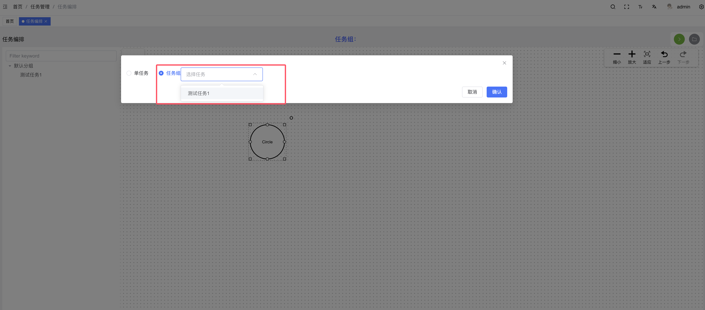 | 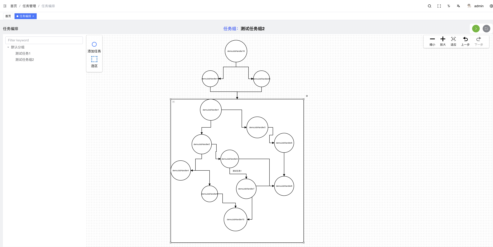 |
| 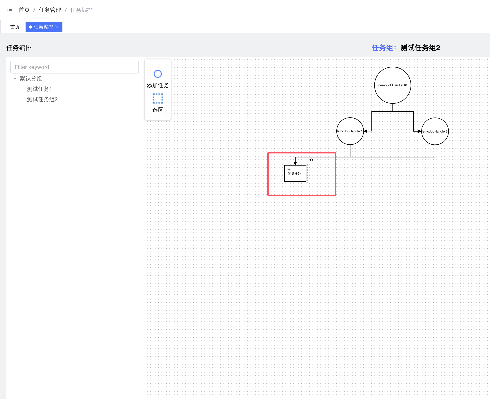 | 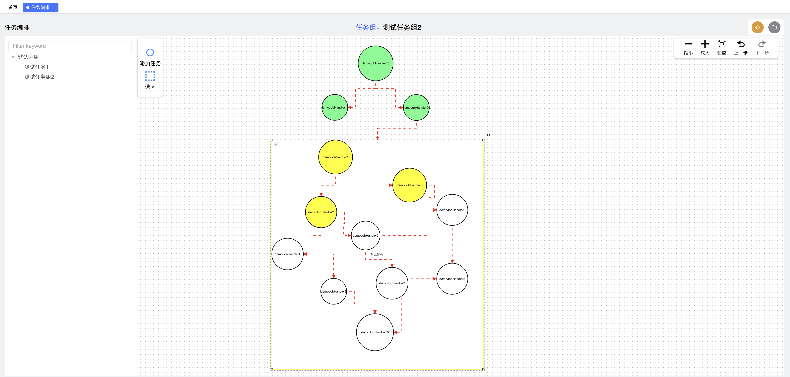 |
| 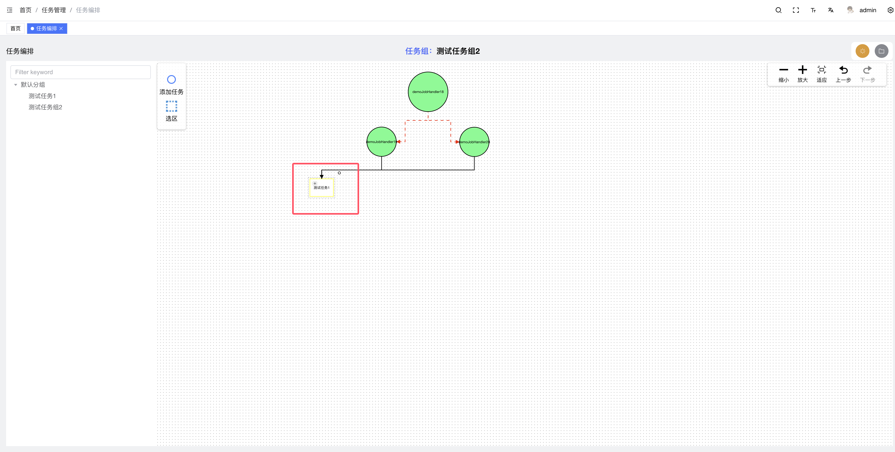 | 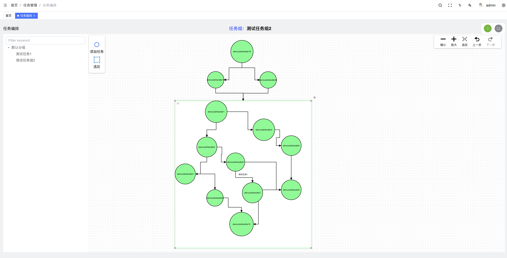 |


## 项目介绍
https://www.yuque.com/xiaozhao-igpfn/kb/six39vboy38eaq87?singleDoc# 《vue3-xxl-job-admin》
## 项目文档
`/doc/cc-job`

[01项目介绍.md](doc/cc-job/01%E9%A1%B9%E7%9B%AE%E4%BB%8B%E7%BB%8D.md)


[02快速开始.md](doc/cc-job/02%E5%BF%AB%E9%80%9F%E5%BC%80%E5%A7%8B.md)


[03功能介绍.md](doc/cc-job/03%E5%8A%9F%E8%83%BD%E4%BB%8B%E7%BB%8D.md)（进行中...）

### 修改配置
与xxl-job后端的配置一样，只不过`admin.addresses`地址要换成`8989`，并且执行器端口不能为`9999`
路径地址也需要进行配置

示例配置（这是xxl-job-executor-sample-springboot的配置）
```yaml
### xxl-job admin address list, such as "http://address" or "http://address01,http://address02"
xxl.job.admin.addresses=http://127.0.0.1:8989/xxl-job-admin

### xxl-job, access token
xxl.job.accessToken=default_token

### xxl-job executor appname
xxl.job.executor.appname=xxl-job-executor-sample
### xxl-job executor registry-address: default use address to registry , otherwise use ip:port if address is null
xxl.job.executor.address=
### xxl-job executor server-info
xxl.job.executor.ip=
xxl.job.executor.port=10000
### xxl-job executor log-path
xxl.job.executor.logpath= #路径地址
### xxl-job executor log-retention-days
xxl.job.executor.logretentiondays=30
```

admin模块配置 !!! 需要配置日志路径，最好与executor的路径一致
```yaml
# xxl-job 定时任务配置
xxl:
  job:
    i18n: zh_CN
    accessToken: default_token
    triggerpool:
      fast:
        max: 200
      slow:
        max: 200
    logretentiondays: 30
    logpath:  #日志路径
```
## 开发中
- 写文档...
- datax增量数据同步功能
- 代码优化和页面优化

## 项目模块


- cc-async-tool 异步任务调度工具，通过这个工具可以实现任务的重复调用，超时策略  **gitee地址**：https://gitee.com/xzjsccz/async-task-tool
- cc-job-admin 任务注册中心，所有的任务和任务组都在当前注册中心进行注册
- cc-job-core 任务执行的核心代码块
- c c-job-executor: 任务执行器，包含datax任务，api任务，jdbc任务
- cc-job-executor-sample：测试样例任务执行器
- cc-job-xo：存储mapper，entity类
- vue3-cc-job-admin：前端

## 简单演示

### datax数据同步任务

简单演示mysql-mysql全量同步功能

首先创建2个mysql数据源**test1**和**test2**，其中**test2**中的表**stu**无数据，现在演示**test1**数据库的**stu**表数据全量同步到**test2**中的**stu**表中


在cc-job中创建好datax任务，项目启动流程和任务构建在**第2章**，这里只是做简单演示

- 创建reader


- 创建writer

  

- 数据源同步配置

  

- 在任务列表点击执行，观察最终日志和运行结果

  


- 观察数据库中的数据是否同步成功

  

### 可视化任务编排工具

- 创建一个任务组

  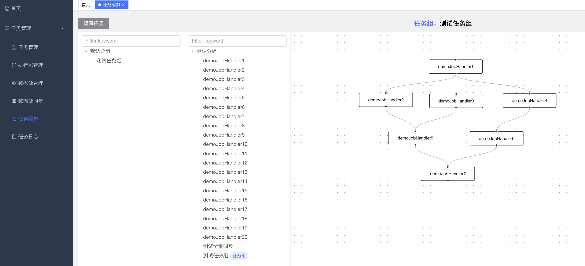

- 点击运行，观察实验日志

  运行中的任务会显示**黄色**，成功的任务会显示**绿色**，失败的任务会显示红色

  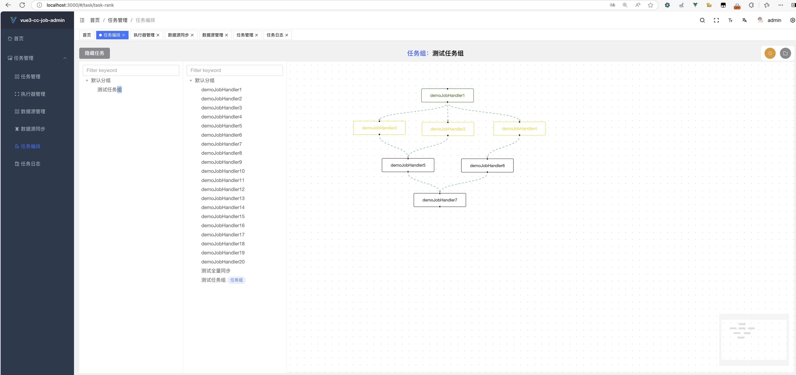

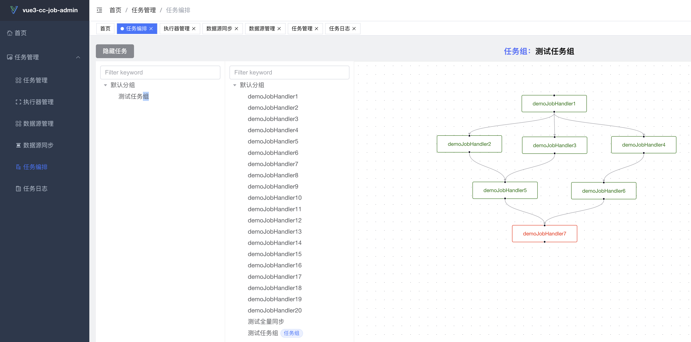

**demoJobHandler7**模拟任务运行失败

```java
@XxlJob("demoJobHandler7")
    public void demoJobHandler7() throws Exception {

        XxlJobHelper.log(">>>>>>>> demoJobHandler7 start");
        System.out.println(">>>>>>>> demoJobHandler7 start");

        for (int i = 0; i < 10; i++) {
            XxlJobHelper.log("demoJobHandler7 beat at:" + i);
            System.out.println("demoJobHandler7 beat at:" + i);
            TimeUnit.SECONDS.sleep(1);
        }
        //default success
//        XxlJobHelper.log(">>>>>>>> demoJobHandler7 end");
//        System.out.println(">>>>>>>> demoJobHandler7 end");
        throw new RuntimeException();
    }
```

任务运行日志

```properties
>>>>>>>> demoJobHandler1 start
demoJobHandler1 beat at:0
demoJobHandler1 beat at:1
demoJobHandler1 beat at:2
demoJobHandler1 beat at:3
demoJobHandler1 beat at:4
demoJobHandler1 beat at:5
demoJobHandler1 beat at:6
demoJobHandler1 beat at:7
demoJobHandler1 beat at:8
demoJobHandler1 beat at:9
>>>>>>>> demoJobHandler1 end
22:56:25.681 logback [xxl-job, EmbedServer bizThreadPool-2001027085] INFO  c.x.job.core.executor.XxlJobExecutor - >>>>>>>>>>> xxl-job register JobThread success, jobId:286, handler:com.xxl.job.core.handler.impl.MethodJobHandler@2d5a1588[class com.cc.job.executor.sample.service.jobhandler.SampleXxlJob#demoJobHandler2]
>>>>>>>> demoJobHandler2 start
demoJobHandler2 beat at:0
22:56:25.684 logback [xxl-job, EmbedServer bizThreadPool-2001027085] INFO  c.x.job.core.executor.XxlJobExecutor - >>>>>>>>>>> xxl-job register JobThread success, jobId:287, handler:com.xxl.job.core.handler.impl.MethodJobHandler@4f116ca2[class com.cc.job.executor.sample.service.jobhandler.SampleXxlJob#demoJobHandler3]
>>>>>>>> demoJobHandler3 start
demoJobHandler3 beat at:0
22:56:25.688 logback [xxl-job, EmbedServer bizThreadPool-2001027085] INFO  c.x.job.core.executor.XxlJobExecutor - >>>>>>>>>>> xxl-job register JobThread success, jobId:288, handler:com.xxl.job.core.handler.impl.MethodJobHandler@125d47c4[class com.cc.job.executor.sample.service.jobhandler.SampleXxlJob#demoJobHandler4]
>>>>>>>> demoJobHandler1 start
demoJobHandler4 beat at:0
demoJobHandler2 beat at:1
demoJobHandler3 beat at:1
demoJobHandler4 beat at:1
demoJobHandler2 beat at:2
demoJobHandler3 beat at:2
demoJobHandler4 beat at:2
demoJobHandler2 beat at:3
demoJobHandler3 beat at:3
demoJobHandler4 beat at:3
demoJobHandler4 beat at:4
demoJobHandler3 beat at:4
demoJobHandler2 beat at:4
demoJobHandler2 beat at:5
demoJobHandler4 beat at:5
demoJobHandler3 beat at:5
demoJobHandler2 beat at:6
demoJobHandler3 beat at:6
demoJobHandler4 beat at:6
demoJobHandler2 beat at:7
demoJobHandler3 beat at:7
demoJobHandler4 beat at:7
demoJobHandler2 beat at:8
demoJobHandler3 beat at:8
demoJobHandler4 beat at:8
demoJobHandler2 beat at:9
demoJobHandler3 beat at:9
demoJobHandler4 beat at:9
>>>>>>>> demoJobHandler2 end
>>>>>>>> demoJobHandler3 end
>>>>>>>> demoJobHandler4 end
22:56:35.788 logback [xxl-job, EmbedServer bizThreadPool-2001027085] INFO  c.x.job.core.executor.XxlJobExecutor - >>>>>>>>>>> xxl-job register JobThread success, jobId:290, handler:com.xxl.job.core.handler.impl.MethodJobHandler@64b018f3[class com.cc.job.executor.sample.service.jobhandler.SampleXxlJob#demoJobHandler6]
>>>>>>>> demoJobHandler6 start
demoJobHandler6 beat at:0
22:56:35.800 logback [xxl-job, EmbedServer bizThreadPool-2001027085] INFO  c.x.job.core.executor.XxlJobExecutor - >>>>>>>>>>> xxl-job register JobThread success, jobId:289, handler:com.xxl.job.core.handler.impl.MethodJobHandler@193bb809[class com.cc.job.executor.sample.service.jobhandler.SampleXxlJob#demoJobHandler5]
>>>>>>>> demoJobHandler5 start
demoJobHandler5 beat at:0
demoJobHandler6 beat at:1
demoJobHandler5 beat at:1
demoJobHandler6 beat at:2
demoJobHandler5 beat at:2
demoJobHandler6 beat at:3
demoJobHandler5 beat at:3
demoJobHandler6 beat at:4
demoJobHandler5 beat at:4
demoJobHandler6 beat at:5
demoJobHandler5 beat at:5
demoJobHandler6 beat at:6
demoJobHandler5 beat at:6
demoJobHandler6 beat at:7
demoJobHandler5 beat at:7
demoJobHandler5 beat at:8
demoJobHandler6 beat at:8
demoJobHandler5 beat at:9
demoJobHandler6 beat at:9
>>>>>>>> demoJobHandler6 end
>>>>>>>> demoJobHandler5 end
22:56:45.886 logback [xxl-job, EmbedServer bizThreadPool-2001027085] INFO  c.x.job.core.executor.XxlJobExecutor - >>>>>>>>>>> xxl-job register JobThread success, jobId:291, handler:com.xxl.job.core.handler.impl.MethodJobHandler@20801cbb[class com.cc.job.executor.sample.service.jobhandler.SampleXxlJob#demoJobHandler7]
>>>>>>>> demoJobHandler7 start
demoJobHandler7 beat at:0
demoJobHandler7 beat at:1
demoJobHandler7 beat at:2
demoJobHandler7 beat at:3
demoJobHandler7 beat at:4
demoJobHandler7 beat at:5
demoJobHandler7 beat at:6
demoJobHandler7 beat at:7
demoJobHandler7 beat at:8
demoJobHandler7 beat at:9
```


## 后续开发

- 代码结构完善：现在使用的是开源的后台管理系统，后续会把没有用的模块删除掉
- 方便更多数据源之间的同步，目前还只有了mysql和oracle数据源同步功能
- 前端任务组绘图工具的完善，前端绘图节点后续如果能做成展开合并式就更好了（需要一个超级前端大佬…）


## 项目截图

|                                 |                                 |
|:-------------------------------:|:-------------------------------:|
|  |  |
|  |  |
|  |  |
|  |  |

