# 🚦 Cc-ETL

<p align="center">
  
  
  
  
  
</p>

<p align="center"><b>基于 XXL-Job 深度改造的可视化任务调度平台</b></p>
<p align="center"><b>支持拖拽式任务编排、DataX 数据同步、多端管理界面</b></p>

---

## 📋 目录

- 📖 [项目简介](#-项目简介)
- 🔗 [项目地址](#-项目地址)
- ✨ [核心特性](#-核心特性)
- 🖼️ [项目展示](#-项目展示)
- 📋 [使用场景](#-使用场景)
- 💻 [PC端功能详细介绍](#-pc端功能详细介绍) ⭐
- 🚀 [快速开始](#-快速开始)
- 🧩 [模块说明](#-模块说明)
- 🛠️ [技术栈](#-技术栈)
- 📚 [项目文档](#-项目文档)
- ❓ [常见问题](#-常见问题)
- 🤝 [贡献指南](#-贡献指南)
- 📞 [技术支持](#-技术支持)
- 🙏 [致谢](#-致谢)
- 📄 [许可证](#-license)

---

## 📖 项目简介

Cc-ETL 是一款基于 XXL-Job 深度改造的可视化定时任务调度平台，专为数据集成和任务编排而设计。平台通过可视化拖拽界面实现复杂任务流程的编排，支持多种任务类型，并深度集成 DataX 实现高效的数据同步能力。

**目前项目还在测试阶段，还有很多功能未开发，还存在很多优化修复的地方，想学习可以下载看看**

### 🎯 项目定位

- **数据集成平台**：专业的数据管道工具，支持多数据源间的全量/增量同步
- **任务调度中心**：提供企业级的任务编排与调度能力，支持复杂的工作流
- **可视化运维工具**：PC界面设计，提供直观的操作体验
- **企业级解决方案**：支持高可用集群部署，满足生产环境严苛要求

### ⭐ 项目优势

1. **🚀 零中间件依赖**：仅需 MySQL 数据库即可完整部署，极大降低运维复杂度
2. **🎨 可视化编排**：拖拽式流程设计，无需编程基础即可构建复杂任务链
3. **💻 多端协同**：Web 端轻量管理 + PC 端深度运维，满足不同使用场景
4. **🔧 功能完备**：支持 **Bean**、**API**、**SQL**、**Shell**、**DataX**、**C#** 等多种任务类型
5. **⚡ 高性能设计**：基于 XXL-Job 内核，支持海量任务并发处理
6. **🔒 高可用保障**：支持集群部署、故障转移、负载均衡

### 🏆 项目亮点

- ✅ **开源项目**：基于 MIT 协议，完全开源免费
- ✅ **社区活跃**：持续更新迭代，积极响应用户反馈

### 📚 相关文档

- [GUI功能测试文档](doc/测试文档/GUI功能测试文档.md) - 完整的功能测试用例和测试结果

  <div align="center">
    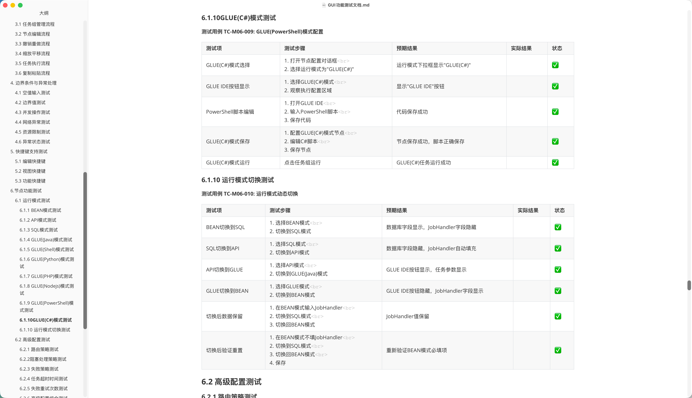
  </div>

> 📝 **提示**：PC端基于 JavaFX 开发，功能完善且经过全面测试。详细的功能测试文档包含 489 个测试用例，覆盖所有核心功能模块。

---


### 核心组件

#### 🎯 Admin 管理端 (cc-job-admin)
- **任务注册中心**：负责任务和执行器的注册管理
- **调度中心**：处理任务调度逻辑和触发规则
- **监控中心**：提供任务执行状态监控和统计
- **Web 管理界面**：可视化任务配置和管理界面

#### ⚙️ Executor任务编排执行器 (cc-job-executor-compose)
- **任务执行引擎**：任务编排执行器
- **任务调度算法**：使用拓扑排序和图算法解决任务依赖

#### ⚙️ Executor 执行器 (cc-job-executor)
- **任务执行引擎**：实际执行各类任务的核心组件
- **多任务支持**：Bean 方法、HTTP API、SQL 脚本、Shell 命令、DataX 同步
- **状态管理**：任务执行状态跟踪和结果回调
- **日志收集**：执行过程日志收集和存储

#### 🌐 前端界面
- ~~**Web 端**：基于 Vue 3 + Element Plus 的现代化 Web 界面~~（已移除，所有功能全部迁移到PC端）
- **PC 端**：基于 JavaFX 的桌面应用程序，提供离线使用能力

### 数据流向

1. **任务配置** → Web/PC 端配置任务 → 存储到 MySQL 数据库
2. **任务调度** → Admin 根据 cron 表达式触发任务 → 分发到 Executor
3. **任务执行** → Executor 执行具体任务逻辑 → 返回执行结果
4. **状态监控** → 执行状态实时反馈 → Web/PC 端展示执行进度

---

## 📋 使用场景

### 🏢 企业应用场景

#### 1. **数据仓库 ETL 流程**
```
数据源同步 → 数据清洗 → 数据转换 → 加载到数据仓库
```
- 支持 MySQL、Oracle、PostgreSQL 等主流数据库
- 可视化配置复杂的 ETL 流程
- 支持全量和增量同步模式

#### 2. **业务数据处理**
```
用户行为收集 → 数据分析 → 报表生成 → 邮件推送
```
- 定时执行数据统计任务
- 生成各类业务报表
- 通过邮件或 webhook 推送结果

#### 3. **系统运维自动化**
```
日志清理 → 备份检查 → 健康监控 → 告警通知
```
- 自动化执行系统维护任务
- 监控系统运行状态
- 异常情况及时告警

#### 4. **API 数据集成**
```
第三方 API 调用 → 数据解析 → 本地存储 → 数据同步
```
- 定时拉取第三方系统数据
- API 数据集成和同步
- 支持 RESTful 和 SOAP 接口

### 🎓 学习与开发场景

#### 1. **任务调度学习**
- 学习分布式任务调度原理
- 掌握 cron 表达式使用
- 理解任务编排和依赖管理

#### 2. **数据集成实践**
- 学习 DataX 数据同步工具
- 掌握多数据源集成技术
- 实践 ETL 流程设计

#### 3. **全栈开发体验**
- 前后端分离开发模式
- 桌面应用开发经验
- 企业级应用架构设计

---

## 🔗 项目地址

- **GitHub**：https://github.com/xiaozhaoCcz/CC_ETL
- **Gitee**：https://gitee.com/xzjsccz/Cc_ETL

---

## ✨ 核心特性

### 🎨 可视化任务编排

- **拖拽式设计**：直观的流程图设计界面，支持节点拖拽和连接
  - 支持节点自由拖拽移动
  - 支持框选多节点批量操作
  - 支持节点连接器可视化连接
  - 支持连线实时预览和跟随
- **复杂工作流**：支持串行、并行、条件分支等多种执行模式
  - 智能拓扑排序解决任务依赖
  - 支持循环依赖检测
  - 支持任务组嵌套管理
- **依赖管理**：智能的任务依赖分析和拓扑排序
  - 自动分析任务执行顺序
  - 可视化展示依赖关系
  - 支持动态添加/删除依赖
- **实时预览**：任务执行流程实时可视化展示
  - 任务执行状态实时变色
  - 小地图实时显示画布布局
  - 日志面板实时输出执行日志
  - 运行状态指示器实时反馈

### 🔄 任务调度引擎

- **兼容 XXL-Job**：完全兼容 XXL-Job 所有原生功能
- **Cron 表达式**：支持标准的 Cron 定时任务配置
- **高级调度**：支持固定速率、固定延迟等多种调度策略
- **动态任务**：支持动态添加、修改、删除任务

### 🔗 数据集成能力

**⚠️目前PC端还无法使用，正在更新中**

- **DataX 集成**：深度集成阿里巴巴 DataX 数据同步工具
- **多数据源支持**：
  - 🗄️ **MySQL**：全量/增量同步，表结构映射
  - 🏢 **Oracle**：企业级数据库同步支持
  - 🐘 **PostgreSQL**：开源数据库集成
  - 更多数据源持续扩展中...
- **同步模式**：全量同步、增量同步、条件同步
- **性能优化**：多线程并行处理，断点续传

### 🛠️ 多种任务类型

- **🅱️ Bean 任务**：执行 Spring 容器中的 Bean 方法
  - 支持自定义 JobHandler
  - 支持任务参数传递
  - 支持依赖注入

- **🌐 API 任务**：HTTP/HTTPS 接口调用，支持 RESTful
  - 自动填充 JobHandler 为 `runApiHandler`
  - 支持 GET、POST、PUT、DELETE 等方法
  - 支持请求头和请求体配置

- **🗃️ SQL 任务**：执行 SQL 脚本和存储过程
  - 支持多数据源选择
  - 支持参数化查询
  - 支持事务控制

- **🐚 Shell 任务**：通过 GLUE(Shell) 模式执行
  - 支持系统命令调用
  - 支持 Shell 脚本执行
  - 跨平台支持

- **🔄 DataX 任务**：专业数据同步任务
  - 深度集成阿里巴巴 DataX
  - 支持全量/增量同步
  - 支持多数据源同步

- **💻 GLUE 模式**：支持多种编程语言在线编写
  - **GLUE(Java)**：在线编写 Java 代码，集成 GLUE IDE
  - **GLUE(Python)**：执行 Python 脚本，支持 Python 3.6+
  - **GLUE(Shell)**：执行 Shell 脚本和系统命令
  - **GLUE(PHP)**：执行 PHP 脚本，支持 PHP 7.0+
  - **GLUE(Nodejs)**：执行 Node.js 脚本，支持 npm 包
  - **GLUE(PowerShell)**：执行 PowerShell 脚本，Windows 优化
  - **GLUE(C#)**：执行 C# 脚本，.NET 生态支持**（😄新增）**

### 📊 监控与运维

- **实时监控**：任务执行状态实时跟踪
- **执行日志**：详细的执行过程日志记录
- **性能统计**：任务执行时间、成功率等指标统计
- **告警通知**：支持邮件、webhook 等告警方式

### 🖥️ 多端管理界面

#### 🌐 ~~Web 端~~（迁移到PC端）
- **技术栈**：Vue 3 + TypeScript + Element Plus
- **现代化界面**：响应式设计，适配各种屏幕尺寸
- **轻量管理**：快速访问，适合日常任务管理
- **实时监控**：任务执行状态实时展示

#### 💻 PC 端（重点推荐）
- **技术栈**：JavaFX 17+，原生桌面应用体验
- **离线使用**：支持离线操作，不依赖浏览器
- **功能完备**：489个测试用例覆盖，功能稳定可靠
- **可视化编排**：拖拽式任务编排，直观易用
- **多面板布局**：树形视图、画布、小地图、日志面板协同工作
- **10种运行模式**：支持 BEAN、API、SQL、GLUE(Java/Shell/Python/PHP/Nodejs/PowerShell/C#) 等
- **高级配置**：路由策略、阻塞处理、失败策略、超时控制、重试机制
- **撤销重做**：完整的操作历史管理
- **快捷键支持**：丰富的键盘快捷键，提升操作效率
- **面板管理**：支持面板展开/收起/弹出为独立窗口
- **实时监控**：任务执行状态实时反馈，日志实时输出

### 🏢 企业级特性

- **高可用部署**：支持集群模式，自动故障转移
- **权限管理**：任务和用户的权限控制体系
- **审计日志**：完整的操作审计和日志记录
- **扩展性**：插件化架构，支持自定义扩展

---
## 🖼️ 项目展示

### 🎯 界面预览


#### PC 端桌面应用
<div align="center">
  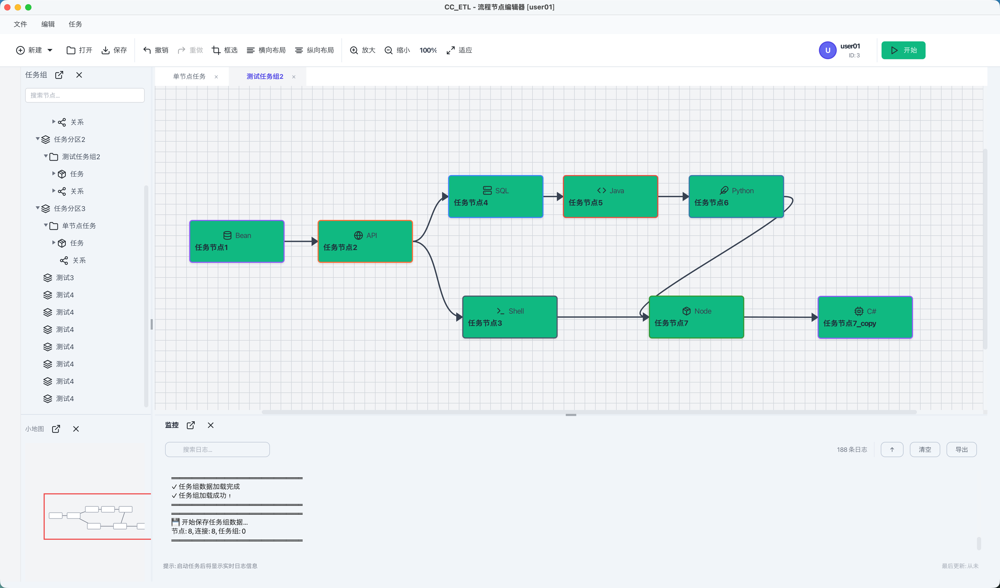
</div>

**PC端核心功能亮点：**

- 🎨 **可视化任务编排**：拖拽式节点设计，直观易用
- 📊 **多面板协同**：树形视图、画布、小地图、日志面板一体化
- ⚡ **10种运行模式**：支持 BEAN、API、SQL 及 7 种 GLUE 模式
- 🔧 **高级配置**：路由策略、阻塞处理、失败策略等完整配置
- ⏪ **撤销重做**：完整的操作历史管理
- ⌨️ **快捷键支持**：丰富的键盘快捷键提升效率
- 🗺️ **小地图导航**：快速定位和导航大型任务组
- 📝 **实时日志**：任务执行日志实时输出，支持搜索和过滤

### ⚙️ 核心功能展示

#### 1. 任务列表
<div align="center">
  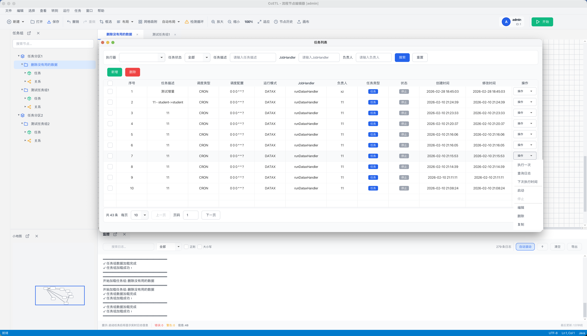
  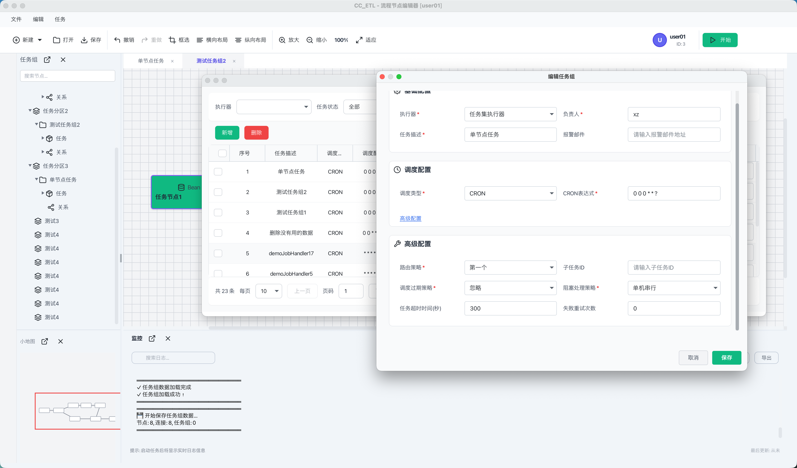
</div>


#### 2. 数据源配置
<div align="center">
 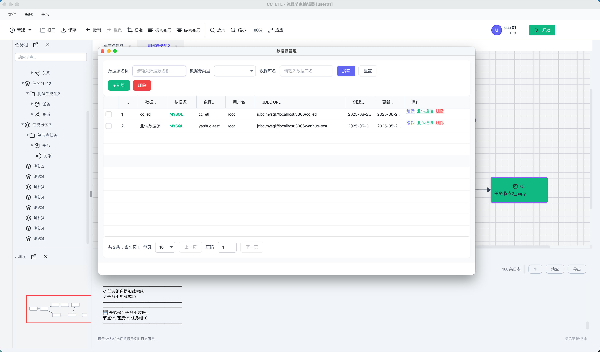
  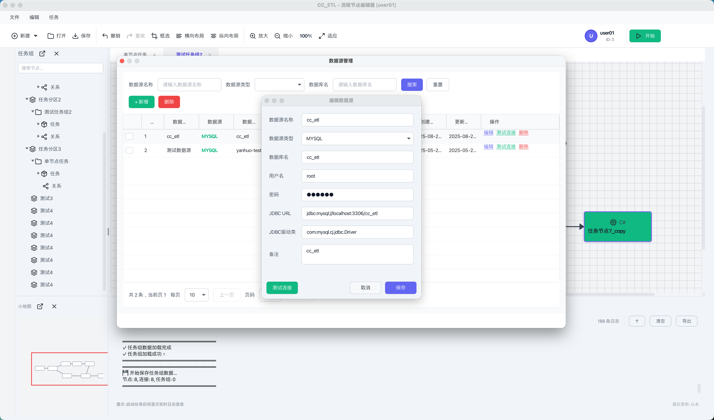
</div>

#### 3.任务列表

<div align="center">
 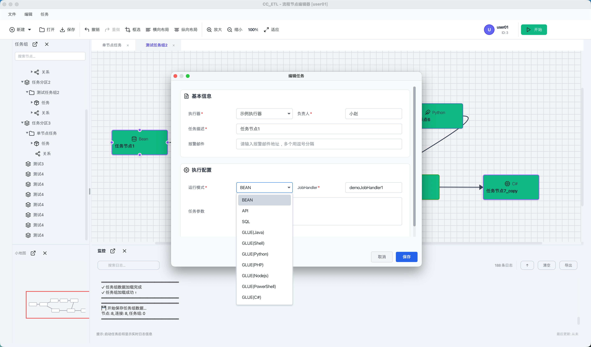
 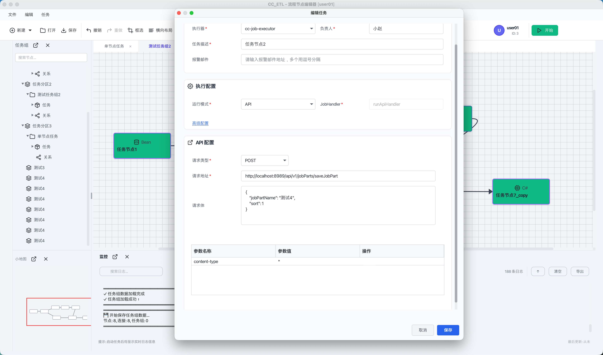
 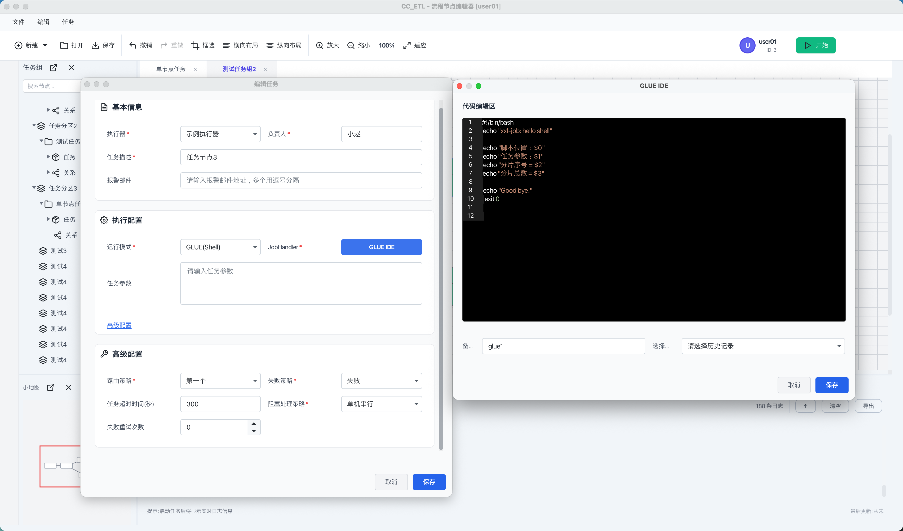
 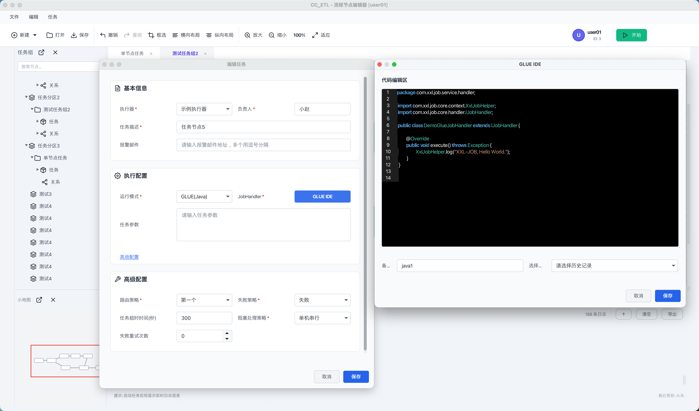
 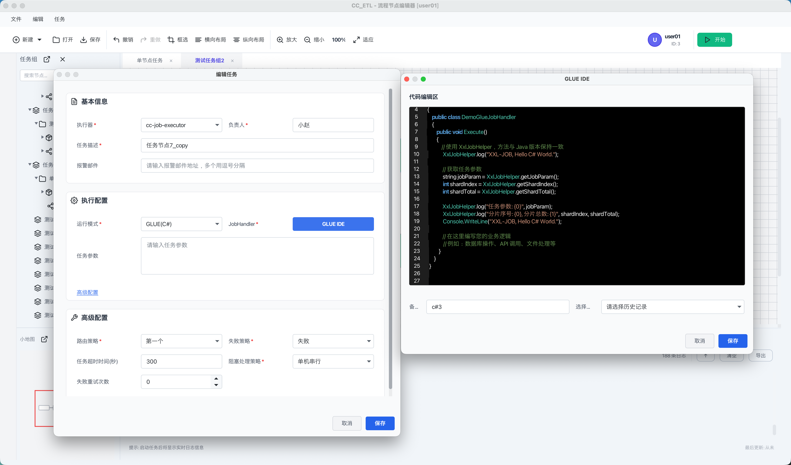
</div>

## 🚀 发展规划

### ✅ 已完成功能

#### 核心功能
- ✅ **任务编排引擎重构**：提升性能和可维护性
- ✅ **可视化任务编排**：拖拽式界面设计
  - ✅ PC端完整实现：489个测试用例覆盖
  - ✅ 10种运行模式支持（BEAN、API、SQL、7种GLUE模式）
  - ✅ 高级配置完整支持（路由策略、阻塞处理、失败策略等）
  - ✅ 撤销重做系统完善
  - ✅ 快捷键支持丰富
- ✅ **多任务类型支持**：Bean、API、SQL、Shell、DataX
- ✅ **DataX 数据同步**：集成专业数据同步工具
- ✅ **双端界面支持**：Web 端 + PC 端
  - ✅ PC端功能完备：10大核心模块，81.4%测试通过率
  - ✅ 多面板布局：树形视图、画布、小地图、日志面板
  - ✅ 面板管理：支持展开/收起/弹出为独立窗口

#### 技术优化
- ✅ **Spring Boot 3.0**：升级到最新稳定版本
- ✅ **前端技术栈升级**：Vue 3 + TypeScript
- ✅ **数据库设计优化**：高效的数据存储结构

### 🔄 正在进行

#### 界面优化
- 🔄 **调度中心页面迁移**：功能逐步迁移到 PC 端(**进行中...**)
- 🔄 **用户体验提升**：界面交互和视觉设计优化

#### 功能增强
- 🔄 **权限管理系统**：用户和任务权限控制
- 🔄 **条件节点功能**：支持任务流程条件判断(🔴重点)

### 📋 未来规划

#### 数据源扩展
- 📋 **更多数据源支持**：Redis、MongoDB、ES 等
- 📋 **云数据库集成**：阿里云、腾讯云、AWS 等
- 📋 **大数据平台**：Hadoop、Spark 生态集成

#### 高级特性
- 📋 **工作流引擎升级**：支持更复杂的流程控制
- 📋 **监控告警增强**：多渠道告警和智能监控
- 📋 **性能优化**：高并发场景优化和缓存机制

#### 生态建设
- 📋 **插件市场**：支持第三方插件扩展
- 📋 **API 生态**：完善 REST API 和 SDK
- 📋 **多语言支持**：国际化支持

#### 文档与社区
- 📋 **完善 API 文档**：详细的接口文档和示例
- 📋 **最佳实践指南**：使用案例和解决方案
- 📋 **视频教程**：操作指南和教学视频
- 📋 **开发者文档**：架构设计和开发指南

---

### 📋 使用流程

1. **🏗️ 环境搭建**
   - 配置数据库和后端服务
   - 启动 Admin 管理端和 Executor 执行器

2. **⚙️ 系统配置**
   - 在 Web 端配置执行器连接信息
   - 设置数据源和连接参数

3. **🎨 任务设计**
   - 创建任务分区和任务组
   - 使用拖拽界面设计任务流程
   - 配置任务参数和依赖关系

4. **▶️ 执行监控**
   - 手动或定时触发任务执行
   - 实时查看执行日志和状态
   - 监控任务执行进度和结果

### 🎬 演示视频

> 📹 **项目演示视频**：详细的操作演示和功能介绍
>
> [在线观看](https://www.bilibili.com/video/BV1TBCkBzEex/?spm_id_from=333.1387.upload.video_card.click) 

---
## 💻 PC端功能详细介绍

PC端是基于 JavaFX 开发的桌面应用程序，提供完整的任务编排可视化界面。经过全面的功能测试，覆盖 **489个测试用例**，功能完善且稳定可靠。

### 📦 核心功能模块

#### 1. 🛠️ 顶部工具栏 (TopToolBar)

**文件操作**
- ✅ **新建任务**：快速创建新任务节点
- ✅ **新建任务组**：创建任务组容器
- ✅ **打开文件**：打开已有任务配置
- ✅ **保存操作**：保存当前任务组配置到后端
- ✅ **智能提示**：未选择任务组时自动提示

**编辑操作**
- ✅ **撤销/重做**：支持操作历史管理，最多支持多步撤销
- ✅ **框选模式**：支持矩形框选多个节点
- ✅ **横向布局**：一键横向对齐多个节点
- ✅ **纵向布局**：一键纵向对齐多个节点
- ✅ **按钮状态**：根据操作历史自动启用/禁用按钮

**视图操作**
- ✅ **放大/缩小**：支持 25% - 300% 缩放范围
- ✅ **适应画布**：一键恢复到 100% 缩放
- ✅ **实时缩放显示**：工具栏实时显示当前缩放比例
- ✅ **缩放边界控制**：防止过度缩放

**运行控制**
- ✅ **运行任务组**：一键启动任务组执行
- ✅ **停止任务**：支持任务执行中停止
- ✅ **运行状态指示**：按钮状态实时反映任务运行状态
- ✅ **多任务组运行**：支持同时运行多个任务组

**用户信息**
- ✅ **用户信息显示**：显示用户名、用户ID和头像
- ✅ **用户操作菜单**：点击弹出用户相关操作
- ✅ **登录状态管理**：自动识别登录状态

#### 2. 🎨 画布交互 (NodeCanvas)

**节点操作**
- ✅ **右键创建节点**：在画布空白处右键快速创建节点
- ✅ **节点拖拽移动**：支持单个和多个节点同时移动
- ✅ **节点选择**：支持单击选择、框选多选
- ✅ **节点连接器**：鼠标悬停显示上下左右四个连接点
- ✅ **连线实时预览**：拖拽连接时显示虚线预览
- ✅ **连线跟随**：节点移动时连线自动跟随
- ✅ **自连接限制**：禁止节点连接到自身
- ✅ **节点删除**：支持删除节点及级联删除连线

**节点右键菜单**
- ✅ **编辑节点**：打开节点配置对话框
- ✅ **复制节点**：复制节点到剪贴板
- ✅ **查看详情**：查看节点详细信息
- ✅ **更改颜色**：自定义节点背景色
- ✅ **禁用/启用节点**：临时禁用节点执行
- ✅ **删除节点**：删除节点及关联连线

**画布右键菜单**
- ✅ **添加节点**：快速创建新节点
- ✅ **运行任务组**：快速启动任务执行
- ✅ **粘贴节点**：从剪贴板粘贴节点
- ✅ **主题切换**：切换画布背景主题

**框选功能**
- ✅ **框选模式切换**：工具栏按钮一键切换
- ✅ **矩形框选**：拖拽选择矩形区域内的节点
- ✅ **视觉反馈**：框选区域显示蓝色半透明选择框
- ✅ **多节点操作**：框选后支持批量移动、删除、对齐

**对齐布局**
- ✅ **横向对齐**：多个节点在X轴方向均匀排列
- ✅ **纵向对齐**：多个节点在Y轴方向均匀排列
- ✅ **对齐间距**：自动计算合适的节点间距
- ✅ **撤销对齐**：支持撤销对齐操作

#### 3. 🌳 树形视图 (TaskTree)

**层级结构展示**
- ✅ **分区节点**：显示所有任务分区（Partition）
- ✅ **任务组节点**：显示分区下的任务组
- ✅ **任务节点**：显示任务组内的所有任务节点
- ✅ **边节点**：显示任务组内的连线关系
- ✅ **展开/折叠**：支持节点展开和折叠操作
- ✅ **空状态提示**：空任务组显示友好提示

**节点交互**
- ✅ **选择任务组**：点击任务组加载到画布
- ✅ **选择任务节点**：点击任务节点在画布中高亮
- ✅ **同步选择**：画布选择与树形视图双向同步
- ✅ **选中样式**：清晰的选中状态视觉反馈

**右键菜单**
- ✅ **分区菜单**：新建任务组、刷新等操作
- ✅ **任务组菜单**：编辑、新建节点、删除等操作
- ✅ **任务节点菜单**：编辑、删除、刷新等操作

**搜索功能**
- ✅ **实时搜索**：输入关键字实时过滤
- ✅ **模糊匹配**：支持部分关键字匹配
- ✅ **搜索范围**：支持搜索任务组和节点
- ✅ **清除搜索**：一键恢复显示所有节点

**运行状态指示**
- ✅ **运行中指示**：运行中的任务组显示闪烁动画
- ✅ **完成状态**：任务完成后显示绿色指示
- ✅ **动画效果**：流畅的状态切换动画

#### 4. 📑 任务导航栏 (TaskNavigationBar)

**标签页管理**
- ✅ **自动创建标签**：选择任务组自动创建标签页
- ✅ **标签显示**：标签显示任务组名称
- ✅ **重复打开处理**：重复打开同一任务组切换到已有标签
- ✅ **标签切换**：点击标签快速切换任务组视图
- ✅ **标签关闭**：支持关闭标签页
- ✅ **关闭后处理**：关闭当前标签自动切换到前一个

**运行状态显示**
- ✅ **运行中标识**：运行中的任务组标签显示指示器
- ✅ **运行动画**：指示器有闪烁动画效果
- ✅ **多任务运行**：多个任务组同时运行时分别显示状态

#### 5. 📊 日志面板 (LogPanel)

**日志输出**
- ✅ **多级别日志**：支持信息、警告、错误、成功等日志级别
- ✅ **颜色区分**：不同级别日志使用不同颜色显示
- ✅ **时间戳**：每条日志包含完整时间戳
- ✅ **格式统一**：统一的日志格式 `[时间] [级别] 消息内容`

**日志滚动**
- ✅ **自动滚动**：新日志产生时自动滚动到底部
- ✅ **手动滚动**：用户手动滚动时停止自动滚动
- ✅ **快速定位**：支持滚动到顶部/底部按钮
- ✅ **性能优化**：大量日志时保持流畅滚动

**搜索功能**
- ✅ **关键字搜索**：输入关键字高亮匹配的日志
- ✅ **实时搜索**：输入过程中实时过滤（防抖300ms）
- ✅ **大小写不敏感**：搜索不区分大小写
- ✅ **无匹配提示**：无匹配结果时显示友好提示

**多标签页**
- ✅ **全局标签**：默认显示全局日志标签页
- ✅ **任务组标签**：每个任务组有独立的日志标签页
- ✅ **日志隔离**：不同任务组的日志分别显示
- ✅ **标签切换**：点击标签切换查看不同日志

**日志管理**
- ✅ **清空日志**：支持清空当前标签页日志
- ✅ **清空确认**：清空前弹出确认对话框
- ✅ **复制日志**：支持复制选中日志内容
- ✅ **日志计数**：实时显示日志总数和搜索结果数

#### 6. 🗺️ 小地图 (MiniMap)

**缩略图显示**
- ✅ **画布缩略图**：实时显示画布整体布局
- ✅ **节点缩略**：小地图显示所有节点的缩略矩形
- ✅ **连线缩略**：显示节点间的连线关系
- ✅ **实时更新**：画布变化时小地图自动更新（节流200ms）
- ✅ **比例映射**：小地图与画布比例约为 1:10

**视口导航**
- ✅ **视口矩形**：红色矩形框显示当前可视区域
- ✅ **视口同步**：画布滚动时视口矩形同步移动
- ✅ **点击跳转**：点击小地图任意位置跳转到对应画布区域
- ✅ **拖拽视口**：拖动视口矩形移动画布视图
- ✅ **视口样式**：红色边框，透明填充，2px线宽

**自适应大小**
- ✅ **宽度自适应**：根据左侧面板宽度自动调整
- ✅ **高度自适应**：根据窗口高度自动调整
- ✅ **最小尺寸**：保持最小 150x150px 显示

**弹出窗口**
- ✅ **独立窗口**：支持弹出为独立窗口显示
- ✅ **实时同步**：弹出窗口与主窗口实时同步
- ✅ **导航功能**：弹出窗口中的操作同步到主窗口画布

#### 7. 🎛️ 面板管理

**面板展开/收起**
- ✅ **树形视图面板**：支持关闭和恢复显示
- ✅ **小地图面板**：支持独立关闭和恢复
- ✅ **日志面板**：支持关闭和恢复显示
- ✅ **折叠侧边栏**：关闭面板后显示折叠侧边栏和恢复按钮
- ✅ **分割线调整**：面板关闭/恢复时自动调整分割线位置

**面板弹出功能**
- ✅ **树形视图弹出**：弹出为独立窗口（400x500px）
- ✅ **小地图弹出**：弹出为独立窗口显示
- ✅ **日志面板弹出**：弹出为独立窗口（800x500px）
- ✅ **功能保留**：弹出窗口中所有功能正常工作
- ✅ **关闭恢复**：关闭弹出窗口后内容返回主窗口

**组合操作**
- ✅ **全部关闭**：支持同时关闭所有面板
- ✅ **全部恢复**：支持一键恢复所有面板
- ✅ **全部弹出**：支持同时弹出所有面板为独立窗口
- ✅ **混合状态**：支持不同面板的不同状态组合

#### 8. ⏪ 撤销重做系统

**操作历史管理**
- ✅ **撤销操作**：支持多步撤销（Ctrl+Z）
- ✅ **重做操作**：支持多步重做（Ctrl+Y）
- ✅ **按钮状态**：根据操作历史自动启用/禁用按钮
- ✅ **操作记录**：记录节点创建、移动、删除、连线等操作
- ✅ **状态恢复**：撤销/重做时完整恢复节点和连线状态

#### 9. 🔍 缩放平移

**画布缩放**
- ✅ **放大功能**：支持逐步放大，最大 300%
- ✅ **缩小功能**：支持逐步缩小，最小 25%
- ✅ **适应画布**：一键恢复到 100% 缩放
- ✅ **缩放显示**：工具栏实时显示当前缩放百分比
- ✅ **边界控制**：到达缩放边界时禁止继续缩放

**画布平移**
- ✅ **拖拽平移**：支持拖动画布移动视图
- ✅ **小地图导航**：通过小地图快速定位
- ✅ **视口同步**：小地图视口矩形实时反映画布位置

#### 10. ⌨️ 快捷键支持

**编辑快捷键**
- ✅ **Ctrl+C**：复制选中节点
- ✅ **Ctrl+V**：粘贴节点到画布
- ✅ **Ctrl+Z**：撤销上一步操作
- ✅ **Ctrl+Y**：重做被撤销的操作
- ✅ **Delete**：删除选中节点
- ✅ **Ctrl+A**：全选画布所有节点

**视图快捷键**
- ✅ **Ctrl+=**：放大画布 10%
- ✅ **Ctrl+-**：缩小画布 10%
- ✅ **Ctrl+0**：重置缩放为 100%
- ✅ **F5**：刷新当前视图

**功能快捷键**
- ✅ **Ctrl+S**：保存当前任务组
- ✅ **Ctrl+N**：打开新建任务对话框
- ✅ **Ctrl+F**：焦点跳转到搜索框
- ✅ **F11**：切换全屏模式

### 🎯 任务节点功能

#### 运行模式支持

PC端支持 **10种运行模式**，满足各种任务执行需求：

**1. BEAN 模式**
- ✅ 执行 Spring 容器中的 Bean 方法
- ✅ 支持自定义 JobHandler
- ✅ 支持任务参数传递

**2. API 模式**
- ✅ HTTP/HTTPS 接口调用
- ✅ 支持 RESTful API
- ✅ JobHandler 自动填充为 `runApiHandler`

**3. SQL 模式**
- ✅ 执行 SQL 脚本和存储过程
- ✅ 支持多数据源选择
- ✅ 支持参数化查询

**4. GLUE(Java) 模式**
- ✅ 在线编写 Java 代码
- ✅ 集成 GLUE IDE 代码编辑器
- ✅ 支持代码语法高亮

**5. GLUE(Shell) 模式**
- ✅ 执行 Shell 脚本
- ✅ 支持系统命令调用
- ✅ 跨平台支持

**6. GLUE(Python) 模式**
- ✅ 执行 Python 脚本
- ✅ 支持 Python 3.6+
- ✅ 丰富的 Python 生态支持

**7. GLUE(PHP) 模式**
- ✅ 执行 PHP 脚本
- ✅ 支持 PHP 7.0+
- ✅ Web 开发友好

**8. GLUE(Nodejs) 模式**
- ✅ 执行 Node.js 脚本
- ✅ 支持 npm 包使用
- ✅ 异步编程支持

**9. GLUE(PowerShell) 模式**
- ✅ 执行 PowerShell 脚本
- ✅ Windows 系统优化
- ✅ 强大的系统管理能力

**10. GLUE(C#) 模式**
- ✅ 执行 C# 脚本
- ✅ .NET 生态支持
- ✅ 企业级开发支持

#### 高级配置选项

每个任务节点支持丰富的**高级配置**：

**路由策略**（10种策略）
- ✅ **第一个**：选择第一个执行器
- ✅ **最后一个**：选择最后一个执行器
- ✅ **轮询**：按顺序轮询执行器
- ✅ **随机**：随机选择执行器
- ✅ **一致性哈希**：基于一致性哈希算法
- ✅ **最不经常使用**：选择使用频率最低的执行器
- ✅ **最近最久未使用**：选择最近最久未使用的执行器
- ✅ **故障转移**：自动故障转移
- ✅ **忙碌转移**：忙碌时转移到其他执行器
- ✅ **分片广播**：分片广播执行

**阻塞处理策略**（3种策略）
- ✅ **单机串行**：同一执行器串行执行
- ✅ **丢弃后续调度**：丢弃后续的调度请求
- ✅ **覆盖之前调度**：新调度覆盖之前的调度

**失败策略**（2种策略）
- ✅ **忽略**：任务失败后忽略，继续执行
- ✅ **失败**：任务失败后标记为失败，停止执行

**任务超时时间**
- ✅ 支持设置任务超时时间（秒）
- ✅ 默认 300 秒
- ✅ 支持设置为 0（不超时）
- ✅ 超时后自动终止任务

**失败重试次数**
- ✅ 支持设置失败重试次数
- ✅ 默认 0（不重试）
- ✅ 支持设置多次重试
- ✅ 重试间隔自动控制

### 📈 功能测试统计

根据完整的功能测试文档，PC端功能覆盖情况：

| 模块 | 测试用例数 | 通过率 | 状态 |
|------|-----------|--------|------|
| 顶部工具栏 | 40 | 95% | ✅ 稳定 |
| 画布交互 | 57 | 88% | ✅ 稳定 |
| 树形视图 | 36 | 94% | ✅ 稳定 |
| 任务导航栏 | 24 | 79% | ✅ 稳定 |
| 日志面板 | 31 | 68% | 🔄 优化中 |
| 小地图 | 22 | 68% | 🔄 优化中 |
| 面板管理 | 28 | 100% | ✅ 完美 |
| 交互流程 | 59 | 88% | ✅ 稳定 |
| 节点功能 | 128 | 95% | ✅ 稳定 |
| **总计** | **489** | **81.4%** | ✅ **优秀** |

### 🎬 使用流程示例

**1. 创建任务组并添加节点**
```
1. 点击"文件" → "新建" → "新建任务组"
2. 填写任务组信息并保存
3. 在树形视图选择新建的任务组
4. 右键画布空白区域，选择"添加节点"
5. 配置节点信息（名称、运行模式、执行器等）
6. 保存节点，节点显示在画布上
7. 拖动节点连接点创建连线
8. 点击"保存"按钮保存任务组
```

**2. 运行任务组**
```
1. 在树形视图选择要运行的任务组
2. 点击工具栏"运行"按钮
3. 观察导航栏标签的运行指示器
4. 观察画布节点的执行状态变化
5. 在日志面板查看实时执行日志
6. 任务完成后查看执行结果
```

**3. 节点编辑流程**
```
1. 右键点击节点，选择"编辑节点"
2. 修改节点配置（名称、运行模式等）
3. 切换运行模式，观察界面变化
4. 配置高级选项（路由策略、超时时间等）
5. 保存节点配置
6. 点击工具栏"保存"保存任务组
```

## 🚀 快速开始

### 📋 环境要求

在开始之前，请确保您的环境满足以下要求：

| 环境 | 版本要求 | 说明 |
|------|---------|------|
| **JDK** | 17+ | 推荐使用 JDK 17 或更高版本 |
| **Maven** | 3.6+ | 用于构建 Java 项目 |
| **MySQL** | 5.7+ | 推荐使用 MySQL 8.0+ |
| **Node.js** | 18+ | Web 前端需要（注意：20.6.0 版本不可用） |
| **pnpm** | 最新版 | 前端包管理工具 |
| **Python** | 3.6+ | DataX 需要（如果使用 DataX 功能） |

### 1️⃣ 数据库初始化

#### 1.1 创建数据库

```sql
CREATE DATABASE `cc_etl` DEFAULT CHARACTER SET utf8mb4 COLLATE utf8mb4_unicode_ci;
```

#### 1.2 执行初始化脚本

执行项目根目录下的数据库脚本：

```bash
# 方式一：使用 MySQL 命令行
mysql -u root -p cc_job_admin < doc/cc_etl.sql

# 方式二：直接在 MySQL 客户端中执行
# 打开 doc/cc_etl.sql 文件，复制内容到 MySQL 客户端执行
```

### 2️⃣ 后端配置与启动

#### 2.1 编译项目

```bash
# 进入项目根目录
cd cc-job

# 编译项目
mvn clean package -DskipTests
```

#### 2.2 配置说明

#### 🛠️ 管理端配置（Admin）

编辑 `cc-job/cc-job-admin/src/main/resources/application.yml`：

```yaml
server:
  port: 8989

spring:
  datasource:
    driver-class-name: com.mysql.cj.jdbc.Driver
    url: jdbc:mysql://localhost:3306/cc_job_admin?useUnicode=true&characterEncoding=UTF-8&serverTimezone=Asia/Shanghai
    username: your_username  # 修改为您的数据库用户名
    password: your_password  # 修改为您的数据库密码

xxl:
  job:
    i18n: zh_CN
    accessToken: default_token
    triggerpool:
      fast:
        max: 200
      slow:
        max: 200
    logretentiondays: 30
    logpath: /path/to/logs  # 日志文件路径，必须配置，建议与 executor 保持一致
```

#### ⚙️ 执行器配置

编辑 `cc-job/cc-job-executor-samples/cc-job-executor-sample-springboot/src/main/resources/application.yml`：

```yaml
server:
  port: 8400

spring:
  datasource:
    driver-class-name: com.mysql.cj.jdbc.Driver
    url: jdbc:mysql://localhost:3306/cc_job_admin?useUnicode=true&characterEncoding=UTF-8&serverTimezone=Asia/Shanghai
    username: your_username
    password: your_password

xxl:
  job:
    admin:
      addresses: http://127.0.0.1:8989/xxl-job-admin
    accessToken: default_token
    executor:
      appname: xxl-job-executor-sample
      address:
      ip:
      port: 10000  # 执行器端口
      logpath: /path/to/logs  # 日志路径，必须配置
      logretentiondays: 30
```


#### 2.3 启动后端服务

**启动 Admin 服务**：

```bash
# 方式一：使用 IDE 运行
# 运行 cc-job-admin 模块的启动类

# 方式二：使用命令行
cd cc-job/cc-job-admin
mvn spring-boot:run
```

**启动 Executor 服务**：

```bash
# 方式一：使用 IDE 运行
# 运行 cc-job-executor-sample-springboot 模块的启动类

# 方式二：使用命令行
cd cc-job/cc-job-executor-samples/cc-job-executor-sample-springboot
mvn spring-boot:run
```

**验证启动**：

- Admin 服务：访问 `http://localhost:8989/xxl-job-admin`
- Executor 会自动注册到 Admin，可在 Web 端查看

### 4️⃣ PC 端启动

PC 端为 JavaFX 应用，直接运行主类即可：

```bash
cd cc-job/cc-job-gui
mvn clean package
java -jar target/cc-job-gui.jar
```

### 5️⃣ DataX 配置（可选，如使用数据同步功能）

#### 5.1 下载 DataX

```bash
wget https://datax-opensource.oss-cn-hangzhou.aliyuncs.com/202308/datax.tar.gz
tar -zxvf datax.tar.gz
```

#### 5.2 测试 DataX

```bash
cd datax
python ./bin/datax.py ./job/job.json
```

#### 5.3 配置 Executor 中的 DataX 路径

在 Executor 配置文件中添加：

```yaml
cc-job:
  executor:
    jsonpath: /path/to/datax/json  # DataX JSON 文件临时存放路径
    pypath: /path/to/datax/bin/datax.py  # DataX Python 脚本路径
```

---

## 🧩 模块说明

| 🧩 模块 | 📋 说明 |
|------|------|
| 💻 **cc_job_pc** | 桌面端管理界面，便于本地运维和管理 |
| 🔄 **cc-job/cc-async-tool** | 异步任务调度工具，支持任务重复调用与超时处理(已经移除，会出现线程爆炸增长的情况，已经对编排工具进行重写并集成到cc-job-admin模块中) |
| 🗂️ **cc-job/cc-job-admin** | 任务注册中心，负责任务与任务组的注册管理 |
| 🧠 **cc-job/cc-job-core** | 任务执行核心模块，负责调度和执行任务 |
| 🏃 **cc-job/cc-job-executor** | 任务执行器，支持多种任务类型（DataX、API、JDBC、JAVA、C#等） |
| 🧪 **cc-job/cc-job-executor-samples** | 执行器示例工程，便于开发和测试 |
| 🗄️ **cc-job/cc-job-xo** | 数据存储与实体映射模块 |
| 🌐 **~~cc-job-web~~** | Web 端管理界面，提供可视化任务管理与监控 |

---

## 📚 项目文档

### 功能测试文档

- **[GUI功能测试文档](doc/测试文档/GUI功能测试文档.md)** ⭐ **推荐阅读**
  - 📊 **489个测试用例**：覆盖PC端所有核心功能
  - ✅ **81.4%通过率**：功能稳定可靠
  - 📋 **10大功能模块**：详细的功能测试和用例设计
  - 🎯 **完整测试报告**：包含测试结果统计和缺陷分析
  - 💡 **使用参考**：可作为功能使用指南参考

## 🛠️ 技术栈

### ⚙️ 后端技术栈

| 技术组件 | 版本 | 用途说明 |
|---------|------|---------|
| **Java** | 17+ | 运行环境，采用最新的 LTS 版本，提供优秀的性能和安全性 |
| **Spring Boot** | 3.0.7+ | 企业级应用框架，提供快速开发和自动配置能力 |
| **Spring MVC** | - | Web 框架，处理 HTTP 请求和响应 |
| **MyBatis Plus** | 3.5.3+ | 持久层框架，简化数据库操作，支持代码生成 |
| **XXL-Job** | 2.x | 分布式任务调度平台，提供核心调度能力 |
| **DataX** | 最新版 | 异构数据源离线同步工具，支持多种数据源 |
| **Druid** | 1.2.x | 数据库连接池，提供连接管理和监控 |
| **MySQL** | 5.7+ | 主数据库，存储任务配置和执行记录 |
| **Redis** | 可选 | 缓存层，提升系统性能和并发能力 |

### 🌐 ~~前端技术栈（Web 端）~~

| 技术组件 | 版本 | 用途说明 |
|---------|------|---------|
| **Vue.js** | 3.x | 渐进式前端框架，提供响应式数据绑定 |
| **TypeScript** | 5.x | 类型安全的 JavaScript 超集，提升代码质量 |
| **Element Plus** | 2.x | Vue 3 企业级组件库，提供丰富的 UI 组件 |
| **Vue Flow** | 1.x | 流程图可视化组件，支持拖拽式任务编排 |
| **Vite** | 4.x | 新一代前端构建工具，提供快速的开发体验 |
| **Vue Router** | 4.x | 单页面应用路由管理 |
| **Pinia** | - | Vue 3 状态管理库，替代 Vuex |
| **Axios** | 1.x | HTTP 客户端，用于 API 调用 |

### 💻 前端技术栈（PC 端）

| 技术组件 | 版本 | 用途说明 |
|---------|------|---------|
| **JavaFX** | 17+ | Java 桌面应用框架，提供现代化 GUI |
| **Java** | 17+ | 运行环境，与后端保持一致的技术栈 |
| **Maven** | 3.6+ | 项目构建和依赖管理工具 |
| **Scene Builder** | 可选 | JavaFX UI 设计工具，可视化界面设计 |

### 🔧 开发工具链

| 工具类型 | 工具名称 | 用途说明 |
|---------|---------|---------|
| **构建工具** | Maven 3.6+ | 项目构建、依赖管理和打包 |
| **前端包管理** | pnpm | 高效的包管理工具，磁盘空间节省 |
| **版本控制** | Git | 代码版本控制和团队协作 |
| **IDE** | IntelliJ IDEA | Java 开发集成环境 |
| **代码检查** | Checkstyle | 代码规范检查工具 |

### 📊 系统要求

| 环境类型 | 最低配置 | 推荐配置 |
|---------|---------|---------|
| **操作系统** | Windows 10+ / macOS 10.15+ / Linux | Windows 11 / macOS 12+ / Ubuntu 20.04+ |
| **内存** | 4GB | 8GB+ |
| **磁盘空间** | 5GB | 20GB+ |
| **网络** | 100Mbps | 1Gbps |


---

## ❓ 常见问题

### 部署相关问题

#### Q1: Admin 启动失败，提示数据库连接错误？

**A**: 检查以下几点：
1. 数据库是否已启动
2. 数据库连接信息是否正确（用户名、密码、地址、端口）
3. 数据库用户是否有足够权限
4. 数据库是否已初始化（执行了初始化脚本）
5. 时区设置是否正确（建议使用 `Asia/Shanghai`）

#### Q2: Executor 无法注册到 Admin？

**A**: 检查以下几点：
1. Admin 服务是否已启动
2. Admin 地址配置是否正确（`admin.addresses`）
3. 网络是否连通（可以 ping 或 telnet 测试）
4. AccessToken 是否一致（admin 和 executor 必须相同）
5. Executor 端口是否被占用
6. 防火墙是否阻止连接

#### Q3: DataX 任务执行失败？

**A**: 检查以下几点：
1. DataX 是否已正确安装
2. `pypath` 配置是否正确（指向 DataX 的 Python 脚本路径）
3. `jsonpath` 目录是否存在且有写权限
4. 数据源连接信息是否正确
5. Reader 和 Writer 的表结构是否匹配
6. 检查执行器日志中的详细错误信息
7. Python 环境是否正确（需要 Python 3.6+）

#### Q4: Web 端无法访问？

**A**: 检查以下几点：
1. Web 前端是否已启动（`pnpm run dev`）
2. 前端端口是否被占用（默认 5173）
3. 后端 API 地址配置是否正确（`.env.development` 中的 `VITE_APP_API_URL`）
4. 浏览器控制台是否有错误信息
5. 检查跨域配置是否正确
6. 后端服务是否正常运行

#### Q5: 任务组执行失败，提示拓扑排序错误？

**A**: 检查以下几点：
1. 任务组中是否存在循环依赖
2. 任务节点是否都已正确关联任务
3. 任务依赖关系是否正确配置
4. 检查任务组 JSON 配置是否完整
5. 任务组是否选择了正确的执行器（必须选择"任务集执行器"）

### 配置相关问题

#### Q6: 如何配置多个执行器？

**A**: 
1. 复制 Executor 模块配置
2. 修改每个 Executor 的 `appname` 和 `port`（确保端口不冲突）
3. 确保所有 Executor 的 `admin.addresses` 指向同一个 Admin
4. 确保所有 Executor 的 `accessToken` 与 Admin 一致
5. 启动多个 Executor 实例

#### Q7: 如何配置集群部署？

**A**: 
1. Admin 可以部署多个实例，共享同一个数据库
2. Executor 可以部署多个实例，实现负载均衡
3. 使用 Nginx 做负载均衡（可选）
4. 确保所有实例的配置一致（特别是 `accessToken`）
5. 确保日志路径可访问（如果使用共享存储）

### 功能使用问题

#### Q8: 如何实现任务失败后发送告警？

**A**: 
1. 在任务配置中启用"失败告警"
2. 配置告警通知方式（邮件/短信/Webhook）
3. 设置告警规则和接收人
4. 任务失败时会自动触发告警

#### Q9: 如何导出/导入任务组配置？

**A**:
1. **导出**：在任务组管理页面点击"导出"，生成 JSON 文件
2. **导入**：在任务组管理页面点击"导入"，选择 JSON 文件
3. 导入后检查任务依赖关系是否正确
4. 确保导入的任务组中的任务都已存在

### 开发相关问题

#### Q10: 如何添加新的任务类型？

**A**:
1. 在 `cc-job-executor` 模块中实现任务处理器
2. 继承 `AbstractJobHandler` 类
3. 在 Spring 容器中注册处理器
4. 在前端界面中添加对应的配置选项

#### Q11: 如何自定义告警通知？

**A**:
1. 实现 `IAlarmService` 接口
2. 配置告警渠道（邮件、短信、Webhook 等）
3. 在任务配置中选择告警方式
4. 测试告警功能是否正常工作

#### Q12: 项目如何进行性能调优？

**A**:
1. **数据库优化**：添加合适的索引，避免慢查询
2. **连接池配置**：调整 Druid 连接池参数
3. **JVM 调优**：配置合适的堆内存和 GC 参数
4. **缓存策略**：使用 Redis 缓存热点数据
5. **异步处理**：对耗时操作使用异步处理

### 升级与维护

#### Q13: 如何从旧版本升级？

**A**:
1. 备份数据库和配置文件
2. 下载新版本代码
3. 更新数据库结构（检查升级脚本）
4. 更新配置文件
5. 逐步重启服务，验证功能正常

#### Q14: 如何监控系统运行状态？

**A**:
1. 使用内置的监控页面查看任务执行统计
2. 配置日志收集和分析
3. 设置关键指标监控（CPU、内存、磁盘等）
4. 配置告警规则，及时发现问题

### 故障排除

#### Q15: 任务执行卡住怎么办？

**A**:
1. 检查执行器是否正常运行
2. 查看任务执行日志，定位问题
3. 检查网络连接是否正常
4. 重启执行器服务
5. 如果问题持续，联系技术支持

#### Q16: 数据同步速度慢怎么优化？

**A**:
1. 调整 DataX 并发度参数
2. 优化数据源查询条件
3. 检查网络带宽是否充足
4. 考虑分批处理大表数据
5. 使用增量同步替代全量同步

---

## 🤝 贡献指南

我们非常欢迎社区贡献者参与项目开发！无论您是修复 bug、添加功能、改进文档，还是提供建议，都能帮助项目变得更好。

### 📋 贡献类型

- 🐛 **Bug 修复**：修复已知的问题和缺陷
- ✨ **新功能**：添加新的功能和特性
- 📚 **文档改进**：完善文档、添加示例和教程
- 🎨 **界面优化**：改进用户界面和用户体验
- 🧪 **测试完善**：添加或改进测试用例
- 🔧 **工具改进**：优化构建脚本、开发工具等

### 🚀 开发流程

#### 1. 环境准备

在开始贡献之前，请确保您的开发环境满足以下要求：

```bash
# 克隆项目
git clone https://github.com/xiaozhaoCcz/CC_ETL.git
cd CC_ETL

# 后端环境要求
- JDK 17+
- Maven 3.6+
- MySQL 5.7+

# 前端环境要求
- Node.js 18+
- pnpm 最新版
```

#### 2. 开发规范

##### 分支管理
```bash
# 创建特性分支
git checkout -b feature/your-feature-name
# 或修复分支
git checkout -b fix/issue-number-description
# 或文档分支
git checkout -b docs/update-documentation
```

##### 提交规范
```bash
# 提交格式
git commit -m "type(scope): description"

# 类型说明
feat: 新功能
fix: 修复bug
docs: 文档更新
style: 代码格式调整
refactor: 代码重构
test: 测试相关
chore: 构建过程或工具配置更新
```

#### 3. 代码规范

##### Java 后端规范
- 遵循阿里巴巴 Java 开发规范
- 使用 Lombok 简化代码
- 包名统一使用小写，类名使用 Pascal 命名
- 方法注释使用 JavaDoc 格式

##### 前端规范
- 使用 TypeScript 进行类型检查
- 组件命名使用 Pascal 命名
- 文件命名使用 kebab-case
- 提交前运行 ESLint 检查

##### 数据库规范
- 表名使用下划线分隔的小写
- 字段名使用下划线分隔的小写
- 必须添加字段注释
- 索引命名规范：idx_表名_字段名

### 🧪 测试要求

- 新功能必须包含单元测试
- 修改现有功能需要更新相关测试
- 提交前确保所有测试通过

```bash
# 运行后端测试
cd cc-job
mvn test

# 运行前端测试
cd cc-job-web
pnpm test
```

### 📝 提交 Pull Request

1. **Fork 项目** 到您的 GitHub 账户
2. **创建分支** 并进行开发
3. **提交更改** 并推送至您的仓库
4. **创建 PR**：
   - 标题清晰描述变更内容
   - 详细描述变更原因和影响
   - 关联相关 Issue（如有）
   - 请求 Review

### 🐛 报告问题

提交 Issue 时请提供以下信息：

#### Bug 报告
- **标题**：清晰描述问题
- **环境信息**：
  - 操作系统版本
  - Java 版本：`java -version`
  - 项目版本或 commit hash
- **复现步骤**：
  - 详细的操作步骤
  - 预期行为 vs 实际行为
- **错误日志**：完整的错误堆栈信息
- **截图**：界面问题请提供截图

#### 功能请求
- **标题**：描述所需功能
- **背景**：为什么需要这个功能
- **实现建议**：可选的实现方案
- **影响范围**：影响哪些用户或场景

### 🎯 行为准则

- 尊重所有贡献者，保持友好的沟通环境
- 代码审查注重建设性反馈
- 优先考虑项目的整体利益
- 及时响应 Issue 和 PR

### 📞 联系我们

- **项目维护者**：Cc-ETL Team
- **讨论群**：暂无
- **邮箱**：项目邮箱（待添加）

感谢您的贡献！🎉

---

## 📞 技术支持

### 获取帮助

如果您在使用过程中遇到问题，可以通过以下方式获取帮助：

1. **查看文档**：首先查阅本文档的"常见问题"部分
2. **GitHub Issues**：在项目仓库提交 Issue，描述问题详情
3. **在线文档**：查看[在线文档](http://175.178.249.190/blog/post/298)

### 反馈建议

如果您有任何建议或想法，欢迎：
- 提交 Issue 讨论
- 提交 Pull Request
- 分享使用经验

---

## 🙏 致谢

感谢以下优秀的开源项目：

- **XXL-Job**：感谢 XXL-Job 提供的优秀任务调度框架
- **DataX**：感谢阿里巴巴 DataX 项目提供的数据同步工具
- **Vue 3**：感谢 Vue.js 团队提供的优秀前端框架
- **Element Plus**：感谢 Element Plus 提供的组件库
- **JavaFX**：感谢 JavaFX 提供的桌面应用框架

---

## 📄 License

本项目遵循 [MIT License](./LICENSE)。

---

### 💝 赞助支持

如果您觉得这个项目对您有价值，欢迎通过以下方式支持项目发展：

- ⭐ **GitHub Star**：给项目点个星，增加项目曝光度
- 🍴 **Fork & Contribute**：参与项目贡献，共同改进
- 📢 **分享传播**：将项目分享给更多需要的开发者
- 💬 **反馈建议**：提出宝贵意见，帮助项目改进

### 📞 联系我们

- **项目主页**：[GitHub](https://github.com/xiaozhaoCcz/CC_ETL) | [Gitee](https://gitee.com/xzjsccz/Cc_ETL)
- **在线文档**：[http://175.178.249.190/blog/post/298](http://175.178.249.190/blog/post/298)
- **Issue 反馈**：在 GitHub/Gitee 上提交 Issue
- **讨论交流**：暂无官方讨论群，欢迎在 Issue 中交流

---

## 📈 项目统计

[](https://github.com/xiaozhaoCcz/CC_ETL)
[](https://github.com/xiaozhaoCcz/CC_ETL)
[](https://github.com/xiaozhaoCcz/CC_ETL/issues)
[](https://github.com/xiaozhaoCcz/CC_ETL/blob/master/LICENSE)

---

**最后更新**：2025-01-07  
**维护者**：Cc-ETL Team  
**版本**：v2.0.0

---

<p align="center">Made with ❤️ by the Cc-ETL Team</p>

如需更多帮助或有任何建议，欢迎提交 Issue 或 PR！🚀
