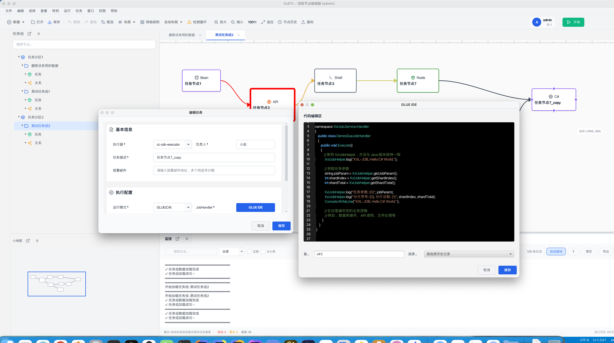

# Cc-ETL

<p align="center">
  
  
  
  
</p>

<p align="center"><b>基于 XXL-Job 的可视化任务调度与数据集成平台</b></p>
<p align="center">拖拽式任务编排 · DataX 数据同步 · PC 端管理界面</p>

Cc-ETL 基于 XXL-Job 深度改造，提供**可视化定时任务调度**与**多数据源集成**能力：通过拖拽画布编排任务依赖，支持 10 种任务类型，并集成 DataX 实现数据库间全量/增量同步，适合企业 ETL、运维自动化与数据中台等场景。

**项目当前处于测试阶段，部分功能仍在开发与优化中，欢迎下载学习使用。**

- **GitHub**：https://github.com/xiaozhaoCcz/CC_ETL  
- **Gitee**：https://gitee.com/xzjsccz/Cc_ETL

**文档导航**：想了解「能做什么」可重点阅读 **[一、核心功能](#一核心功能)** 与 **[二、典型使用场景](#二典型使用场景)**；需要上手可跳转 **[五、快速开始](#五快速开始)**。

---

## 一、核心功能

### 1. 可视化任务编排

| 能力 | 说明 |
|------|------|
| **拖拽画布** | 节点连线、拓扑排序自动解决执行顺序，支持串行/并行、循环依赖检测 |
| **实时反馈** | 执行状态、日志流式展示，小地图导航，多面板布局 |
| **编排执行器** | 按依赖顺序触发下游任务，与 Admin 调度无缝配合 |

适用于：多步骤流水线、有依赖的批处理、ETL 多阶段流程。

### 2. 任务调度

- 兼容 **XXL-Job**：Cron 表达式、动态增删改任务、多种路由与阻塞策略  
- **失败策略**：失败重试、告警、忽略等可配置  
- **超时与重试**：单任务超时时间、重试次数独立配置  

适用于：定时报表、定时同步、定时巡检、补数重跑等。

### 3. 数据集成（DataX）

- **多数据源**：MySQL、Oracle、PostgreSQL 等，可扩展  
- **同步方式**：全量、增量、条件过滤，通过 JSON 配置即可  
- **与编排结合**：可将「数据同步」作为编排中的一环，前后接清洗、转换或推送  

（⚠️ PC 端 DataX 配置与执行正在更新中）

适用于：库到库同步、数仓 ODS 层接入、跨库数据迁移。

### 4. 多任务类型（10 种运行模式）

| 类型 | 说明 | 典型用途 |
|------|------|----------|
| **Bean** | Spring Bean 方法调用 | 业务逻辑、内部服务调用 |
| **API** | HTTP 请求 | 调用第三方接口、内部微服务 |
| **SQL** | 执行 SQL 脚本 | 数据清洗、统计、归档 |
| **Shell** | 执行 Shell 脚本 | 运维脚本、文件处理、调用外部程序 |
| **DataX** | DataX 同步任务 | 数据库/表同步 |
| **GLUE** | Java/Shell/Python/PHP/Nodejs/PowerShell/C# | 自定义脚本、一次性任务、多语言扩展 |

适用于：混合编排（例如先 API 拉数 → SQL 清洗 → DataX 入仓 → Shell 发通知）。

### 5. 监控与运维

- **执行记录**：每次触发的开始/结束时间、状态、耗时  
- **日志查看**：控制台日志、执行日志持久化与检索  
- **告警**：邮件、Webhook 通知，便于对接钉钉/企业微信等  

适用于：任务失败排查、性能分析、值班告警。

### 6. 权限管控

- **角色与权限**：支持按角色划分任务、执行器、数据源等资源的访问与操作权限  
- **操作审计**：关键操作可追溯，便于企业合规与安全管控  

适用于：多团队共用平台、生产环境隔离、敏感任务与数据源管控。

### 7. 版本管理

- **配置版本**：任务、编排、数据源等配置支持版本记录与回溯  
- **变更追溯**：可查看历史版本、对比差异、按需回滚，降低误改风险  

适用于：任务配置变更审计、上线前回滚、多环境配置管理。

### 8. PC 端（JavaFX）

- **离线使用**：不依赖浏览器，树形视图、画布、小地图、日志面板一体化  
- **高级配置**：路由策略、阻塞处理、失败策略、超时、重试等与 Admin 一致  
- **交互**：撤销/重做、快捷键、面板可展开/收起/弹出独立窗口  
- **质量保障**：功能经 489 个测试用例覆盖，详见 [GUI 功能测试文档](doc/测试文档/GUI功能测试文档.md)  

---

## 二、典型使用场景

### 场景一：数据仓库 ETL 流程

**流程**：`数据源同步 → 数据清洗/转换 → 加载到数仓 → 后续统计或推送`

- 使用 **DataX** 将业务库（MySQL/Oracle 等）全量或增量同步到 ODS 层  
- 使用 **SQL** 或 **Bean** 任务做清洗、维度关联、指标计算  
- 使用 **编排** 将「同步 → 清洗 → 加载」串成一条流水线，按依赖顺序执行  
- 可选：最后接 **API** 或 **Shell** 推送报表或触发下游系统  

**价值**：可视化配置、减少手写脚本，便于交接与审计。

### 场景二：业务报表与数据推送

**流程**：`定时统计/汇总 → 生成报表或文件 → 邮件/Webhook 推送`

- 使用 **SQL** 或 **Bean** 做日/周/月统计  
- 使用 **Shell** 生成 Excel/CSV 或调用报表服务  
- 使用 **API** 或 **邮件/Webhook** 将结果推送给业务或领导  

**价值**：定时自动化，减少人工取数、发邮件。

### 场景三：系统运维自动化

**流程**：`日志清理/备份 → 健康检查 → 异常告警`

- 使用 **Shell** 做日志切割、归档、备份脚本  
- 使用 **API** 或 **Bean** 调用健康检查接口，判断服务状态  
- 配置 **失败告警**、**邮件/Webhook**，异常时及时通知  

**价值**：例行维护自动化，故障早发现、早处理。

### 场景四：第三方 API 数据集成

**流程**：`定时调用第三方 API → 解析落库 → 与内部数据联动`

- 使用 **API** 任务定时拉取第三方数据（RESTful/SOAP 等）  
- 使用 **Bean** 或 **SQL** 解析、清洗并写入本地库  
- 需要时可与 **DataX**、**SQL** 等组合，参与数仓或报表链路  

**价值**：统一在平台内管理外部数据接入，可编排、可监控。

### 场景五：学习与二次开发

- **任务调度**：学习分布式调度、Cron、任务依赖与拓扑编排  
- **数据集成**：学习 DataX、多数据源 ETL 设计  
- **桌面应用**：JavaFX 界面、多模块架构，可作为企业级桌面端参考  

---

## 三、架构简述

- **Admin**：任务与执行器注册、调度触发、监控、Web 管理  
- **Executor（编排）**：按任务组依赖执行，拓扑排序  
- **Executor（执行）**：执行 Bean/API/SQL/Shell/DataX 等，状态与日志回调  
- **数据流**：PC 端配置 → 持久化到 MySQL → Admin 调度 → Executor 执行 → 状态与日志回传展示  

---

## 四、项目展示

### 界面预览

#### PC 端主界面

<div align="center">
  
</div>

#### 任务列表与编辑

<div align="center">
  
</div>


#### 数据源同步

<div align="center">
  
</div>

#### 任务类型示例（API / Shell / Java / C# / Sql / Bean / Datax）

<div align="center">
  
  
</div>
<div align="center">
  
  
</div>
<div align="center">
  
  
</div>


### 使用流程

1. **环境搭建**：配置数据库与后端，启动 Admin、Executor、Compose。  
2. **系统配置**：配置执行器地址、数据源与连接参数。  
3. **任务设计**：创建分区与任务组，拖拽画布设计流程，配置依赖与参数。  
4. **执行监控**：手动或定时触发，查看日志与状态。  

**演示视频**：[在线观看](https://www.bilibili.com/video/BV1TBCkBzEex/?spm_id_from=333.1387.upload.video_card.click)

---

## 五、快速开始

### 环境要求

- **JDK** 17+  
- **Maven** 3.6+  
- **MySQL** 5.7+（推荐 8.0+）  
- **Python** 3.6+（使用 DataX 时）  

### 数据库初始化

```sql
CREATE DATABASE `cc_etl` DEFAULT CHARACTER SET utf8mb4 COLLATE utf8mb4_unicode_ci;
```

```bash
mysql -u root -p cc_job_admin < doc/cc_etl.sql
```

（也可在 MySQL 客户端中执行 `doc/cc_etl.sql`，`doc/cc_etl_clean.sql`是一份干净的数据库，也可以直接导入。）


### 后端配置与启动

**编译**：`cd cc-job` → `mvn clean package -DskipTests`

**配置**：  
- Admin：编辑 `cc-job/cc-job-admin/src/main/resources/application.yml`（端口 8989、数据库、`xxl.job.logpath` 等）。  
- Executor：编辑 `cc-job/cc-job-executor/cc-job-executor-sample-springboot/src/main/resources/application.yml`（`admin.addresses`、`executor.port`、`logpath`）。  
- Compose：编辑对应模块 `application.yml`，配置 `cc-job.job.admin.addresses`、`executor.appname`、`port`、`logpath`。  

**启动**：

```bash
# Admin
cd cc-job/cc-job-admin && mvn spring-boot:run

# Executor
cd cc-job/cc-job-executor/cc-job-executor-springboot && mvn spring-boot:run

# Compose
cd cc-job/cc-job-executor-compose/cc-job-executor-compose-springboot && mvn spring-boot:run
```

验证：访问 `http://localhost:8989/xxl-job-admin`。

### PC 端启动

JavaFX 应用，需添加 VM 参数（`--module-path`、`--add-modules javafx.controls,javafx.fxml`），路径替换为本机 Maven 仓库中 OpenJFX 的 jar。然后：

```bash
cd cc-job/cc-job-gui
mvn clean package
java -jar target/cc-job-gui.jar
```

### DataX（可选）

下载并解压 DataX，在 Executor 配置中设置 `cc-job.executor.jsonpath`、`pypath`（指向 DataX 的 json 目录与 `bin/datax.py`）。

---

## 六、模块说明

| 模块 | 说明 |
|------|------|
| **cc-job-admin** | 任务注册与调度中心，任务组与执行器管理 |
| **cc-job-executor** | 任务执行器，支持 Bean/API/SQL/Shell/DataX 等 |
| **cc-job-executor-compose** | 任务编排执行器，拓扑排序与依赖执行 |
| **cc-job-core** | 调度与执行核心 |
| **cc-job-xo** | 数据存储与实体映射 |
| **cc-job-gui** | PC 端桌面管理（JavaFX） |
| **cc-job-executor-samples** | 执行器示例工程 |
| ~~cc-job-web~~ | Web 端已移除，功能迁移至 PC 端 |
| ~~cc-async-tool~~ | 已移除，编排能力已集成至 admin |

---

## 七、技术栈

- **后端**：Java 17+、Spring Boot 3.x、MyBatis Plus、XXL-Job、DataX、Druid、MySQL  
- **PC 端**：JavaFX 17+、Maven  

---

## 八、文档与常见问题

- **[GUI 功能测试文档](doc/测试文档/GUI功能测试文档.md)**：489 个测试用例与使用参考。  
- **在线文档**：[http://175.178.249.190/blog/post/298](http://175.178.249.190/blog/post/298)  

**常见问题**：  
- **Admin 数据库连接失败**：检查库是否创建、脚本是否执行、连接信息与时区（如 `Asia/Shanghai`）。  
- **Executor 未注册**：确认 Admin 已启动、`admin.addresses` 与 `accessToken` 一致、端口与防火墙。  
- **DataX 执行失败**：检查 DataX 安装、`pypath`/`jsonpath`、数据源与表结构、Python 版本。  
- **任务组拓扑错误**：检查是否存在循环依赖、节点是否关联任务、是否选择「任务集执行器」。  

更多问题可提交 [GitHub Issues](https://github.com/xiaozhaoCcz/CC_ETL/issues)。

---

## 九、发展规划（简述）

- **已完成**：可视化编排、10 种运行模式、PC 端多面板与高级配置、DataX 集成、Spring Boot 3 升级。  
- **进行中**：调度中心迁移至 PC、权限与条件节点。  
- **计划**：更多数据源、监控告警增强、插件与 API 生态、文档与社区。  

---

## 十、贡献与支持

欢迎提交 Issue 与 Pull Request。请从 fork 拉分支开发，提交信息建议使用 `feat/fix/docs` 等前缀。详细规范见仓库内约定。

**致谢**：感谢 XXL-Job、DataX、JavaFX 等开源项目。

**许可证**：本项目采用 [MIT License](./LICENSE)。若对您有帮助，欢迎 Star、Fork 或参与贡献。

**联系我们**：[GitHub](https://github.com/xiaozhaoCcz/CC_ETL) | [Gitee](https://gitee.com/xzjsccz/Cc_ETL) | [在线文档](http://175.178.249.190/blog/post/298)
