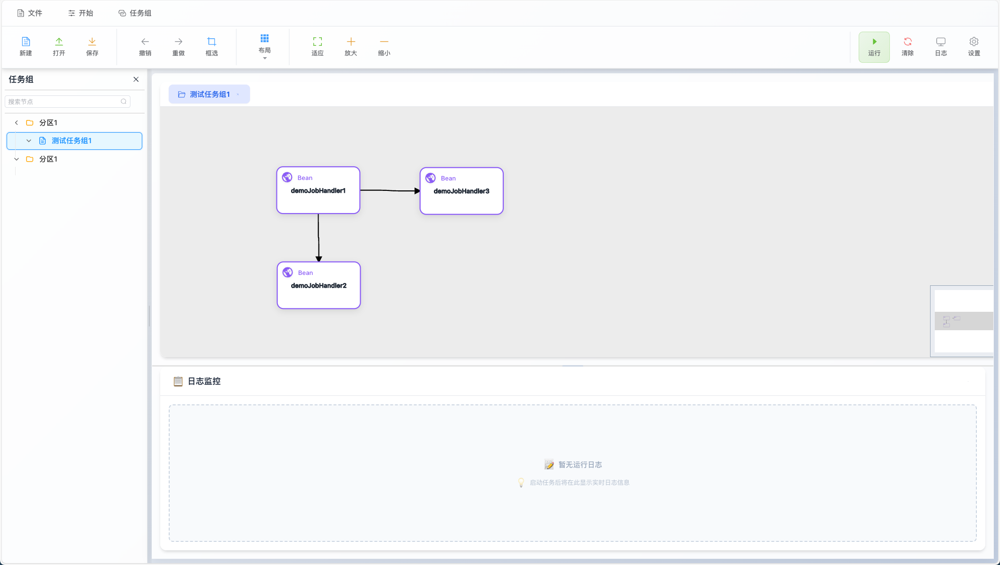
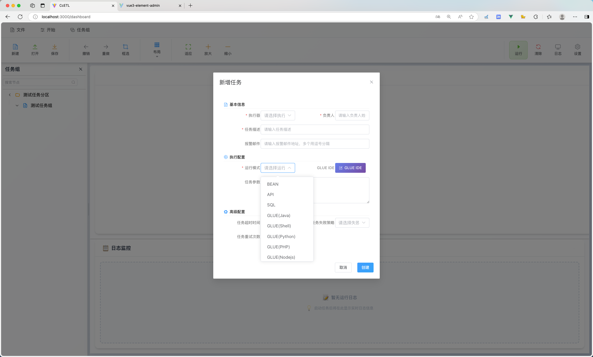
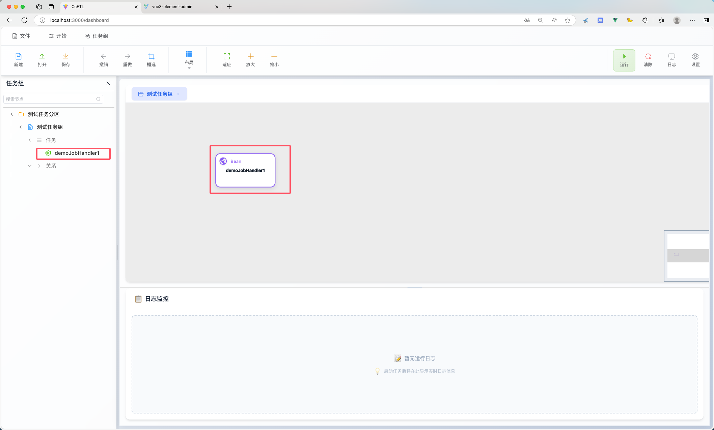

# Cc-ETL

<p align="center"><b>基于 XXL-Job 改造的可视化任务调度平台</b></p>

---

## 目录

- [项目简介](#项目简介)
- [主要特性](#主要特性)
- [项目展示](#项目展示)
- [快速开始](#快速开始)
- [模块说明](#模块说明)
- [项目文档](#项目文档)
- [License](#license)

---

## 项目简介

Cc-ETL 是一款基于 XXL-Job 深度改造的可视化定时任务调度工具，支持任务可视化编排、失败重试、暂停、预测、超时控制等高级特性，并集成 DataX 实现多数据源间的数据同步。平台支持单任务、多任务串并联运行，运行状态可视化，极大提升了易用性和可观测性。

---

## 主要特性

- **任务编排前端重构**：可视化编辑与拖拽
- **简洁部署**：仅需数据库，无需其他中间件
- **PC端支持**：Electron 实现本地可视化
- **兼容 XXL-Job 全部功能**
- **集成 DataX 数据同步**：
  - 支持 MySQL、Oracle 全量/增量同步
  - 后续支持更多数据源
- **支持存储过程与 SQL 调用**
- **支持 API 任务调度**
- **高级编排特性**：
  - 任务节点预测、暂停、超时、失败重试、失败忽略、状态可视化、串并联运行

---

## 项目展示

### 启动 PC 端和 Web 端

分别启动 PC 端和 Web 端，后端启动方式见下文。

<div align="center">
  
  
</div>

### Web 端配置执行器和数据源

<div align="center">
  
  
</div>

### 配置任务并执行

1. **创建任务分区**：点击“新建”创建任务分区，一个分区下可有多个任务组。
2. **创建任务组**：任务组需选择“任务集执行器”，需先在 Web 端配置。
3. **新建任务**：支持 bean、api、sql、shell 等多种任务类型，节点可关联。
4. **运行任务组**：点击右上角“运行”，可实时查看日志和状态。

<div align="center">
  
  
</div>

---

## 快速开始

### 1. 数据库初始化

执行数据库脚本：  
```bash
/doc/cc_etl.sql
```

### 2. 配置说明

#### 执行器配置（以 xxl-job-executor-sample-springboot 为例）

```yaml
xxl.job.admin.addresses=http://127.0.0.1:8989/xxl-job-admin
xxl.job.accessToken=default_token
xxl.job.executor.appname=xxl-job-executor-sample
xxl.job.executor.address=
xxl.job.executor.ip=
xxl.job.executor.port=10000
xxl.job.executor.logpath= # 路径地址
xxl.job.executor.logretentiondays=30
```

#### 管理端配置（admin）

```yaml
xxl:
  job:
    i18n: zh_CN
    accessToken: default_token
    triggerpool:
      fast:
        max: 200
      slow:
        max: 200
    logretentiondays: 30
    logpath:  # 日志路径，建议与 executor 保持一致
```

> ⚠️ **注意**：`admin.addresses` 端口需为 `8989`，执行器端口不能为 `9999`。

---

## 模块说明

| 模块 | 说明 |
|------|------|
| **cc_job_pc** | 桌面端管理界面，便于本地运维和管理 |
| **cc-job/cc-async-tool** | 异步任务调度工具，支持任务重复调用与超时处理 |
| **cc-job/cc-job-admin** | 任务注册中心，负责任务与任务组的注册管理 |
| **cc-job/cc-job-core** | 任务执行核心模块，负责调度和执行任务 |
| **cc-job/cc-job-executor** | 任务执行器，支持多种任务类型（DataX、API、JDBC等） |
| **cc-job/cc-job-executor-samples** | 执行器示例工程，便于开发和测试 |
| **cc-job/cc-job-xo** | 数据存储与实体映射模块 |
| **cc-job-web** | Web 端管理界面，提供可视化任务管理与监控 |

---

## 项目文档

- [在线文档](http://175.178.249.190/blog/post/298)
- [本地文档](/doc/cc-job)
  - [01 项目介绍](doc/cc-job/01项目介绍.md)
  
  - [02 快速开始](doc/cc-job/02快速开始.md)
  
  - [03 功能介绍](doc/cc-job/03功能介绍.md)
  

---

## License

本项目遵循 [MIT License](./LICENSE)。

---

如需更多帮助或有任何建议，欢迎提交 Issue 或 PR！

