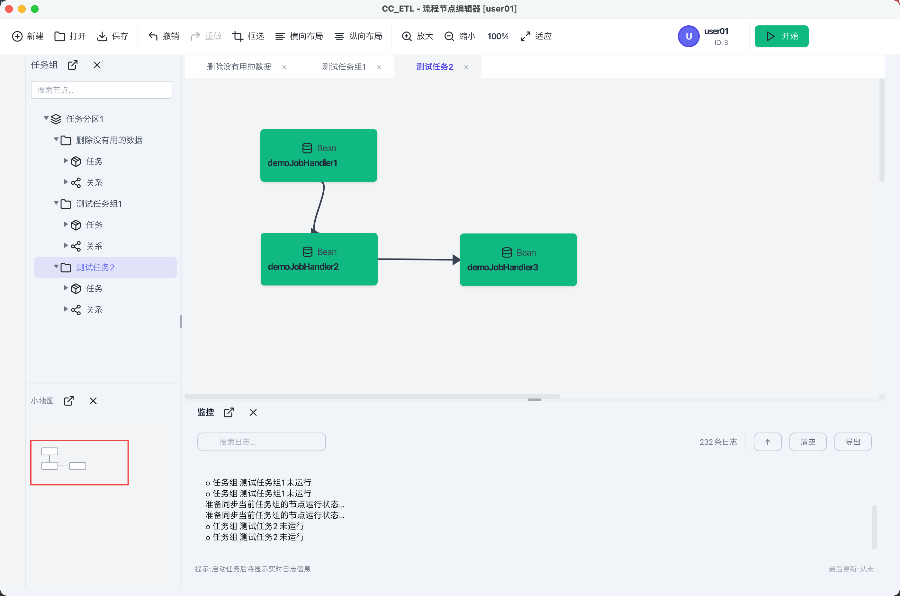
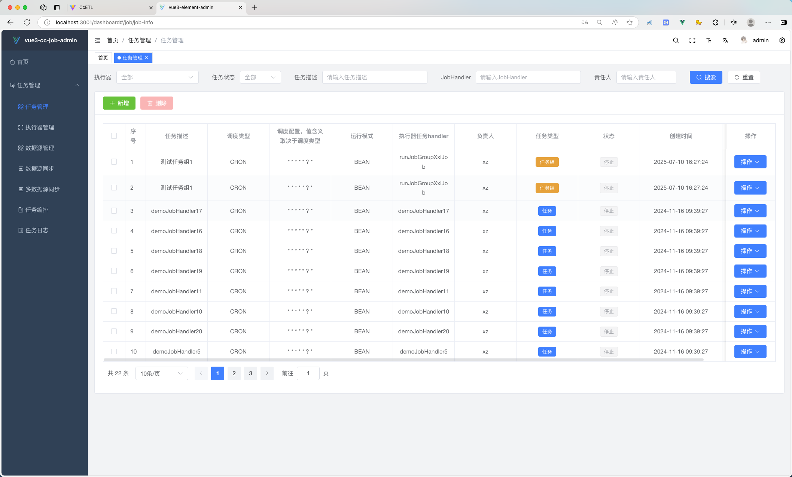
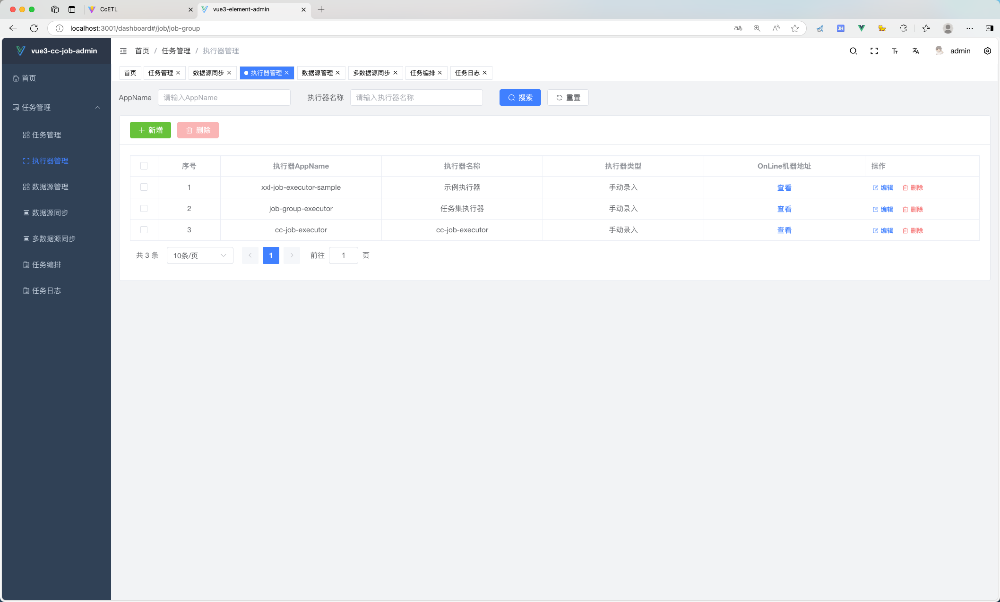
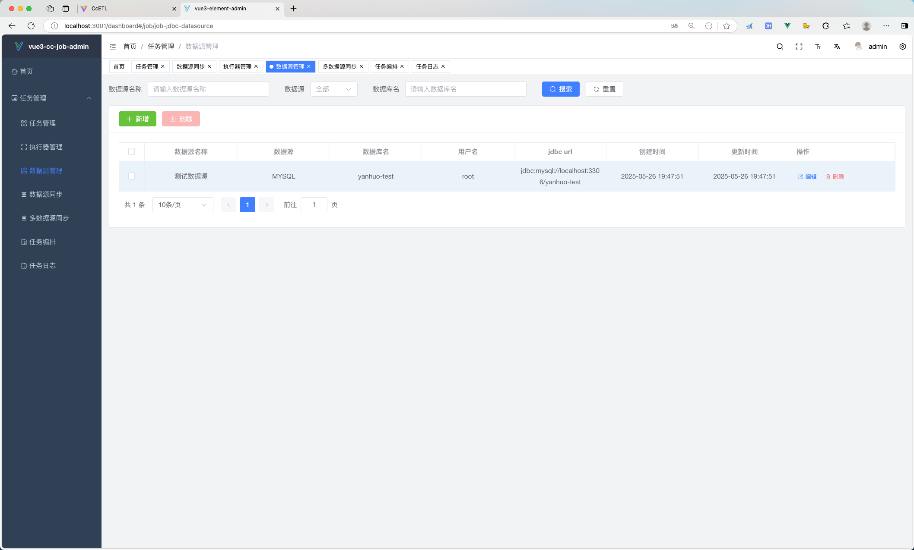
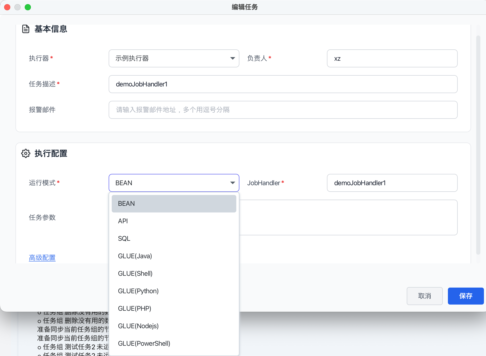
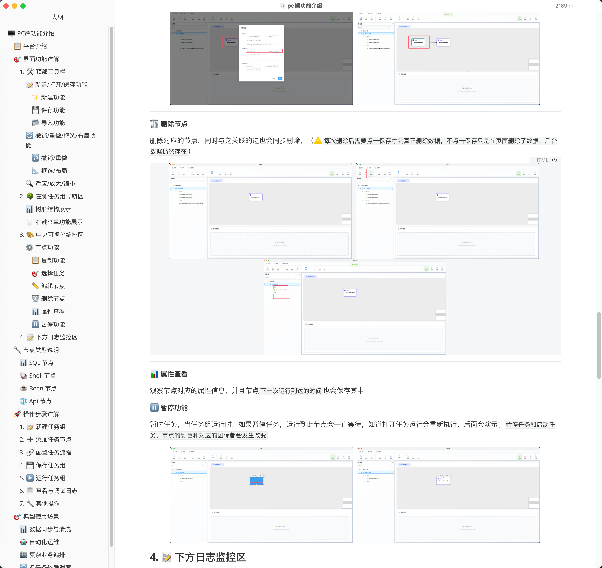
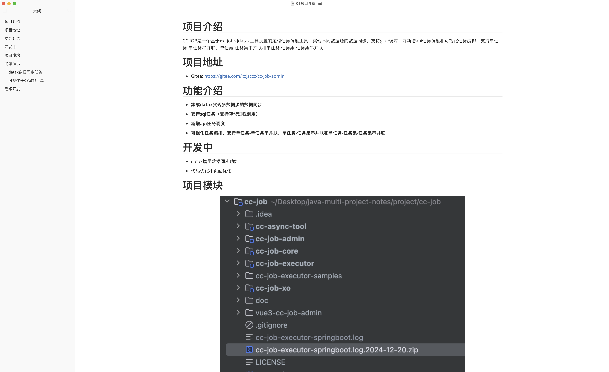
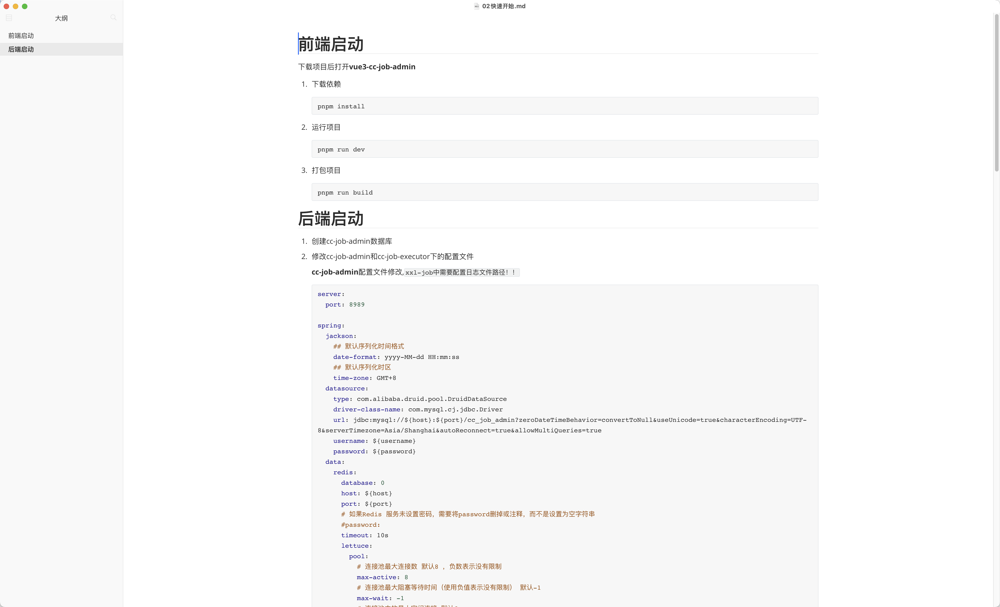
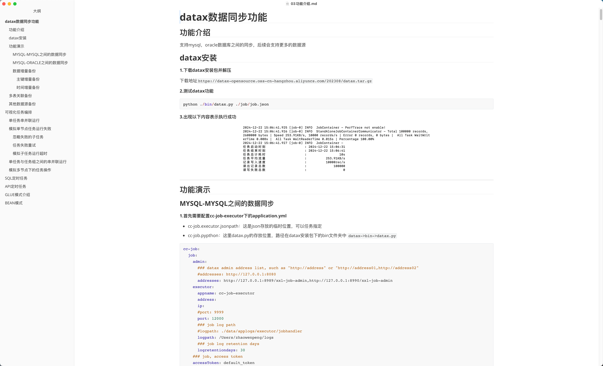

# 🚦 Cc-ETL

<p align="center"><b>基于 XXL-Job 改造的可视化任务调度平台</b></p>

---

## 目录

📖 [项目简介](#-项目简介) | 🔗[项目地址](#-项目地址) | ✨ [主要特性](#-主要特性) | 🖼️ [项目展示](#-项目展示) | 💻 [pc端](#pc端功能文档介绍) | 🚀 [快速开始](#-快速开始) | 🧩 [模块说明](#-模块说明) | 📚 [项目文档](#-项目文档) | 📄 [License](#-license)

---

## 📖 项目简介

Cc-ETL 是一款基于 XXL-Job 深度改造的可视化定时任务调度工具，支持任务可视化编排、失败重试、暂停、预测、超时控制等高级特性，并集成 DataX 实现多数据源间的数据同步。平台支持单任务、多任务串并联运行，运行状态可视化，极大提升了易用性和可观测性。

### 项目定位

- **数据集成平台**：支持多数据源之间的数据同步与转换
- **任务调度中心**：提供强大的任务编排与调度能力
- **可视化运维工具**：通过 Web 端和 PC 端提供友好的操作界面
- **企业级解决方案**：支持高可用、分布式部署，满足企业生产环境需求

### 项目优势

1. **零中间件依赖**：仅需数据库即可部署，降低运维成本
2. **可视化编排**：拖拽式任务编排，降低使用门槛
3. **多端支持**：Web 端 + PC 端，满足不同使用场景
4. **功能丰富**：支持多种任务类型，覆盖常见业务场景
5. **高可用设计**：支持集群部署，保障系统稳定性

> 💡 **项目亮点**：靠此项目拿到国企offer和多个中小公司offer

---

## 🔗 项目地址

- **GitHub**：https://github.com/xiaozhaoCcz/CC_ETL
- **Gitee**：https://gitee.com/xzjsccz/Cc_ETL

---

## ✨ 主要特性

- 🖱️ **任务编排前端重构**：可视化编辑与拖拽
- 🧩 **简洁部署**：仅需数据库，无需其他中间件
- 💻 **PC端支持**：JavaFx和Vue3实现
- 🔄 **兼容 XXL-Job 全部功能**
- 🔗 **集成 DataX 数据同步**：
    - 🗄️ 支持 MySQL、Oracle 全量/增量同步
    - ⏳ 后续支持更多数据源
- 🏦 **支持存储过程与 SQL 调用**
- 🌐 **支持 API 任务调度**
- 🏗️ **高级编排特性**：
    - ⏱️ 任务节点预测、暂停、超时、失败重试、失败忽略、状态可视化、串并联运行

---
### 后续优化
后续考虑所有功能全部使用c#使用，所有代码和功能全部重构

#### 代码优化
- [ ] 🔴 调度中心页面功能全部迁移到gui中，移除调度中心页面
- [ ] 🔴 重构任务编排引擎，提升性能和可维护性
- [ ] 🔴 优化数据库设计，减少冗余查询
- [ ] 🟡 完善单元测试和集成测试覆盖率
- [ ] 🟡 代码规范统一，完善代码注释
- [ ] 🟡 优化日志输出，提升可观测性
- [ ] 🟡 添加权限管理功能，任务与用户权限关联
- [ ] 🔴 实现条件节点功能，支持任务节点的条件判断

#### 文档完善
- [ ] 🟡 完善 API 文档
- [ ] 🟡 添加更多使用示例和最佳实践
- [ ] 🟡 制作视频教程和操作指南
- [ ] 🟡 完善开发者文档

---

## 🖼️ 项目展示

### 🖥️ 启动 PC 端和 Web 端

分别启动 PC 端和 Web 端，后端启动方式见下文。

<div align="center">
  
  
</div>

### ⚙️ Web 端配置执行器和数据源

<div align="center">
  
  
</div>

### 📝 配置任务并执行

1. 🗂️ **创建任务分区**：点击“新建”创建任务分区，一个分区下可有多个任务组。
2. 🧑‍🤝‍🧑 **创建任务组**：任务组需选择“任务集执行器”，需先在 Web 端配置。
3. 🆕 **新建任务**：支持 bean、api、sql、shell 等多种任务类型，节点可关联。
4. ▶️ **运行任务组**：点击右上角“运行”，可实时查看日志和状态。

<div align="center">
  
  
</div>

---
## PC端功能文档介绍
- [本地文档](/doc/cc-job)
    - [pc端](doc/cc-job/pc端功能介绍.md)
      此文档是旧的pc端文档，新版本使用JavaFX写的，文档是适用的，新文档编写中.....
<div align="center">
  
</div>

## 🚀 快速开始

### 📋 环境要求

在开始之前，请确保您的环境满足以下要求：

| 环境 | 版本要求 | 说明 |
|------|---------|------|
| **JDK** | 17+ | 推荐使用 JDK 17 或更高版本 |
| **Maven** | 3.6+ | 用于构建 Java 项目 |
| **MySQL** | 5.7+ | 推荐使用 MySQL 8.0+ |
| **Node.js** | 18+ | Web 前端需要（注意：20.6.0 版本不可用） |
| **pnpm** | 最新版 | 前端包管理工具 |
| **Python** | 3.6+ | DataX 需要（如果使用 DataX 功能） |

### 1️⃣ 数据库初始化

#### 1.1 创建数据库

```sql
CREATE DATABASE `cc_job_admin` DEFAULT CHARACTER SET utf8mb4 COLLATE utf8mb4_unicode_ci;
```

#### 1.2 执行初始化脚本

执行项目根目录下的数据库脚本：

```bash
# 方式一：使用 MySQL 命令行
mysql -u root -p cc_job_admin < doc/cc_etl.sql

# 方式二：直接在 MySQL 客户端中执行
# 打开 doc/cc_etl.sql 文件，复制内容到 MySQL 客户端执行
```

### 2️⃣ 后端配置与启动

#### 2.1 编译项目

```bash
# 进入项目根目录
cd cc-job

# 编译项目
mvn clean package -DskipTests
```

#### 2.2 配置说明

#### 🛠️ 管理端配置（Admin）

编辑 `cc-job/cc-job-admin/src/main/resources/application.yml`：

```yaml
server:
  port: 8989

spring:
  datasource:
    driver-class-name: com.mysql.cj.jdbc.Driver
    url: jdbc:mysql://localhost:3306/cc_job_admin?useUnicode=true&characterEncoding=UTF-8&serverTimezone=Asia/Shanghai
    username: your_username  # 修改为您的数据库用户名
    password: your_password  # 修改为您的数据库密码

xxl:
  job:
    i18n: zh_CN
    accessToken: default_token
    triggerpool:
      fast:
        max: 200
      slow:
        max: 200
    logretentiondays: 30
    logpath: /path/to/logs  # 日志文件路径，必须配置，建议与 executor 保持一致
```

#### ⚙️ 执行器配置

编辑 `cc-job/cc-job-executor-samples/cc-job-executor-sample-springboot/src/main/resources/application.yml`：

```yaml
server:
  port: 8400

spring:
  datasource:
    driver-class-name: com.mysql.cj.jdbc.Driver
    url: jdbc:mysql://localhost:3306/cc_job_admin?useUnicode=true&characterEncoding=UTF-8&serverTimezone=Asia/Shanghai
    username: your_username
    password: your_password

xxl:
  job:
    admin:
      addresses: http://127.0.0.1:8989/xxl-job-admin
    accessToken: default_token
    executor:
      appname: xxl-job-executor-sample
      address:
      ip:
      port: 10000  # 执行器端口，不能为 9999
      logpath: /path/to/logs  # 日志路径，必须配置
      logretentiondays: 30
```

> ⚠️ **重要提示**：
> - `admin.addresses` 端口必须为 `8989`
> - 执行器端口不能为 `9999`
> - `logpath` 必须配置，建议与 admin 保持一致
> - `accessToken` 在 admin 和 executor 中必须一致

#### 2.3 启动后端服务

**启动 Admin 服务**：

```bash
# 方式一：使用 IDE 运行
# 运行 cc-job-admin 模块的启动类

# 方式二：使用命令行
cd cc-job/cc-job-admin
mvn spring-boot:run
```

**启动 Executor 服务**：

```bash
# 方式一：使用 IDE 运行
# 运行 cc-job-executor-sample-springboot 模块的启动类

# 方式二：使用命令行
cd cc-job/cc-job-executor-samples/cc-job-executor-sample-springboot
mvn spring-boot:run
```

**验证启动**：

- Admin 服务：访问 `http://localhost:8989/xxl-job-admin`
- Executor 会自动注册到 Admin，可在 Web 端查看

### 3️⃣ 前端配置与启动

#### 3.1 Web 端配置

```bash
# 进入 Web 前端目录
cd cc-job-web

# 安装 pnpm（如果未安装）
npm install pnpm -g

# 设置镜像源（可选，加速下载）
pnpm config set registry https://registry.npmmirror.com

# 安装依赖
pnpm install
```

#### 3.2 配置后端 API 地址

编辑 `cc-job-web/.env.development`：

```bash
# 后端 API 地址
VITE_APP_API_URL=http://localhost:8989
```

#### 3.3 启动 Web 端

```bash
# 开发环境运行
pnpm run dev

# 访问地址：http://localhost:5173
```

#### 3.4 生产环境构建

```bash
# 构建生产版本
pnpm run build

# 构建产物在 dist 目录
```

### 4️⃣ PC 端启动（可选）

PC 端为 JavaFX 应用，直接运行主类即可：

```bash
cd cc-job/cc-job-gui
mvn clean package
java -jar target/cc-job-gui.jar
```

### 5️⃣ DataX 配置（可选，如使用数据同步功能）

#### 5.1 下载 DataX

```bash
wget https://datax-opensource.oss-cn-hangzhou.aliyuncs.com/202308/datax.tar.gz
tar -zxvf datax.tar.gz
```

#### 5.2 测试 DataX

```bash
cd datax
python ./bin/datax.py ./job/job.json
```

#### 5.3 配置 Executor 中的 DataX 路径

在 Executor 配置文件中添加：

```yaml
cc-job:
  executor:
    jsonpath: /path/to/datax/json  # DataX JSON 文件临时存放路径
    pypath: /path/to/datax/bin/datax.py  # DataX Python 脚本路径
```

---

## 🧩 模块说明

| 🧩 模块 | 📋 说明 |
|------|------|
| 💻 **cc_job_pc** | 桌面端管理界面，便于本地运维和管理 |
| 🔄 **cc-job/cc-async-tool** | 异步任务调度工具，支持任务重复调用与超时处理(已经移除，会出现线程爆炸增长的情况，已经对编排工具进行重写并集成到cc-job-admin模块中) |
| 🗂️ **cc-job/cc-job-admin** | 任务注册中心，负责任务与任务组的注册管理 |
| 🧠 **cc-job/cc-job-core** | 任务执行核心模块，负责调度和执行任务 |
| 🏃 **cc-job/cc-job-executor** | 任务执行器，支持多种任务类型（DataX、API、JDBC等） |
| 🧪 **cc-job/cc-job-executor-samples** | 执行器示例工程，便于开发和测试 |
| 🗄️ **cc-job/cc-job-xo** | 数据存储与实体映射模块 |
| 🌐 **cc-job-web** | Web 端管理界面，提供可视化任务管理与监控 |

---

## 📚 项目文档

### 在线文档

- [在线文档](http://175.178.249.190/blog/post/298)

### 本地文档

> 📝 **提示**：此项目文档比较旧，但是够用，新文档编写中.....

- [本地文档](/doc/cc-job)
    - [01 项目介绍](doc/cc-job/01项目介绍.md)
      
    - [02 快速开始](doc/cc-job/02快速开始.md)
      
    - [03 功能介绍](doc/cc-job/03功能介绍.md)
      
    - [PC端功能介绍](doc/cc-job/pc端功能介绍.md)

### 技术栈

#### 后端技术栈
- **Java 17**：采用最新的 LTS 版本
- **Spring Boot 3.0.7**：企业级应用框架
- **MyBatis Plus 3.5.3**：持久层框架
- **XXL-Job Core**：任务调度核心引擎
- **DataX**：数据同步工具
- **Druid**：数据库连接池

#### 前端技术栈（Web 端）
- **Vue 3**：渐进式 JavaScript 框架
- **Element Plus**：Vue 3 组件库
- **Vue Flow**：流程图可视化组件
- **Vite**：新一代前端构建工具
- **TypeScript**：类型安全的 JavaScript

#### 前端技术栈（PC 端）
- **JavaFX**：Java 桌面应用框架
- **Java 17**：运行环境


---

## ❓ 常见问题

### 部署相关问题

#### Q1: Admin 启动失败，提示数据库连接错误？

**A**: 检查以下几点：
1. 数据库是否已启动
2. 数据库连接信息是否正确（用户名、密码、地址、端口）
3. 数据库用户是否有足够权限
4. 数据库是否已初始化（执行了初始化脚本）
5. 时区设置是否正确（建议使用 `Asia/Shanghai`）

#### Q2: Executor 无法注册到 Admin？

**A**: 检查以下几点：
1. Admin 服务是否已启动
2. Admin 地址配置是否正确（`admin.addresses`）
3. 网络是否连通（可以 ping 或 telnet 测试）
4. AccessToken 是否一致（admin 和 executor 必须相同）
5. Executor 端口是否被占用
6. 防火墙是否阻止连接

#### Q3: DataX 任务执行失败？

**A**: 检查以下几点：
1. DataX 是否已正确安装
2. `pypath` 配置是否正确（指向 DataX 的 Python 脚本路径）
3. `jsonpath` 目录是否存在且有写权限
4. 数据源连接信息是否正确
5. Reader 和 Writer 的表结构是否匹配
6. 检查执行器日志中的详细错误信息
7. Python 环境是否正确（需要 Python 3.6+）

#### Q4: Web 端无法访问？

**A**: 检查以下几点：
1. Web 前端是否已启动（`pnpm run dev`）
2. 前端端口是否被占用（默认 5173）
3. 后端 API 地址配置是否正确（`.env.development` 中的 `VITE_APP_API_URL`）
4. 浏览器控制台是否有错误信息
5. 检查跨域配置是否正确
6. 后端服务是否正常运行

#### Q5: 任务组执行失败，提示拓扑排序错误？

**A**: 检查以下几点：
1. 任务组中是否存在循环依赖
2. 任务节点是否都已正确关联任务
3. 任务依赖关系是否正确配置
4. 检查任务组 JSON 配置是否完整
5. 任务组是否选择了正确的执行器（必须选择"任务集执行器"）

### 配置相关问题

#### Q6: 如何配置多个执行器？

**A**:
1. 复制 Executor 模块配置
2. 修改每个 Executor 的 `appname` 和 `port`（确保端口不冲突）
3. 确保所有 Executor 的 `admin.addresses` 指向同一个 Admin
4. 确保所有 Executor 的 `accessToken` 与 Admin 一致
5. 启动多个 Executor 实例

#### Q7: 如何配置集群部署？

**A**:
1. Admin 可以部署多个实例，共享同一个数据库
2. Executor 可以部署多个实例，实现负载均衡
3. 使用 Nginx 做负载均衡（可选）
4. 确保所有实例的配置一致（特别是 `accessToken`）
5. 确保日志路径可访问（如果使用共享存储）

### 功能使用问题

#### Q8: 如何实现任务失败后发送告警？

**A**:
1. 在任务配置中启用"失败告警"
2. 配置告警通知方式（邮件/短信/Webhook）
3. 设置告警规则和接收人
4. 任务失败时会自动触发告警

#### Q9: 如何导出/导入任务组配置？

**A**:
1. **导出**：在任务组管理页面点击"导出"，生成 JSON 文件
2. **导入**：在任务组管理页面点击"导入"，选择 JSON 文件
3. 导入后检查任务依赖关系是否正确
4. 确保导入的任务组中的任务都已存在

---

## 🤝 贡献指南

我们欢迎所有形式的贡献！

### 如何贡献

1. **Fork 项目**：点击项目右上角的 Fork 按钮
2. **创建分支**：创建特性分支（`git checkout -b feature/AmazingFeature`）
3. **提交更改**：提交您的更改（`git commit -m 'Add some AmazingFeature'`）
4. **推送分支**：推送到分支（`git push origin feature/AmazingFeature`）
5. **提交 PR**：在 GitHub/Gitee 上开启 Pull Request

### 代码规范

- 遵循项目的代码风格
- 添加必要的注释
- 确保代码可以编译通过
- 提交前运行测试（如果有）

### 报告问题

报告问题时，请包含以下信息：
- 操作系统版本
- Java 版本
- 项目版本
- 错误日志
- 复现步骤
- 预期行为 vs 实际行为

---

## 📞 技术支持

### 获取帮助

如果您在使用过程中遇到问题，可以通过以下方式获取帮助：

1. **查看文档**：首先查阅本文档的"常见问题"部分
2. **GitHub Issues**：在项目仓库提交 Issue，描述问题详情
3. **在线文档**：查看[在线文档](http://175.178.249.190/blog/post/298)

### 反馈建议

如果您有任何建议或想法，欢迎：
- 提交 Issue 讨论
- 提交 Pull Request
- 分享使用经验

---

## 🙏 致谢

感谢以下优秀的开源项目：

- **XXL-Job**：感谢 XXL-Job 提供的优秀任务调度框架
- **DataX**：感谢阿里巴巴 DataX 项目提供的数据同步工具
- **Vue 3**：感谢 Vue.js 团队提供的优秀前端框架
- **Element Plus**：感谢 Element Plus 提供的组件库
- **JavaFX**：感谢 JavaFX 提供的桌面应用框架

---

## 📄 License

本项目遵循 [MIT License](./LICENSE)。

---

## ⭐ Star History

如果这个项目对您有帮助，欢迎给个 Star ⭐️

---

**最后更新**：2024-12  
**维护者**：Cc-ETL Team

如需更多帮助或有任何建议，欢迎提交 Issue 或 PR！
