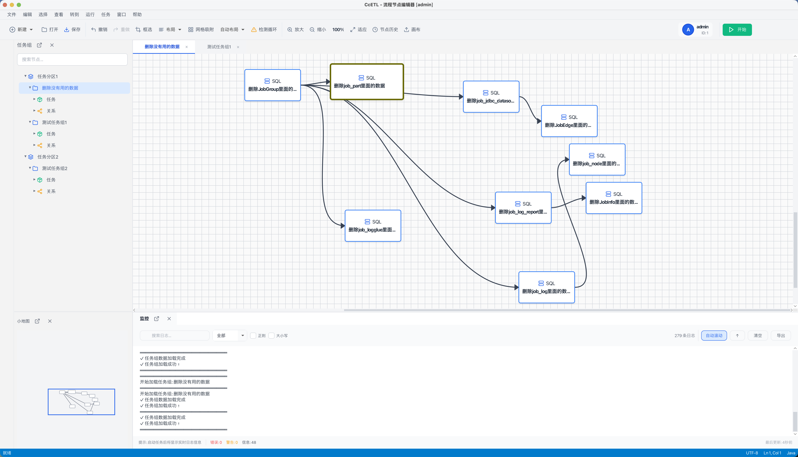
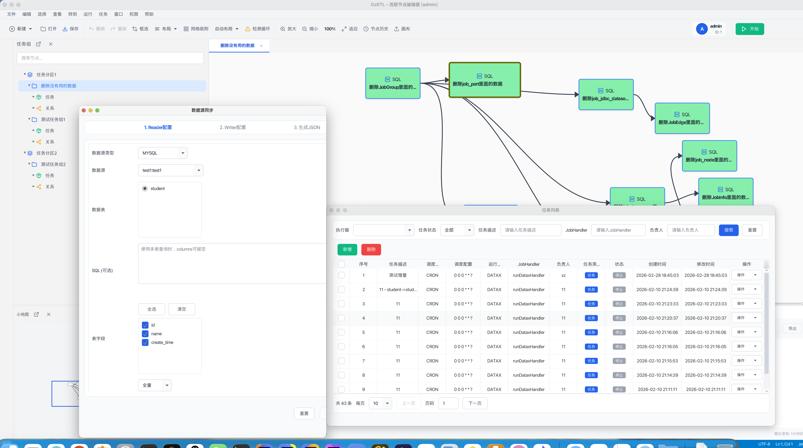
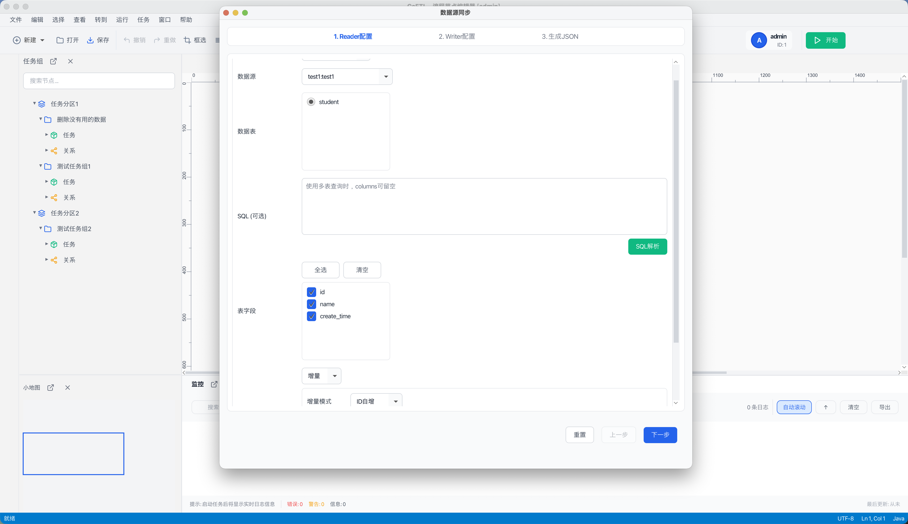
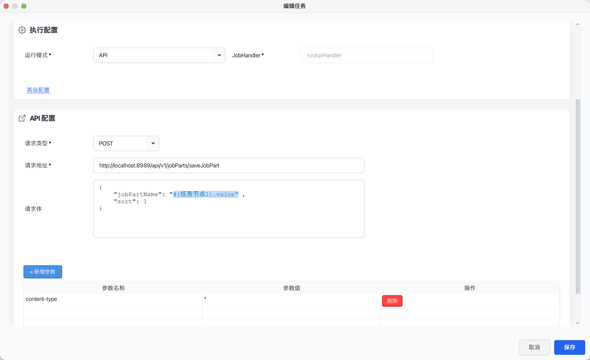
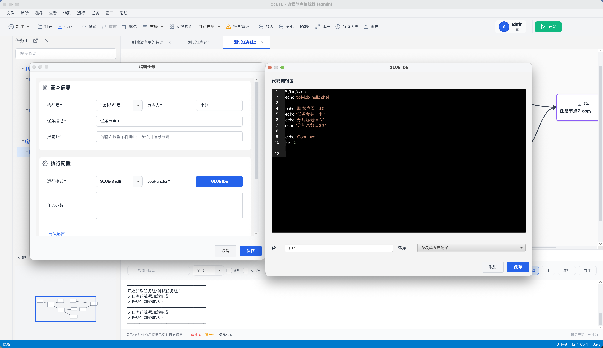
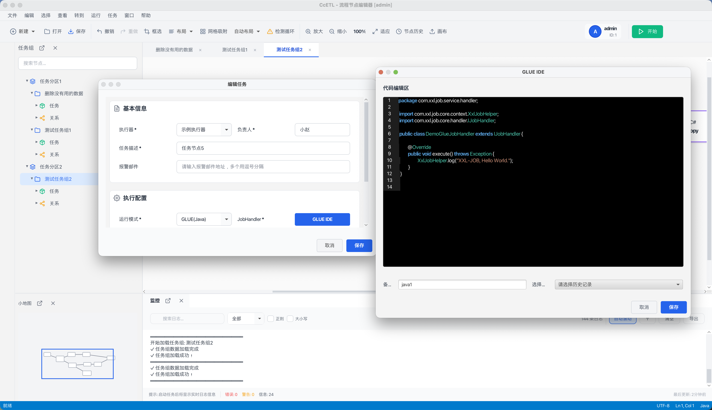
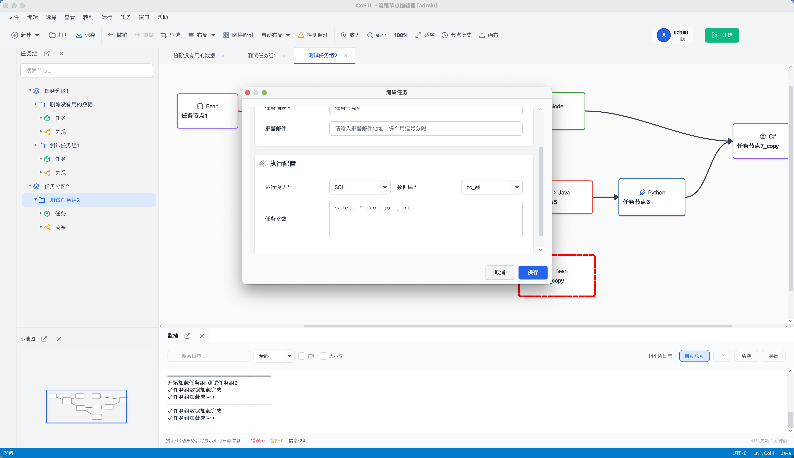
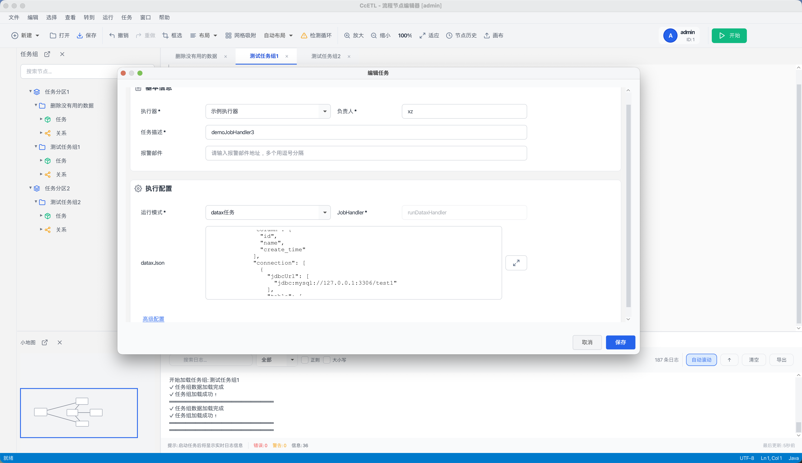

# Cc-ETL

<p align="center">
  
  
  
  
</p>

<p align="center"><b>基于 XXL-Job 的可视化任务调度与数据集成平台</b></p>
<p align="center">拖拽式任务编排、DataX 数据同步、PC 端管理界面</p>

Cc-ETL 基于 XXL-Job 深度改造，提供可视化定时任务调度与数据集成能力。通过拖拽界面编排任务流程，支持多种任务类型，并集成 DataX 实现多数据源同步。

**项目当前处于测试阶段，部分功能仍在开发与优化中，欢迎下载学习使用。**

- **GitHub**：https://github.com/xiaozhaoCcz/CC_ETL  
- **Gitee**：https://gitee.com/xzjsccz/Cc_ETL

---

## 使用场景

### 企业应用场景

**1. 数据仓库 ETL 流程**  
`数据源同步 → 数据清洗 → 数据转换 → 加载到数据仓库`  
- 支持 MySQL、Oracle、PostgreSQL 等主流数据库，全量/增量同步  
- 可视化配置 ETL 流程  

**2. 业务数据处理**  
`用户行为收集 → 数据分析 → 报表生成 → 邮件/Webhook 推送`  
- 定时统计、报表生成、结果推送  

**3. 系统运维自动化**  
`日志清理 → 备份检查 → 健康监控 → 告警通知`  
- 自动化维护、状态监控、异常告警  

**4. API 数据集成**  
`第三方 API 调用 → 数据解析 → 本地存储 → 数据同步`  
- 定时拉取第三方数据，支持 RESTful/SOAP  

### 学习与开发场景

- **任务调度**：学习分布式调度、Cron、任务依赖与编排  
- **数据集成**：学习 DataX、多数据源集成与 ETL 设计  
- **桌面应用**：JavaFX 桌面开发与企业级应用架构  

---

## 功能介绍

### 核心能力

- **可视化任务编排**：拖拽画布、节点连线、拓扑排序解决依赖，支持串行/并行、循环依赖检测；执行状态与日志实时展示，小地图导航。  
- **任务调度**：兼容 XXL-Job，Cron 定时、动态增删改任务，多种调度策略。  
- **数据集成**：深度集成 DataX，多数据源（MySQL/Oracle/PostgreSQL 等）、全量/增量/条件同步。（⚠️ PC 端 DataX 正在更新中）  
- **多任务类型**：Bean、API、SQL、Shell、DataX，以及 GLUE(Java/Shell/Python/PHP/Nodejs/PowerShell/C#) 共 10 种运行模式。  
- **监控与运维**：执行状态跟踪、执行日志、性能统计、邮件/Webhook 告警。  

### PC 端（JavaFX）

- 离线使用，不依赖浏览器；树形视图、画布、小地图、日志面板多布局。  
- 10 种运行模式，高级配置：路由策略、阻塞处理、失败策略、超时、重试。  
- 撤销/重做、快捷键、面板展开/收起/弹出独立窗口；任务执行状态与日志实时反馈。  
- 功能经 489 个测试用例覆盖，详见 [GUI 功能测试文档](doc/测试文档/GUI功能测试文档.md)。  

### 架构简述

- **Admin**：任务与执行器注册、调度、监控、Web 管理。  
- **Executor（编排）**：任务编排执行，拓扑排序解决依赖。  
- **Executor（执行）**：执行 Bean/API/SQL/Shell/DataX 等，状态与日志回调。  
- **数据流**：PC/Web 配置 → MySQL → Admin 调度 → Executor 执行 → 状态回传展示。  

---

## 项目展示

### 界面预览

#### PC 端主界面

<div align="center">
  
</div>

#### 任务列表与编辑

<div align="center">
  
</div>


#### 数据源同步

<div align="center">
  
</div>

#### 任务类型示例（API / Shell / Java / C# / Sql / Bean / Datax）

<div align="center">
  
  
</div>
<div align="center">
  
  
</div>
<div align="center">
  
  
</div>


### 使用流程

1. **环境搭建**：配置数据库与后端，启动 Admin、Executor、Compose。  
2. **系统配置**：配置执行器地址、数据源与连接参数。  
3. **任务设计**：创建分区与任务组，拖拽画布设计流程，配置依赖与参数。  
4. **执行监控**：手动或定时触发，查看日志与状态。  

**演示视频**：[在线观看](https://www.bilibili.com/video/BV1TBCkBzEex/?spm_id_from=333.1387.upload.video_card.click)

---

## 快速开始

### 环境要求

- **JDK** 17+  
- **Maven** 3.6+  
- **MySQL** 5.7+（推荐 8.0+）  
- **Python** 3.6+（使用 DataX 时）  

### 数据库初始化

```sql
CREATE DATABASE `cc_etl` DEFAULT CHARACTER SET utf8mb4 COLLATE utf8mb4_unicode_ci;
```

```bash
mysql -u root -p cc_job_admin < doc/cc_etl.sql
```

（也可在 MySQL 客户端中执行 `doc/cc_etl.sql`。）

### 后端配置与启动

**编译**：`cd cc-job` → `mvn clean package -DskipTests`

**配置**：  
- Admin：编辑 `cc-job/cc-job-admin/src/main/resources/application.yml`（端口 8989、数据库、`xxl.job.logpath` 等）。  
- Executor：编辑 `cc-job/cc-job-executor/cc-job-executor-sample-springboot/src/main/resources/application.yml`（`admin.addresses`、`executor.port`、`logpath`）。  
- Compose：编辑对应模块 `application.yml`，配置 `cc-job.job.admin.addresses`、`executor.appname`、`port`、`logpath`。  

**启动**：

```bash
# Admin
cd cc-job/cc-job-admin && mvn spring-boot:run

# Executor
cd cc-job/cc-job-executor/cc-job-executor-springboot && mvn spring-boot:run

# Compose
cd cc-job/cc-job-executor-compose/cc-job-executor-compose-springboot && mvn spring-boot:run
```

验证：访问 `http://localhost:8989/xxl-job-admin`。

### PC 端启动

JavaFX 应用，需添加 VM 参数（`--module-path`、`--add-modules javafx.controls,javafx.fxml`），路径替换为本机 Maven 仓库中 OpenJFX 的 jar。然后：

```bash
cd cc-job/cc-job-gui
mvn clean package
java -jar target/cc-job-gui.jar
```

### DataX（可选）

下载并解压 DataX，在 Executor 配置中设置 `cc-job.executor.jsonpath`、`pypath`（指向 DataX 的 json 目录与 `bin/datax.py`）。

---

## 模块说明

| 模块 | 说明 |
|------|------|
| **cc-job-admin** | 任务注册与调度中心，任务组与执行器管理 |
| **cc-job-executor** | 任务执行器，支持 Bean/API/SQL/Shell/DataX 等 |
| **cc-job-executor-compose** | 任务编排执行器，拓扑排序与依赖执行 |
| **cc-job-core** | 调度与执行核心 |
| **cc-job-xo** | 数据存储与实体映射 |
| **cc-job-gui** | PC 端桌面管理（JavaFX） |
| **cc-job-executor-samples** | 执行器示例工程 |
| ~~cc-job-web~~ | Web 端已移除，功能迁移至 PC 端 |
| ~~cc-async-tool~~ | 已移除，编排能力已集成至 admin |

---

## 技术栈

- **后端**：Java 17+、Spring Boot 3.x、MyBatis Plus、XXL-Job、DataX、Druid、MySQL  
- **PC 端**：JavaFX 17+、Maven  

---

## 文档与常见问题

- **[GUI 功能测试文档](doc/测试文档/GUI功能测试文档.md)**：489 个测试用例与使用参考。  
- **在线文档**：[http://175.178.249.190/blog/post/298](http://175.178.249.190/blog/post/298)  

**常见问题**：  
- **Admin 数据库连接失败**：检查库是否创建、脚本是否执行、连接信息与时区（如 `Asia/Shanghai`）。  
- **Executor 未注册**：确认 Admin 已启动、`admin.addresses` 与 `accessToken` 一致、端口与防火墙。  
- **DataX 执行失败**：检查 DataX 安装、`pypath`/`jsonpath`、数据源与表结构、Python 版本。  
- **任务组拓扑错误**：检查是否存在循环依赖、节点是否关联任务、是否选择「任务集执行器」。  

更多问题可提交 [GitHub Issues](https://github.com/xiaozhaoCcz/CC_ETL/issues)。

---

## 发展规划（简述）

- **已完成**：可视化编排、10 种运行模式、PC 端多面板与高级配置、DataX 集成、Spring Boot 3 升级。  
- **进行中**：调度中心迁移至 PC、权限与条件节点。  
- **计划**：更多数据源、监控告警增强、插件与 API 生态、文档与社区。  

---

## 贡献与支持

欢迎提交 Issue 与 Pull Request。请从 fork 拉分支开发，提交信息建议使用 `feat/fix/docs` 等前缀。详细规范见仓库内约定。

**致谢**：感谢 XXL-Job、DataX、JavaFX 等开源项目。

**许可证**：本项目采用 [MIT License](./LICENSE)。若对您有帮助，欢迎 Star、Fork 或参与贡献。

**联系我们**：[GitHub](https://github.com/xiaozhaoCcz/CC_ETL) | [Gitee](https://gitee.com/xzjsccz/Cc_ETL) | [在线文档](http://175.178.249.190/blog/post/298)
