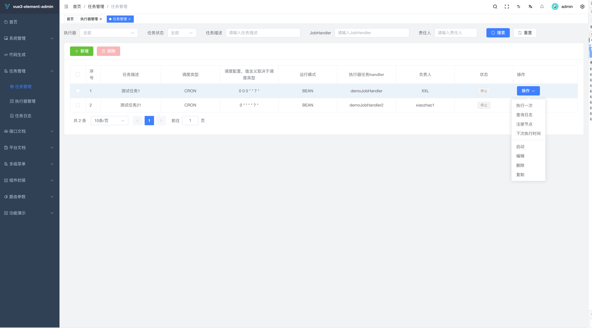
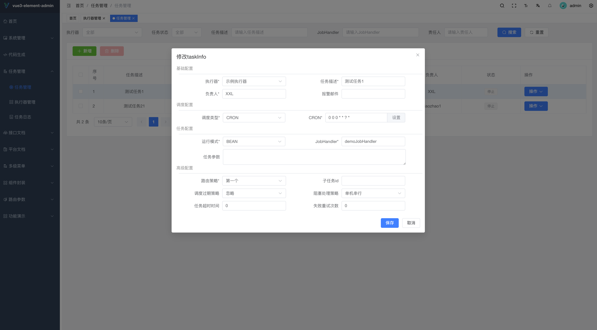
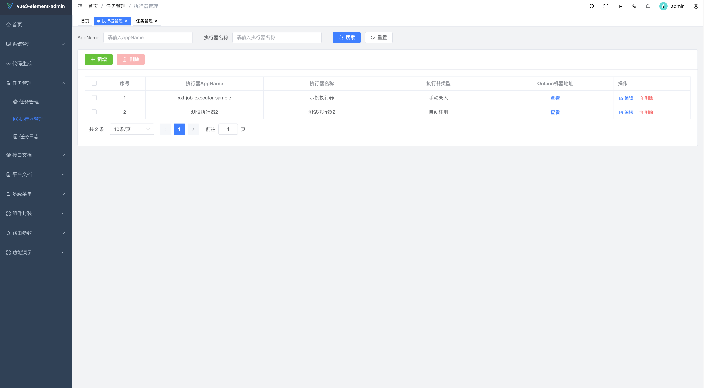
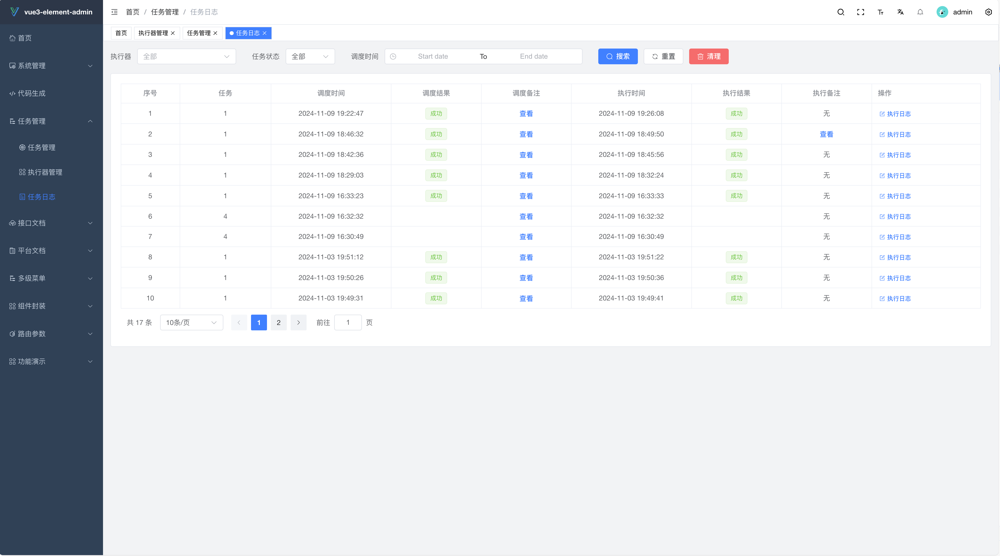
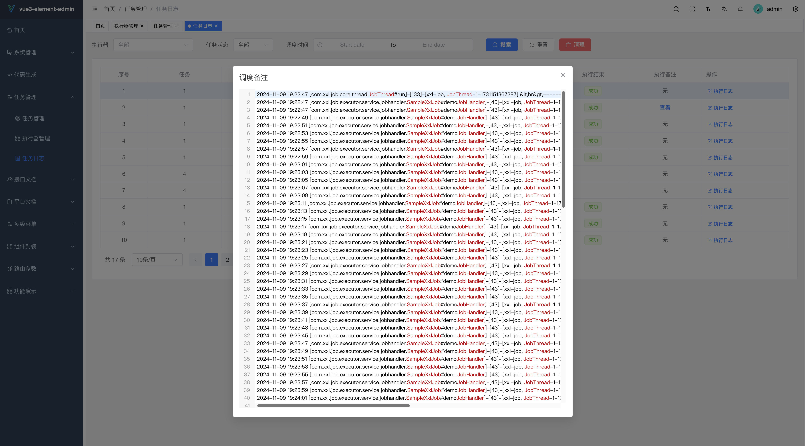

# vue3-xxl-job

<p align=center>
    vue3版本xxl-job
</p>
<p align="center">

## 项目介绍
使用vue3对xxl-job-admin模块进行重构，除了glue模块没有实现外，其他功能与xxl-job功能一致，支持二次开发

## 数据库地址
/doc/cc_job_admin.sql

# 项目运行
与xxl-job后端的配置一样，只不过`admin.addresses`地址要换成`8989`

示例配置
```yaml
### xxl-job admin address list, such as "http://address" or "http://address01,http://address02"
xxl.job.admin.addresses=http://127.0.0.1:8989/xxl-job-admin

### xxl-job, access token
xxl.job.accessToken=default_token

### xxl-job executor appname
xxl.job.executor.appname=xxl-job-executor-sample
### xxl-job executor registry-address: default use address to registry , otherwise use ip:port if address is null
xxl.job.executor.address=
### xxl-job executor server-info
xxl.job.executor.ip=
xxl.job.executor.port=9999
### xxl-job executor log-path
xxl.job.executor.logpath=/Users/zhaowenpeng/logs
### xxl-job executor log-retention-days
xxl.job.executor.logretentiondays=30
```
## 项目截图

|                                 |                                |
|:-------------------------------:|:------------------------------:|
|   |  |
|   |  |
|   |  |

