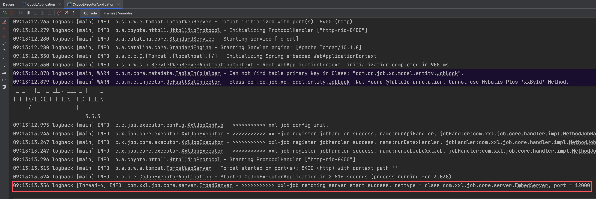

# 前端启动

下载项目后打开**vue3-cc-job-admin**

1. 下载依赖

   ```
   pnpm install
   ```

2. 运行项目

   ```
   pnpm run dev
   ```

3. 打包项目

   ```
   pnpm run build
   ```

# 后端启动

1. 创建cc-job-admin数据库

2. 修改cc-job-admin和cc-job-executor下的配置文件

   **cc-job-admin**配置文件修改,`xxl-job中需要配置日志文件路径！！`

   ```yaml
   server:
     port: 8989
   
   spring:
     jackson:
       ## 默认序列化时间格式
       date-format: yyyy-MM-dd HH:mm:ss
       ## 默认序列化时区
       time-zone: GMT+8
     datasource:
       type: com.alibaba.druid.pool.DruidDataSource
       driver-class-name: com.mysql.cj.jdbc.Driver
       url: jdbc:mysql://${host}:${port}/cc_job_admin?zeroDateTimeBehavior=convertToNull&useUnicode=true&characterEncoding=UTF-8&serverTimezone=Asia/Shanghai&autoReconnect=true&allowMultiQueries=true
       username: ${username}
       password: ${password}
     data:
       redis:
         database: 0
         host: ${host}
         port: ${port}
         # 如果Redis 服务未设置密码，需要将password删掉或注释，而不是设置为空字符串
         #password:
         timeout: 10s
         lettuce:
           pool:
             # 连接池最大连接数 默认8 ，负数表示没有限制
             max-active: 8
             # 连接池最大阻塞等待时间（使用负值表示没有限制） 默认-1
             max-wait: -1
             # 连接池中的最大空闲连接 默认8
             max-idle: 8
             # 连接池中的最小空闲连接 默认0
             min-idle: 0
     cache:
       enabled: false
       # 缓存类型 redis、none(不使用缓存)
       type: redis
       # 缓存时间(单位：ms)
       redis:
         time-to-live: 3600000
         # 缓存null值，防止缓存穿透
         cache-null-values: true
     # 邮件配置
     mail:
       host: smtp.youlai.tech
       port: 587
       username: your-email@example.com
       password: 123456
       properties:
         mail:
           smtp:
             auth: true
             starttls:
               enable: true
       # 邮件发送者
       from: youlaitech@163.com
   
   mybatis-plus:
     mapper-locations: classpath*:/mapper/**/*.xml
     global-config:
       db-config:
         # 主键ID类型
         id-type: none
         # 逻辑删除全局属性名(驼峰和下划线都支持)
         logic-delete-field: isDeleted
         # 逻辑删除-删除值
         logic-delete-value: 1
         # 逻辑删除-未删除值
         logic-not-delete-value: 0
     configuration:
       # 驼峰下划线转换
       map-underscore-to-camel-case: true
       # 这个配置会将执行的sql打印出来，在开发或测试的时候可以用
       # log-impl: org.apache.ibatis.logging.stdout.StdOutImpl
   
   # xxl-job 定时任务配置
   xxl:
     job:
       i18n: zh_CN
       accessToken: default_token
       triggerpool:
         fast:
           max: 200
         slow:
           max: 200
       logretentiondays: 30
       logpath: XXXXXX #日志文件地址
   ```

   cc-job-executor下的配置文件

   - cc-job.executor.jsonpath：临时存放json文件的路径，使用datax工具时需要配置
   - cc-job.pypath：存放datax.py的路径位置，使用datax工具时需要配置

   ```yaml
   server:
     port: 8400
   
   logging:
     config: classpath:logback.xml
   
   spring:
     jackson:
       ## 默认序列化时间格式
       date-format: yyyy-MM-dd HH:mm:ss
       ## 默认序列化时区
       time-zone: GMT+8
     datasource:
       type: com.alibaba.druid.pool.DruidDataSource
       driver-class-name: com.mysql.cj.jdbc.Driver
       url: jdbc:mysql://${host}:${port}/cc_job_admin?zeroDateTimeBehavior=convertToNull&useUnicode=true&characterEncoding=UTF-8&serverTimezone=Asia/Shanghai&autoReconnect=true&allowMultiQueries=true
       username: ${username}
       password: ${password}
   
   mybatis-plus:
     mapper-locations: classpath*:/mapper/**/*.xml
     global-config:
       db-config:
         # 主键ID类型
         id-type: none
         # 逻辑删除全局属性名(驼峰和下划线都支持)
         logic-delete-field: isDeleted
         # 逻辑删除-删除值
         logic-delete-value: 1
         # 逻辑删除-未删除值
         logic-not-delete-value: 0
     configuration:
       # 驼峰下划线转换
       map-underscore-to-camel-case: true
       # 这个配置会将执行的sql打印出来，在开发或测试的时候可以用
       # log-impl: org.apache.ibatis.logging.stdout.StdOutImpl
   
   cc-job:
     job:
       admin:
         ### datax admin address list, such as "http://address" or "http://address01,http://address02"
         #addresses: http://127.0.0.1:8080
         addresses: http://127.0.0.1:8989/xxl-job-admin,http://127.0.0.1:8990/xxl-job-admin
       executor:
         appname: cc-job-executor
         address:
         ip:
         #port: 9999
         port: 12000
         ### job log path
         #logpath: ./data/applogs/executor/jobhandler
         logpath: /Users/zhaowenpeng/logs
         ### job log retention days
         logretentiondays: 30
       ### job, access token
       accessToken: default_token
   
     executor:
       #jsonpath: D:\\temp\\executor\\json\\
       jsonpath:  XXX #临时存放json文件的路径
   
     #pypath: F:\tools\datax\bin\datax.py
     pypath: XXX #datax.py的路径位置
   ```

3. 启动项目

启动**cc-job-admin**下的**CcJobApplication**和**cc-job-executor**下的**CcJobExecutorApplication**，观察是否注册成功



