# datax数据同步功能

## 功能介绍

支持mysql，oracle数据库之间的同步，后续会支持更多的数据源

## datax安装

**1.下载datax安装包并解压**

下载地址`https://datax-opensource.oss-cn-hangzhou.aliyuncs.com/202308/datax.tar.gz`

**2.测试datax功能**

```python
python ./bin/datax.py ./job/job.json
```

**3.出现以下内容表示执行成功**


------

## 功能演示

### MYSQL-MYSQL之间的数据同步

**1.首先需要配置cc-job-executor下的application.yml**

- cc-job.executor.jsonpath：这是json存放的临时位置，可以任务指定
- cc-job.pypthon：这里datax.py的存放位置，路径在datax安装包下的bin文件夹中 `datax->bin->datax.py`

```yaml
cc-job:
  job:
    admin:
      ### datax admin address list, such as "http://address" or "http://address01,http://address02"
      #addresses: http://127.0.0.1:8080
      addresses: http://127.0.0.1:8989/xxl-job-admin,http://127.0.0.1:8990/xxl-job-admin
    executor:
      appname: cc-job-executor
      address:
      ip:
      #port: 9999
      port: 12000
      ### job log path
      #logpath: ./data/applogs/executor/jobhandler
      logpath: /Users/zhaowenpeng/logs
      ### job log retention days
      logretentiondays: 30
    ### job, access token
    accessToken: default_token

  executor:
    #jsonpath: D:\\temp\\executor\\json\\
    jsonpath:  /Users/zhaowenpeng/Downloads/datax/

  #pypath: F:\tools\datax\bin\datax.py
  pypath: /Users/zhaowenpeng/Downloads/datax/bin/datax.py
```

**2.启动cc-job-admin和cc-job-executor**

**3.创建datax执行器**

端口设置为cc-job-executor下的port


**4.创建需要同步的数据表**

演示将yanhuo.t_user_oper_log表中的数据全量同步到yanhuo_test.t_user_oper_log表中

|  |  |
| ------------------------------------------------------------ | ------------------------------------------------------------ |

**5.在页面中创建2个数据源**


**6.创建数据同步任务**

1. 创建reader，读取yanhuo表
2. 创建writer，写入yanhuo-test表
3. 创建全量任务

|  |  |
| ------------------------------------------------------------ | ------------------------------------------------------------ |
|  |                                                              |

json文件展示

```json
{
  "job": {
    "content": [
      {
        "reader": {
          "name": "mysqlreader",
          "parameter": {
            "username": "root",
            "password": "root",
            "connection": [
              {
                "jdbcUrl": [
                  "jdbc:mysql://localhost:3306/yanhuo"
                ],
                "table": [
                  "t_user_oper_log"
                ]
              }
            ],
            "column": [
              "id",
              "title",
              "business_type",
              "method",
              "request_method",
              "operator_type",
              "oper_name",
              "oper_url",
              "oper_ip",
              "oper_location",
              "oper_param",
              "json_result",
              "status",
              "error_msg",
              "oper_time",
              "cost_time",
              "oper_uid"
            ]
          }
        },
        "writer": {
          "name": "mysqlwriter",
          "parameter": {
            "username": "root",
            "password": "root",
            "connection": [
              {
                "jdbcUrl": "jdbc:mysql://localhost:3306/yanhuo-test",
                "table": [
                  "t_user_oper_log"
                ]
              }
            ],
            "column": [
              "id",
              "title",
              "business_type",
              "method",
              "request_method",
              "operator_type",
              "oper_name",
              "oper_url",
              "oper_ip",
              "oper_location",
              "oper_param",
              "json_result",
              "status",
              "error_msg",
              "oper_time",
              "cost_time",
              "oper_uid"
            ],
            "writeMode": "insert"
          }
        }
      }
    ],
    "setting": {
      "speed": {
        "channel": 3,
        "byte": -1
      },
      "errorLimit": {
        "record": 0,
        "percentage": 0.02
      }
    }
  }
}
```

- 执行任务,观察运行日志

  |               |  |
  | ------------------------------------------------------------ | ------------------------------------------------------------ |
  |  |                                                              |


### MYSQL-ORACLE之间的数据同步

1.首先在oracle中创建一个同步的**O_YANHUO**数据库

2.在页面中创建同步任务

3.创建writer任务

4.创建同步任务

5.观察同步日志

|  |  |
| ------------------------------------------------------------ | ------------------------------------------------------------ |
|  |  |
|  |  |

### 数据增量备份

通过设置where条件实现数据的增量备份

#### 主键增量备份

通过设置主键实现数据的增量备份,演示**MYSQL-ORACLE**主键自增同步。将**yanhuo**中**t_note**表中的数据同步到**ORACLE->T_NOTE**中，只同步`id>1839940327255855106`的数据

**参数值设置**

- 表头列：自增的数据列
- 数据值：增量的数据值
- 参数值：datax动态参数设置
- 时间格式：时间增量同步时设置格式化时间

|  |  |
| ------------------------------------------------------------ | ------------------------------------------------------------ |

| ! |  |
| ------------------------------------------------------------ | ------------------------------------------------------------ |

保存成功后会插入一条新的数据到job_info表中，在页面点击运行观察数据库的更新，**id字段值发生改变**

> [!NOTE]
>
> ID：1839940327255855106  -> 1868108544427970562

|  |  |
| ------------------------------------------------------------ | ----------------------------------------------- |

查看oracle中数据是否同步成功

|  |  |
| ----------------------------------------------- | ----------------------------------------------- |


#### 时间增量备份

与主键增量备份一样...

## 多表关联备份

> [!NOTE]
>
> 如果使用多表关联，columns不需要选择！！！

|  |      |
| ------------------------------------------------------------ | ---- |

## 其他数据源备份

如果想实现其他数据源之间的同步，可以直接在任务管理模块新建**datax**任务，然后将需要同步的**json**复制到json模版中即可，**数据源同步页面只是方便我们快捷的创建json模块**

|  |  |
| ----------------------------------------------- | ----------------------------------------------- |

# 可视化任务编排

## 单任务串并联运行

- 创建一个任务组

  > [!WARNING]
  >
  > **任务超时时间必须设置，默认10分钟**

  |  |  |
  | ------------------------------------------------------------ | ----------------------------------------------- |

- 点击运行观察任务的运行结果

  当任务运行成功时，节点演示会变成**绿色**，运行失败会显示**红色**，运行中的任务显示**黄色**

  运行中开始之前可以预测每一个任务节点的**开始时间**和**完成时间**

  |  |  |
  | ----------------------------------------------- | ----------------------------------------------- |
  | 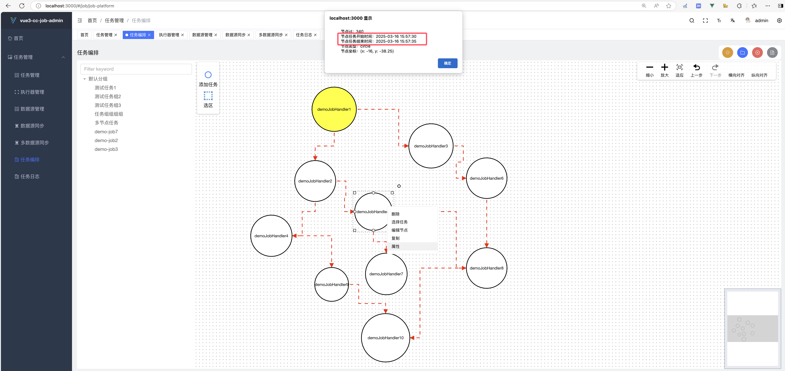 |                                                 |

- 运行的日志可以在任务日志中查看

  - 任务组日志会记录子任务的运行情况，运行失败的信息也会记录到任务组日志中
  - 单节点任务会记录所有任务的执行信息

  | 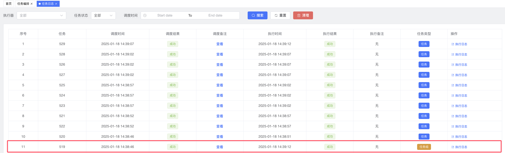 | 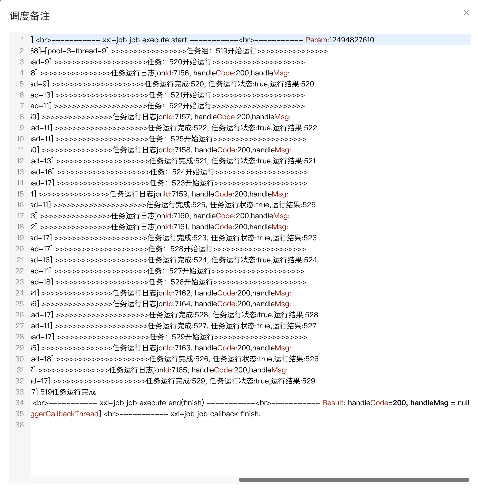 |
  | ----------------------------------------------- | ----------------------------------------------- |

  以下是控制台输出

  ```apl
  >>>>>>>> demoJobHandler1 start
  demoJobHandler1 beat at:0
  demoJobHandler1 beat at:1
  demoJobHandler1 beat at:2
  demoJobHandler1 beat at:3
  demoJobHandler1 beat at:4
  demoJobHandler1 beat at:5
  demoJobHandler1 beat at:6
  demoJobHandler1 beat at:7
  demoJobHandler1 beat at:8
  demoJobHandler1 beat at:9
  >>>>>>>> demoJobHandler1 end
  >>>>>>>> demoJobHandler3 start
  demoJobHandler3 beat at:0
  >>>>>>>> demoJobHandler2 start
  demoJobHandler2 beat at:0
  demoJobHandler3 beat at:1
  demoJobHandler2 beat at:1
  demoJobHandler3 beat at:2
  demoJobHandler2 beat at:2
  demoJobHandler3 beat at:3
  demoJobHandler2 beat at:3
  demoJobHandler3 beat at:4
  demoJobHandler2 beat at:4
  demoJobHandler3 beat at:5
  demoJobHandler2 beat at:5
  demoJobHandler3 beat at:6
  demoJobHandler2 beat at:6
  demoJobHandler3 beat at:7
  demoJobHandler2 beat at:7
  demoJobHandler3 beat at:8
  demoJobHandler2 beat at:8
  demoJobHandler3 beat at:9
  demoJobHandler2 beat at:9
  >>>>>>>> demoJobHandler3 end
  >>>>>>>> demoJobHandler2 end
  >>>>>>>> demoJobHandler6 start
  demoJobHandler6 beat at:0
  demoJobHandler5 beat at:0
  >>>>>>>> demoJobHandler1 start
  demoJobHandler4 beat at:0
  demoJobHandler6 beat at:1
  demoJobHandler5 beat at:1
  demoJobHandler4 beat at:1
  demoJobHandler6 beat at:2
  demoJobHandler5 beat at:2
  demoJobHandler4 beat at:2
  demoJobHandler6 beat at:3
  demoJobHandler5 beat at:3
  demoJobHandler4 beat at:3
  demoJobHandler6 beat at:4
  demoJobHandler5 beat at:4
  demoJobHandler4 beat at:4
  demoJobHandler6 beat at:5
  demoJobHandler5 beat at:5
  demoJobHandler4 beat at:5
  demoJobHandler6 beat at:6
  demoJobHandler5 beat at:6
  demoJobHandler4 beat at:6
  demoJobHandler6 beat at:7
  demoJobHandler4 beat at:7
  demoJobHandler5 beat at:7
  demoJobHandler6 beat at:8
  demoJobHandler4 beat at:8
  demoJobHandler5 beat at:8
  demoJobHandler6 beat at:9
  demoJobHandler4 beat at:9
  demoJobHandler5 beat at:9
  >>>>>>>> demoJobHandler6 end
  >>>>>>>> demoJobHandler4 end
  >>>>>>>> demoJobHandler9 start
  demoJobHandler9 beat at:0
  >>>>>>>> demoJobHandler7 start
  demoJobHandler7 beat at:0
  >>>>>>>> demoJobHandler8 start
  demoJobHandler8 beat at:0
  demoJobHandler7 beat at:1
  demoJobHandler9 beat at:1
  demoJobHandler8 beat at:1
  demoJobHandler9 beat at:2
  demoJobHandler7 beat at:2
  demoJobHandler8 beat at:2
  demoJobHandler9 beat at:3
  demoJobHandler8 beat at:3
  demoJobHandler7 beat at:3
  demoJobHandler8 beat at:4
  demoJobHandler7 beat at:4
  demoJobHandler9 beat at:4
  demoJobHandler7 beat at:5
  demoJobHandler9 beat at:5
  demoJobHandler8 beat at:5
  demoJobHandler9 beat at:6
  demoJobHandler8 beat at:6
  demoJobHandler7 beat at:6
  demoJobHandler8 beat at:7
  demoJobHandler9 beat at:7
  demoJobHandler7 beat at:7
  demoJobHandler9 beat at:8
  demoJobHandler7 beat at:8
  demoJobHandler8 beat at:8
  demoJobHandler8 beat at:9
  demoJobHandler7 beat at:9
  demoJobHandler9 beat at:9
  >>>>>>>> demoJobHandler9 end
  >>>>>>>> demoJobHandler7 end
  >>>>>>>> demoJobHandler8 end
  >>>>>>>> demoJobHandler10 start
  demoJobHandler10 beat at:0
  demoJobHandler10 beat at:1
  demoJobHandler10 beat at:2
  demoJobHandler10 beat at:3
  demoJobHandler10 beat at:4
  demoJobHandler10 beat at:5
  demoJobHandler10 beat at:6
  demoJobHandler10 beat at:7
  demoJobHandler10 beat at:8
  demoJobHandler10 beat at:9
  >>>>>>>> demoJobHandler10 end
  ```

## 模拟单节点任务运行失败

**模拟任务5运行失败，后面的任务7不会继续运行**

- 更改任务5的代码

  ```java
  @XxlJob("demoJobHandler5")
      public void demoJobHandler5() throws Exception {
  
          XxlJobHelper.log(">>>>>>>> demoJobHandler5 start");
          System.out.println(">>>>>>>> demoJobHandler5 start");
  
          for (int i = 0; i < 10; i++) {
              XxlJobHelper.log("demoJobHandler5 beat at:" + i);
              System.out.println("demoJobHandler5 beat at:" + i);
              TimeUnit.SECONDS.sleep(1);
          }
          //default success
  //        XxlJobHelper.log(">>>>>>>> demoJobHandler5 end");
  //        System.out.println(">>>>>>>> demoJobHandler5 end");
          throw new RuntimeException("任务5运行失败");
      }
  ```

- 重新执行任务，并观察日志

  | 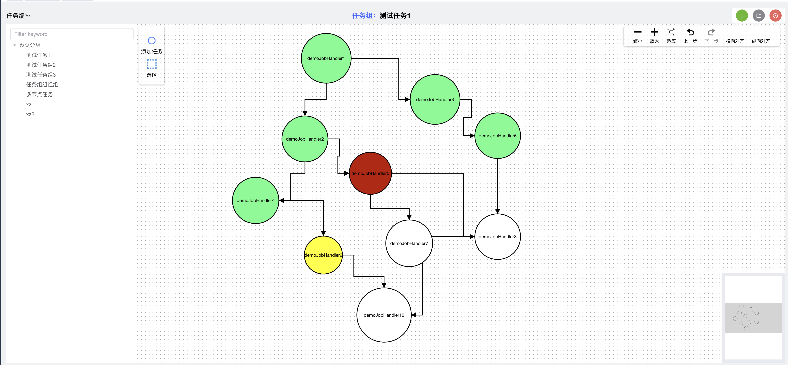 | 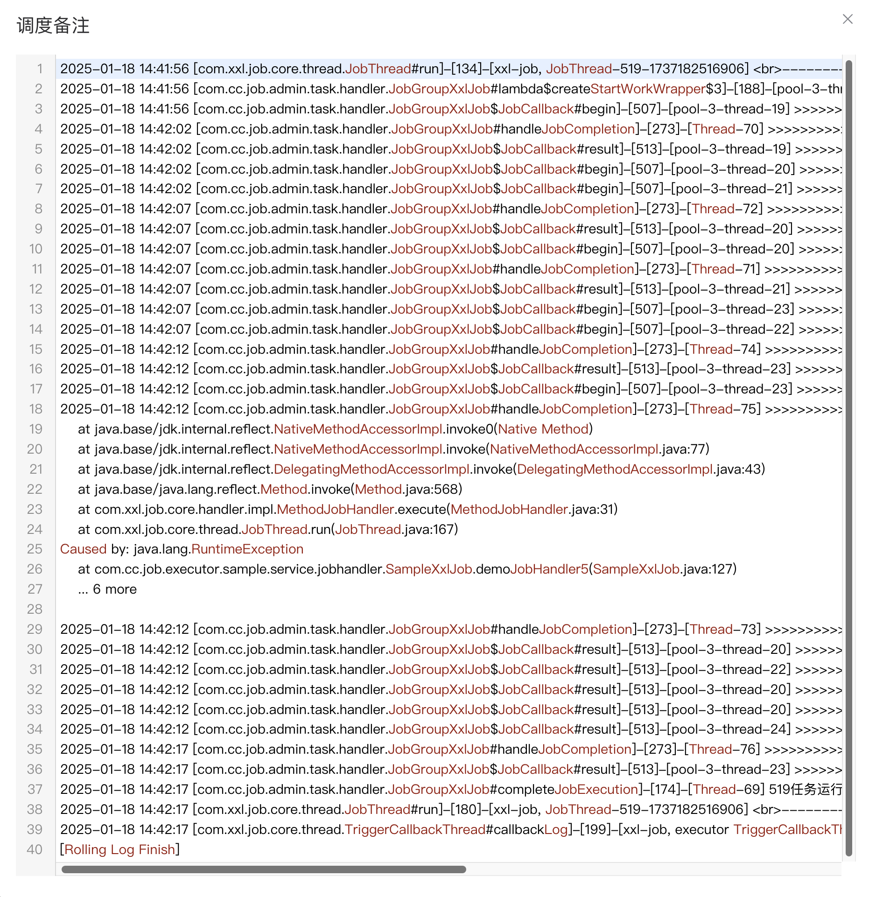 |
  | ----------------------------------------------- | ----------------------------------------------- |

### 忽略失败的子任务

更新子任务的失败策略会`忽略`,后面依赖的任务节点不会因为当前节点的失败而停止运行

| 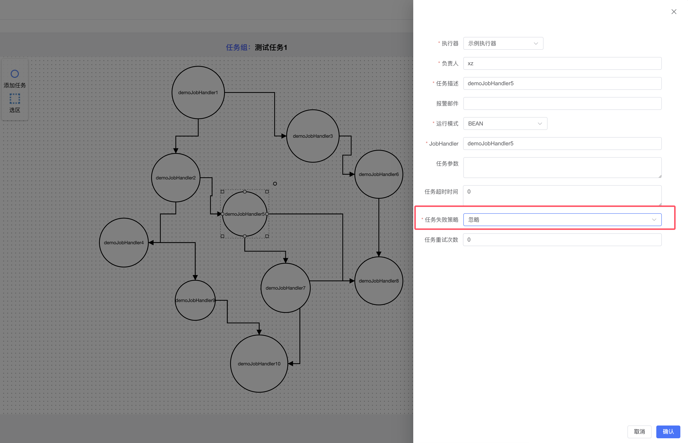 | 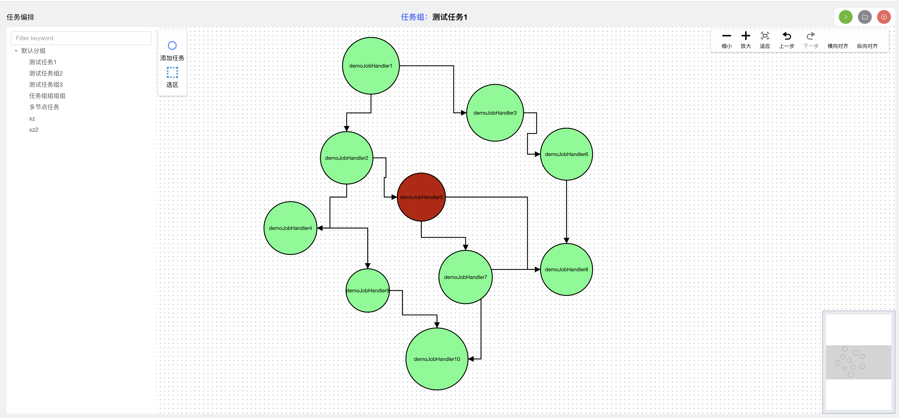 |
| ----------------------------------------------- | ----------------------------------------------- |

------

### 任务失败重试

模拟任务5运行失败2次后任务运行成功，任务7会等待任务5重试3次后成功则继续运行

- 更改demo5的代码

  ```java
  @XxlJob("demoJobHandler5")
      public void demoJobHandler5() throws Exception {
  
          XxlJobHelper.log(">>>>>>>> demoJobHandler5 start");
  
          for (int i = 0; i < 10; i++) {
              XxlJobHelper.log("demoJobHandler5 beat at:" + i);
              System.out.println("demoJobHandler5 beat at:" + i);
              TimeUnit.SECONDS.sleep(1);
          }
          //default success
          if(count.incrementAndGet()<=2){
              System.out.println(">>>>>>>>count"+count.get());
              throw  new RuntimeException();
          }
          XxlJobHelper.log(">>>>>>>> demoJobHandler5 end");
      }
  ```

- 更改任务节点5的失败重试次数。

  > [!CAUTION]
  >
  > **任务失败策略必须是单机串行，不然任务7会直接执行，不会等待任务5运行3次后才执行**

  | 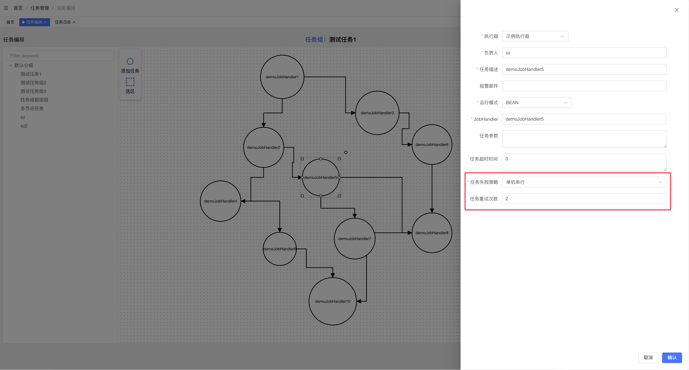 | 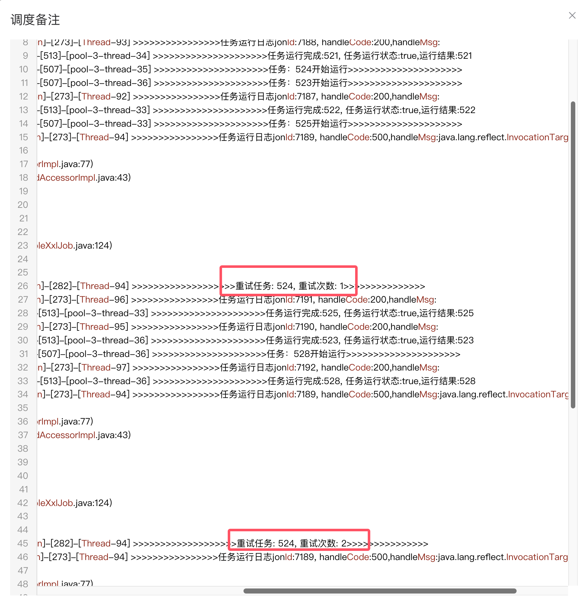 |
  | ----------------------------------------------- | --------------------------------- |

- 模拟子任务运行超时

  设置任务5的运行时间只有2秒

| 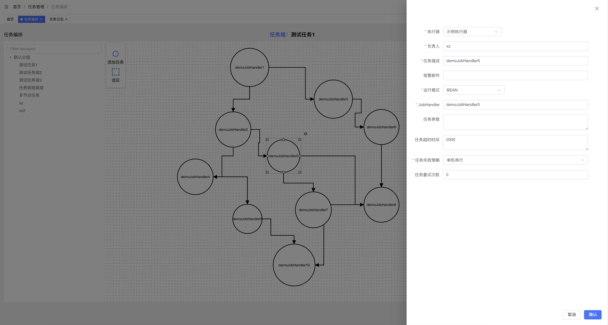 | 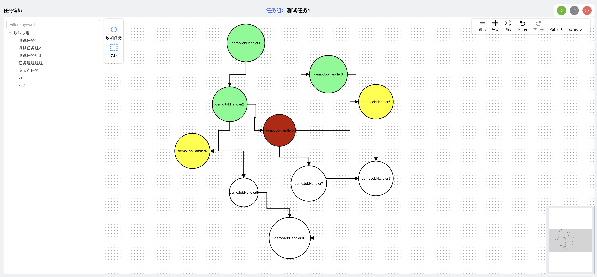 |
| ----------------------------------------------- | ----------------------------------------------- |

## 单任务与任务组之间的串并联运行

如果仅仅是单任务之间的串联无法提现这个工具的强大，任务组中包含任务组要怎么运行呢？

如下图所示job5，job6，job7是job2的子任务，job8，job9，job10是job3的子任务，而job11，job12又是job7的子任务，这要怎么运行呢？

**我们可以考虑把多维图进行转化，多个任务组转化成一个任务组进行运行，因此我们需要把上面的图稍微改变一下**

|  |  |
| ----------------------------------------------- | ----------------------------------------------- |

- 创建任务和任务组

  任务组的边框会随着节点运行情况而发生改变，当任务组里面的节点运行时，任务组的边框会变成`黄色`,当任务组的节点运行失败时，任务组的边框会变成`红色`，当任务组中所有任务运行完成时，任务组的边框会变成`绿色`

  | 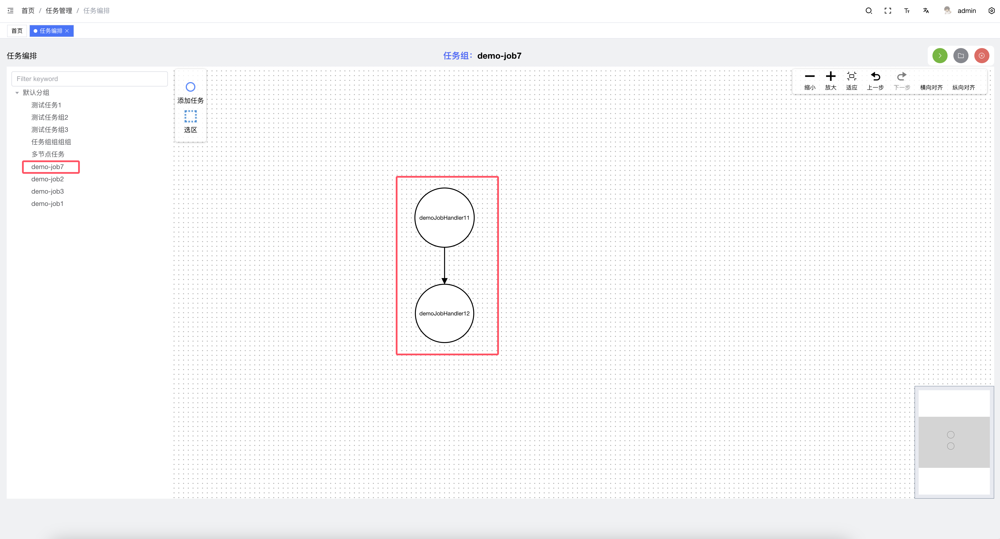 | 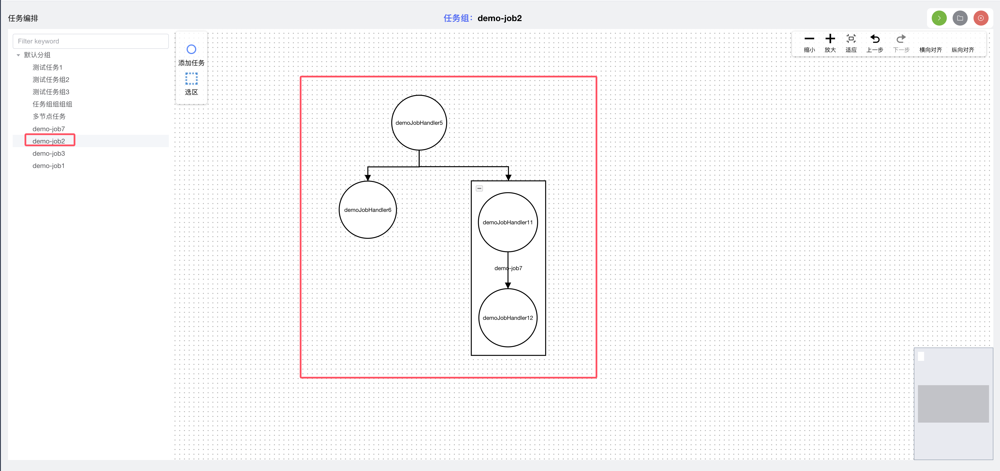 |
  | ----------------------------------------------- | ----------------------------------------------- |
  | 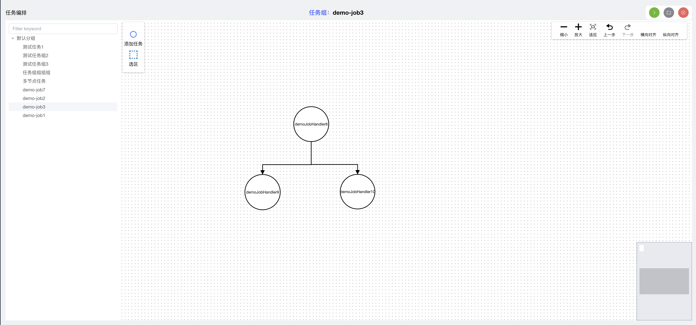 | 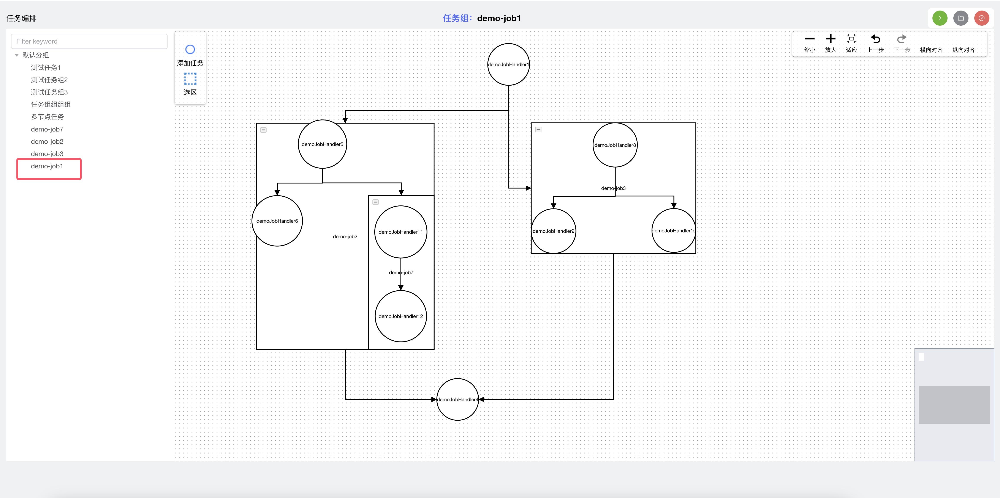 |
  | 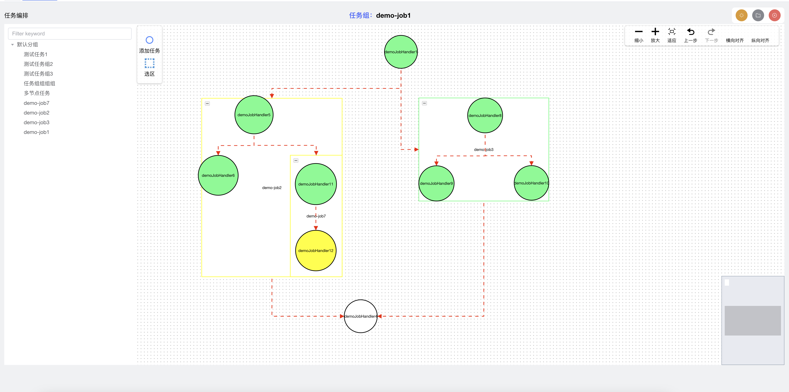 | 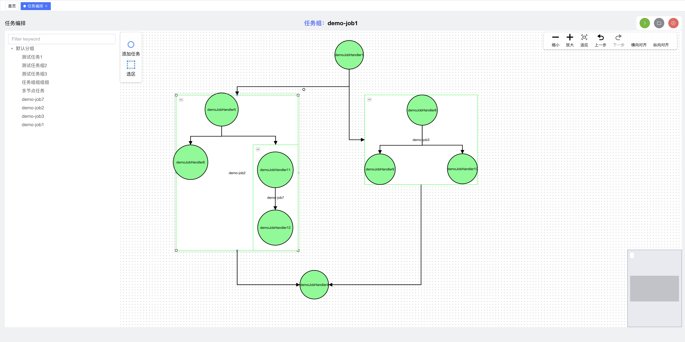 |

- 以下是任务的运行日志，有兴趣的小伙伴可以自己下载源码尝试

  ```apl
  >>>>>>>> demoJobHandler1 start
  demoJobHandler1 beat at:0
  demoJobHandler1 beat at:1
  demoJobHandler1 beat at:2
  demoJobHandler1 beat at:3
  demoJobHandler1 beat at:4
  demoJobHandler1 beat at:5
  demoJobHandler1 beat at:6
  demoJobHandler1 beat at:7
  demoJobHandler1 beat at:8
  demoJobHandler1 beat at:9
  >>>>>>>> demoJobHandler1 end
  08:12:11.786 logback [xxl-job, EmbedServer bizThreadPool-1840373440] INFO  c.x.job.core.executor.XxlJobExecutor - >>>>>>>>>>> xxl-job register JobThread success, jobId:657, handler:com.xxl.job.core.handler.impl.MethodJobHandler@581b1c08[class com.cc.job.executor.sample.service.jobhandler.SampleXxlJob#demoJobHandler8]
  >>>>>>>> demoJobHandler8 start
  demoJobHandler8 beat at:0
  08:12:11.789 logback [xxl-job, EmbedServer bizThreadPool-1840373440] INFO  c.x.job.core.executor.XxlJobExecutor - >>>>>>>>>>> xxl-job register JobThread success, jobId:651, handler:com.xxl.job.core.handler.impl.MethodJobHandler@193bb809[class com.cc.job.executor.sample.service.jobhandler.SampleXxlJob#demoJobHandler5]
  demoJobHandler5 beat at:0
  demoJobHandler8 beat at:1
  demoJobHandler5 beat at:1
  demoJobHandler8 beat at:2
  demoJobHandler5 beat at:2
  demoJobHandler8 beat at:3
  demoJobHandler5 beat at:3
  demoJobHandler8 beat at:4
  demoJobHandler5 beat at:4
  demoJobHandler8 beat at:5
  demoJobHandler5 beat at:5
  demoJobHandler8 beat at:6
  demoJobHandler5 beat at:6
  demoJobHandler8 beat at:7
  demoJobHandler5 beat at:7
  demoJobHandler8 beat at:8
  demoJobHandler5 beat at:8
  demoJobHandler8 beat at:9
  demoJobHandler5 beat at:9
  >>>>>>>> demoJobHandler8 end
  08:12:16.865 logback [xxl-job, EmbedServer bizThreadPool-1840373440] INFO  c.x.job.core.executor.XxlJobExecutor - >>>>>>>>>>> xxl-job register JobThread success, jobId:652, handler:com.xxl.job.core.handler.impl.MethodJobHandler@64b018f3[class com.cc.job.executor.sample.service.jobhandler.SampleXxlJob#demoJobHandler6]
  08:12:16.867 logback [xxl-job, EmbedServer bizThreadPool-1840373440] INFO  c.x.job.core.executor.XxlJobExecutor - >>>>>>>>>>> xxl-job register JobThread success, jobId:659, handler:com.xxl.job.core.handler.impl.MethodJobHandler@78b7f805[class com.cc.job.executor.sample.service.jobhandler.SampleXxlJob#demoJobHandler10]
  >>>>>>>> demoJobHandler6 start
  demoJobHandler6 beat at:0
  >>>>>>>> demoJobHandler10 start
  08:12:16.868 logback [xxl-job, EmbedServer bizThreadPool-1840373440] INFO  c.x.job.core.executor.XxlJobExecutor - >>>>>>>>>>> xxl-job register JobThread success, jobId:658, handler:com.xxl.job.core.handler.impl.MethodJobHandler@1c240cf2[class com.cc.job.executor.sample.service.jobhandler.SampleXxlJob#demoJobHandler9]
  demoJobHandler10 beat at:0
  >>>>>>>> demoJobHandler9 start
  demoJobHandler9 beat at:0
  08:12:16.880 logback [xxl-job, EmbedServer bizThreadPool-1840373440] INFO  c.x.job.core.executor.XxlJobExecutor - >>>>>>>>>>> xxl-job register JobThread success, jobId:654, handler:com.xxl.job.core.handler.impl.MethodJobHandler@58f2466c[class com.cc.job.executor.sample.service.jobhandler.SampleXxlJob#demoJobHandler11]
  >>>>>>>> demoJobHandler11 start
  demoJobHandler11 beat at:0
  demoJobHandler10 beat at:1
  demoJobHandler6 beat at:1
  demoJobHandler9 beat at:1
  demoJobHandler11 beat at:1
  demoJobHandler10 beat at:2
  demoJobHandler6 beat at:2
  demoJobHandler9 beat at:2
  demoJobHandler11 beat at:2
  demoJobHandler10 beat at:3
  demoJobHandler6 beat at:3
  demoJobHandler9 beat at:3
  demoJobHandler11 beat at:3
  demoJobHandler6 beat at:4
  demoJobHandler10 beat at:4
  demoJobHandler9 beat at:4
  demoJobHandler11 beat at:4
  demoJobHandler10 beat at:5
  demoJobHandler6 beat at:5
  demoJobHandler9 beat at:5
  demoJobHandler11 beat at:5
  demoJobHandler6 beat at:6
  demoJobHandler10 beat at:6
  demoJobHandler9 beat at:6
  demoJobHandler11 beat at:6
  demoJobHandler6 beat at:7
  demoJobHandler10 beat at:7
  demoJobHandler9 beat at:7
  demoJobHandler11 beat at:7
  demoJobHandler6 beat at:8
  demoJobHandler9 beat at:8
  demoJobHandler10 beat at:8
  demoJobHandler11 beat at:8
  demoJobHandler6 beat at:9
  demoJobHandler9 beat at:9
  demoJobHandler10 beat at:9
  demoJobHandler11 beat at:9
  >>>>>>>> demoJobHandler9 end
  >>>>>>>> demoJobHandler6 end
  >>>>>>>> demoJobHandler10 end
  >>>>>>>> demoJobHandler11 end
  08:12:21.962 logback [xxl-job, EmbedServer bizThreadPool-1840373440] INFO  c.x.job.core.executor.XxlJobExecutor - >>>>>>>>>>> xxl-job register JobThread success, jobId:655, handler:com.xxl.job.core.handler.impl.MethodJobHandler@5809fa26[class com.cc.job.executor.sample.service.jobhandler.SampleXxlJob#demoJobHandler12]
  >>>>>>>> demoJobHandler12 start
  demoJobHandler12 beat at:0
  demoJobHandler12 beat at:1
  demoJobHandler12 beat at:2
  demoJobHandler12 beat at:3
  demoJobHandler12 beat at:4
  demoJobHandler12 beat at:5
  demoJobHandler12 beat at:6
  demoJobHandler12 beat at:7
  demoJobHandler12 beat at:8
  demoJobHandler12 beat at:9
  >>>>>>>> demoJobHandler12 end
  08:12:27.077 logback [xxl-job, EmbedServer bizThreadPool-1840373440] INFO  c.x.job.core.executor.XxlJobExecutor - >>>>>>>>>>> xxl-job register JobThread success, jobId:649, handler:com.xxl.job.core.handler.impl.MethodJobHandler@125d47c4[class com.cc.job.executor.sample.service.jobhandler.SampleXxlJob#demoJobHandler4]
  >>>>>>>> demoJobHandler1 start
  demoJobHandler4 beat at:0
  demoJobHandler4 beat at:1
  demoJobHandler4 beat at:2
  demoJobHandler4 beat at:3
  demoJobHandler4 beat at:4
  demoJobHandler4 beat at:5
  demoJobHandler4 beat at:6
  demoJobHandler4 beat at:7
  demoJobHandler4 beat at:8
  demoJobHandler4 beat at:9
  >>>>>>>> demoJobHandler4 end
  ```

### 节点运行失败

模拟demoJobHandler12节点运行失败

```java
    @XxlJob("demoJobHandler12")
    public void demoJobHandler12() throws Exception {

        XxlJobHelper.log(">>>>>>>> demoJobHandler12 start");
        System.out.println(">>>>>>>> demoJobHandler12 start");

        for (int i = 0; i < 10; i++) {
            XxlJobHelper.log("demoJobHandler12 beat at:" + i);
            System.out.println("demoJobHandler12 beat at:" + i);
            TimeUnit.MILLISECONDS.sleep(500);
        }
        //default success
//        XxlJobHelper.log(">>>>>>>> demoJobHandler12 end");
//        System.out.println(">>>>>>>> demoJobHandler12 end");
        throw  new RuntimeException("节点12运行失败");
    }
```


| 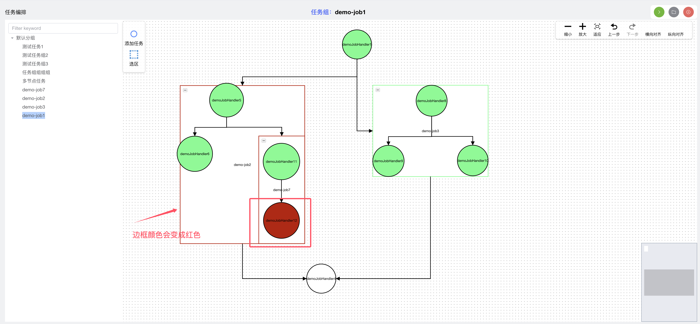 | 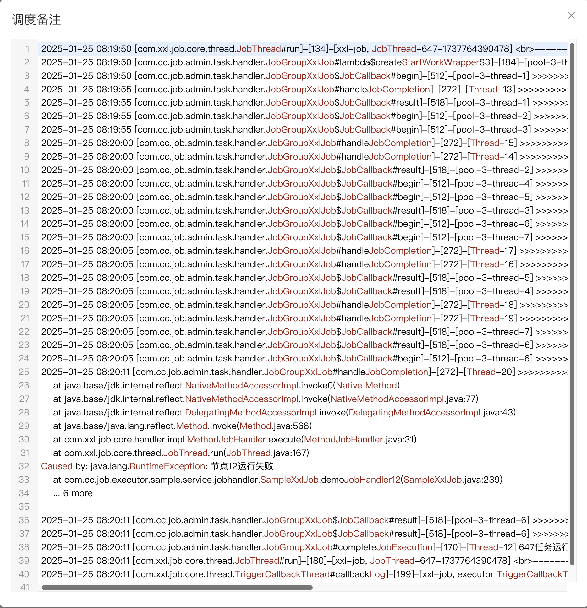 |
| ----------------------------------------------- | ----------------------------------------------- |

### 忽略节点失败

将demoJobHandler12的**任务失败策略**改为`忽略`

| 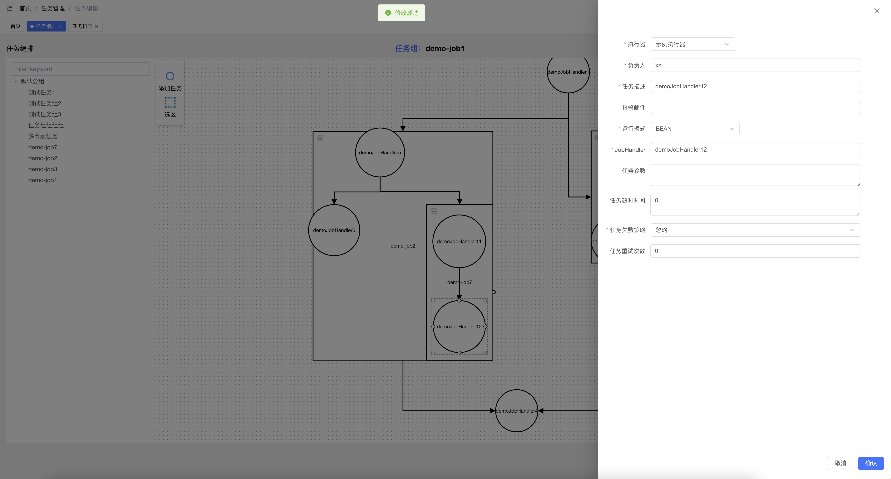 | 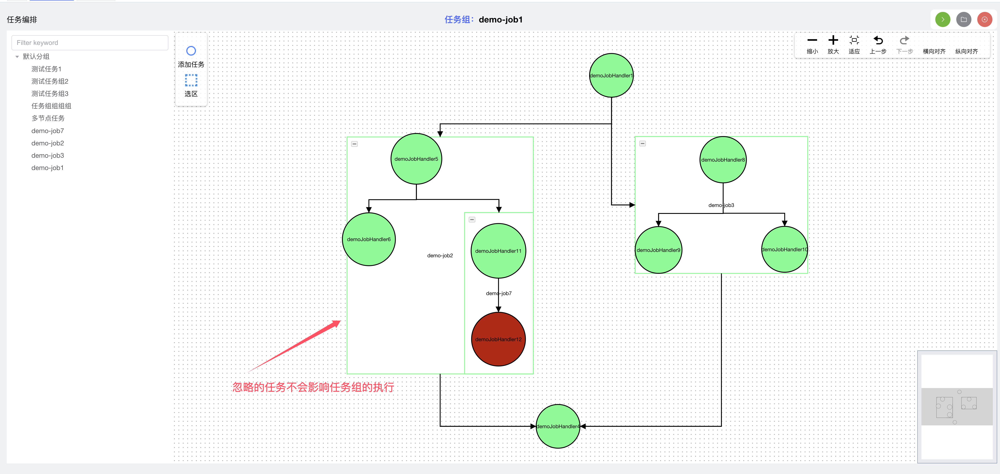 |
| ----------------------------------------------- | ----------------------------------------------- |

### 任务失败重试

将demoJobHandler12的**任务失败次数**改为2次

| 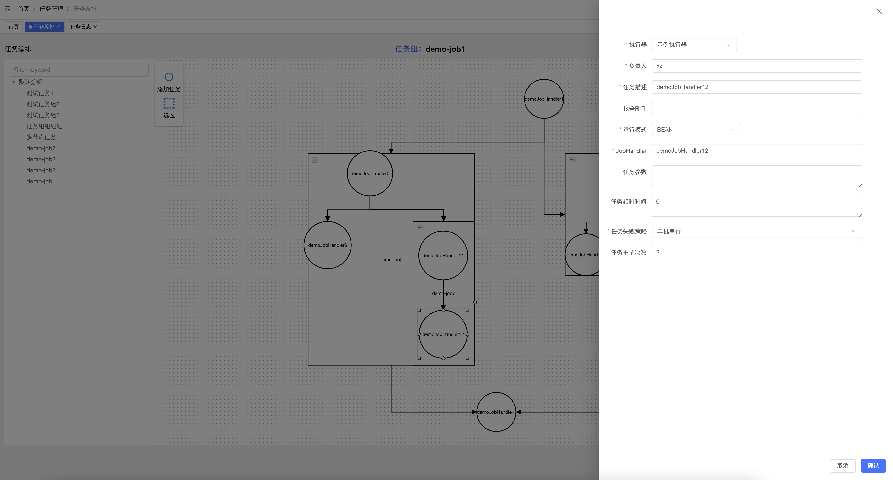 | 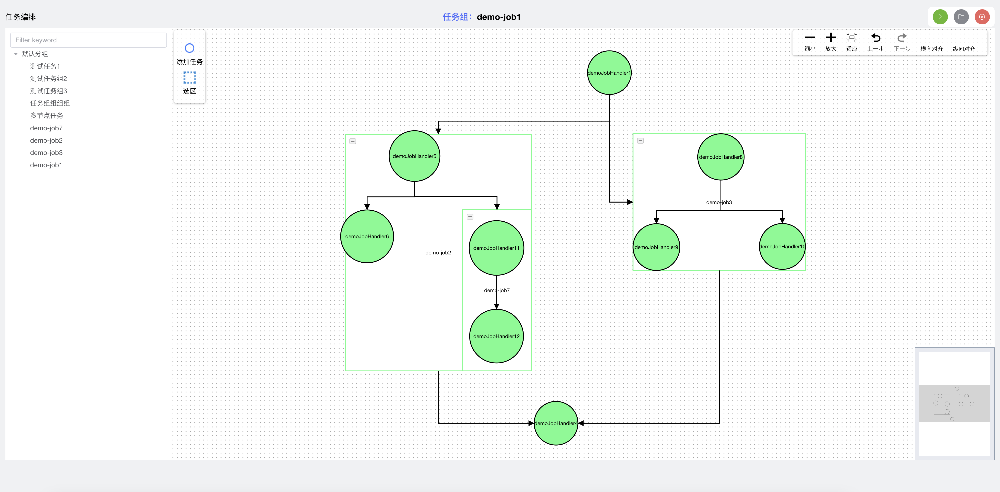 |
| ----------------------------------------------- | ----------------------------------------------- |
| 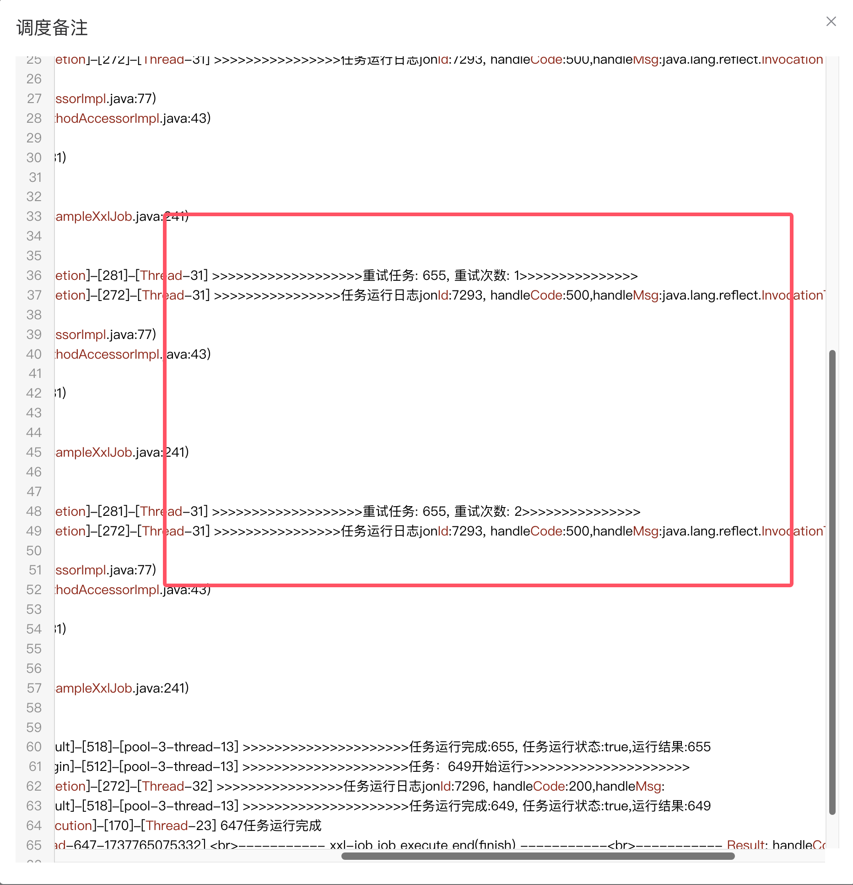 |                                                 |


## 模拟多节点下的任务操作

启动多个**admin**模块和多个**执行器**，调用其中一个任务组观察任务是否能成功运行

- 分别以**8989，8990**端口启动**admin**模块，并启动2个执行器

|  |      |
| ----------------------------------------------- | ---- |
|                                                 |      |


- 执行器1-application.properties

  ```properties
  # web port
  server.port=8081
  # no web
  #spring.main.web-environment=false
  
  # log config
  logging.config=classpath:logback.xml
  
  
  ### xxl-job admin address list, such as "http://address" or "http://address01,http://address02"
  xxl.job.admin.addresses=http://127.0.0.1:8989/xxl-job-admin,http://127.0.0.1:8990/xxl-job-admin
  
  ### xxl-job, access token
  xxl.job.accessToken=default_token
  
  ### xxl-job executor appname
  xxl.job.executor.appname=xxl-job-executor-sample
  ### xxl-job executor registry-address: default use address to registry , otherwise use ip:port if address is null
  xxl.job.executor.address=
  ### xxl-job executor server-info
  xxl.job.executor.ip=
  xxl.job.executor.port=13000
  ### xxl-job executor log-path
  xxl.job.executor.logpath=/Users/zhaowenpeng/logs
  ### xxl-job executor log-retention-days
  xxl.job.executor.logretentiondays=30
  ```

- 执行器2-application.properties

  ```properties
  # web port
  server.port=8082
  # no web
  #spring.main.web-environment=false
  
  # log config
  logging.config=classpath:logback.xml
  
  
  ### xxl-job admin address list, such as "http://address" or "http://address01,http://address02"
  xxl.job.admin.addresses=http://127.0.0.1:8989/xxl-job-admin,http://127.0.0.1:8990/xxl-job-admin
  
  ### xxl-job, access token
  xxl.job.accessToken=default_token
  
  ### xxl-job executor appname
  xxl.job.executor.appname=xxl-job-executor-sample2
  ### xxl-job executor registry-address: default use address to registry , otherwise use ip:port if address is null
  xxl.job.executor.address=
  ### xxl-job executor server-info
  xxl.job.executor.ip=
  xxl.job.executor.port=14000
  ### xxl-job executor log-path
  xxl.job.executor.logpath=/Users/zhaowenpeng/logs
  ### xxl-job executor log-retention-days
  xxl.job.executor.logretentiondays=30
  ```

- 创建新的执行器和任务，对应**xxl-job-executor-sample2**

  | 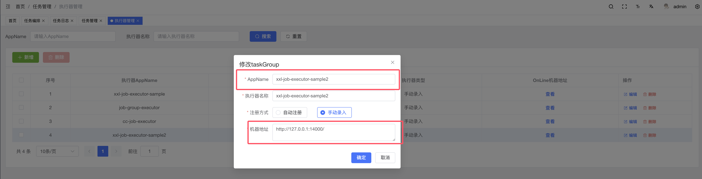 |  |
  | ----------------------------------------------- | ----------------------------------------------- |
  | 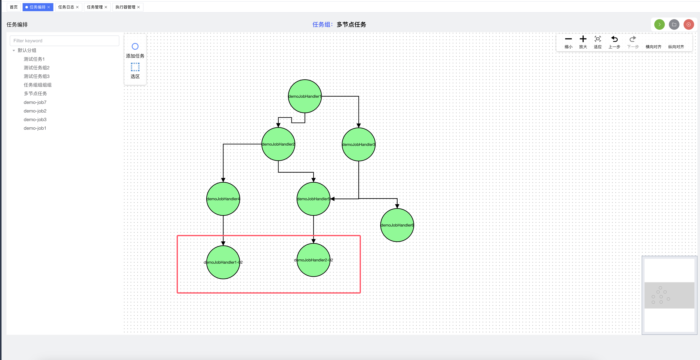 |                                                 |

- 任务运行日志

  - 这是**执行器1**输出的结果

    ```apl
    pushTriggerQueue262
      >>>>>>>> demoJobHandler3 start
    demoJobHandler3 beat at:0
    demoJobHandler3 beat at:1
    demoJobHandler3 beat at:2
    demoJobHandler3 beat at:3
    demoJobHandler3 beat at:4
    demoJobHandler3 beat at:5
    demoJobHandler3 beat at:6
    demoJobHandler3 beat at:7
    demoJobHandler3 beat at:8
    demoJobHandler3 beat at:9
      >>>>>>>> demoJobHandler3 end
      >>>>>>> 添加回滚任务262
    replace thread (new or exists invalid266
    07:39:00.917 logback [xxl-job, EmbedServer bizThreadPool-2121699531] INFO  c.x.job.core.executor.XxlJobExecutor - >>>>>>>>>>> xxl-job register JobThread success, jobId:266, handler:com.xxl.job.core.handler.impl.MethodJobHandler@32faa16c[class com.xxl.job.executor.service.jobhandler.SampleXxlJob#demoJobHandler5]
    pushTriggerQueue266
    replace thread (new or exists invalid263
    07:39:00.919 logback [xxl-job, EmbedServer bizThreadPool-2121699531] INFO  c.x.job.core.executor.XxlJobExecutor - >>>>>>>>>>> xxl-job register JobThread success, jobId:263, handler:com.xxl.job.core.handler.impl.MethodJobHandler@5503de1[class com.xxl.job.executor.service.jobhandler.SampleXxlJob#demoJobHandler4]
    pushTriggerQueue263
      >>>>>>>> demoJobHandler5 start
    demoJobHandler5 beat at:0
      >>>>>>>> demoJobHandler1 start
    demoJobHandler4 beat at:0
    demoJobHandler5 beat at:1
    demoJobHandler4 beat at:1
    demoJobHandler5 beat at:2
    demoJobHandler4 beat at:2
    demoJobHandler5 beat at:3
    demoJobHandler4 beat at:3
    demoJobHandler5 beat at:4
    demoJobHandler4 beat at:4
    demoJobHandler5 beat at:5
    demoJobHandler4 beat at:5
    demoJobHandler5 beat at:6
    demoJobHandler4 beat at:6
    demoJobHandler4 beat at:7
    demoJobHandler5 beat at:7
    demoJobHandler4 beat at:8
    demoJobHandler5 beat at:8
    demoJobHandler4 beat at:9
    demoJobHandler5 beat at:9
      >>>>>>>> demoJobHandler4 end
      >>>>>>> 添加回滚任务263
      >>>>>>>> demoJobHandler5 end
      >>>>>>> 添加回滚任务266
    ```

    

  - 当**执行器1**任务运行完成后，会开始**执行器2**下的任务（**demoJobHandler示例2-01，demoJobHandler示例2-02**）

    ```apl
    pushTriggerQueue264
    >>>>>>>> demoJobHandler1 start
    demoJobHandler1 beat at:0
    demoJobHandler1 beat at:1
    demoJobHandler1 beat at:2
    demoJobHandler1 beat at:3
    demoJobHandler1 beat at:4
    demoJobHandler1 beat at:5
    demoJobHandler1 beat at:6
    demoJobHandler1 beat at:7
    demoJobHandler1 beat at:8
    demoJobHandler1 beat at:9
    >>>>>>>> demoJobHandler1 end
    >>>>>>> 添加回滚任务264
    replace thread (new or exists invalid265
    07:39:21.124 logback [xxl-job, EmbedServer bizThreadPool-1433599704] INFO  c.x.job.core.executor.XxlJobExecutor - >>>>>>>>>>> xxl-job register JobThread success, jobId:265, handler:com.xxl.job.core.handler.impl.MethodJobHandler@343fddd9[class com.xxl.job.executor.service.jobhandler.SampleXxlJob#demoJobHandler2]
    pushTriggerQueue265
    >>>>>>>> demoJobHandler2 start
    demoJobHandler2 beat at:0
    demoJobHandler2 beat at:1
    demoJobHandler2 beat at:2
    demoJobHandler2 beat at:3
    demoJobHandler2 beat at:4
    demoJobHandler2 beat at:5
    demoJobHandler2 beat at:6
    demoJobHandler2 beat at:7
    demoJobHandler2 beat at:8
    demoJobHandler2 beat at:9
    >>>>>>>> demoJobHandler2 end
    >>>>>>> 添加回滚任务265
    ```

# SQL定时任务

## sql任务

模拟每秒中往test1表中插入一条数据

1. 创建数据源

   | 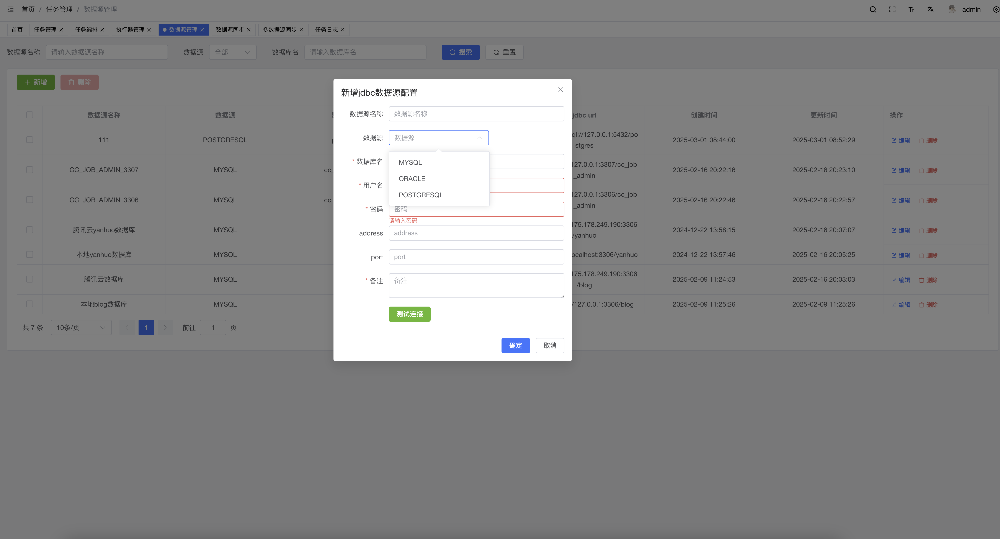 | 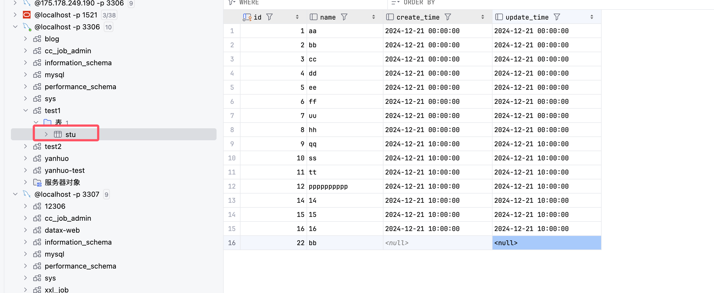 |
   | ----------------------------------------------- | ----------------------------------------------- |

2. 创建任务

   | 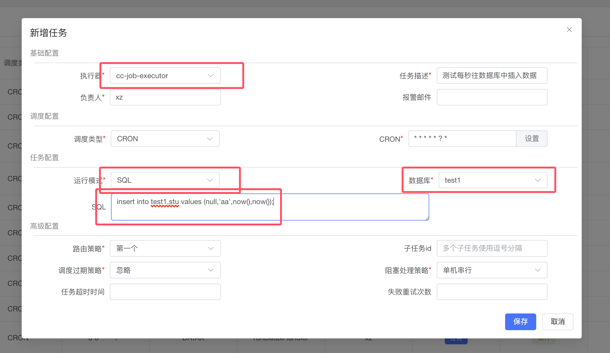 |      |
   | ----------------------------------------------- | ---- |

3. 执行任务

   运行任务，观察数据表中数据是否新增

   | 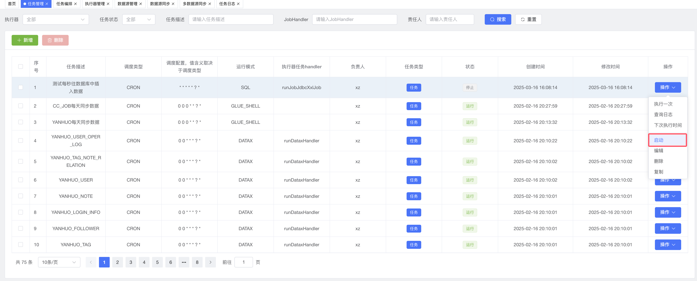 | 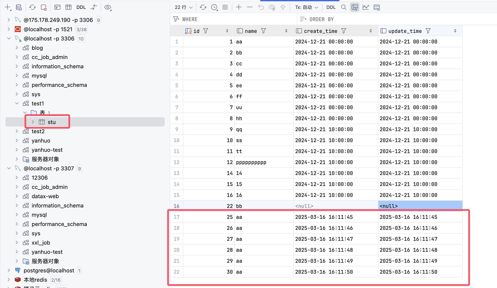 |
   | ----------------------------------------------- | ----------------------------------------------- |

## 执行存储过程

1. 创建存储过程，模拟每秒插入数据

   | 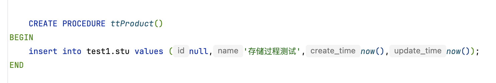 | 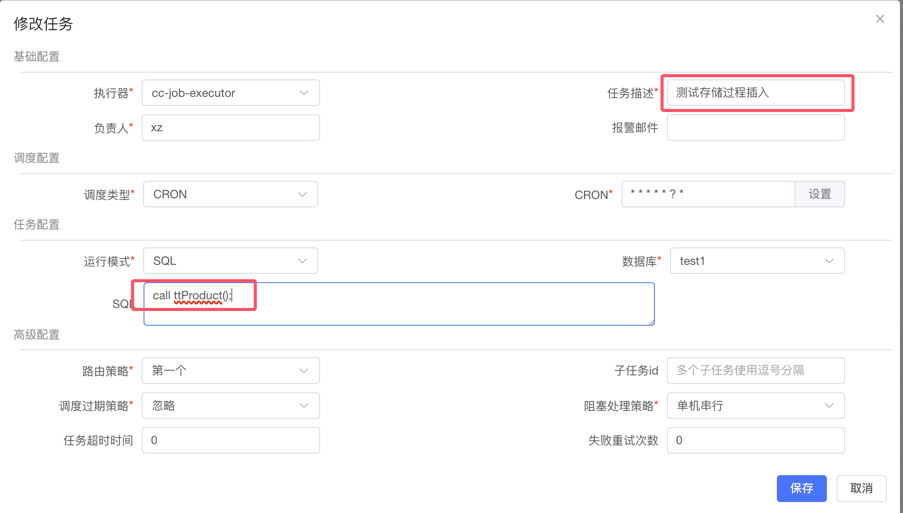 |
   | ----------------------------------------------- | ----------------------------------------------- |

2. 观察结果

   | 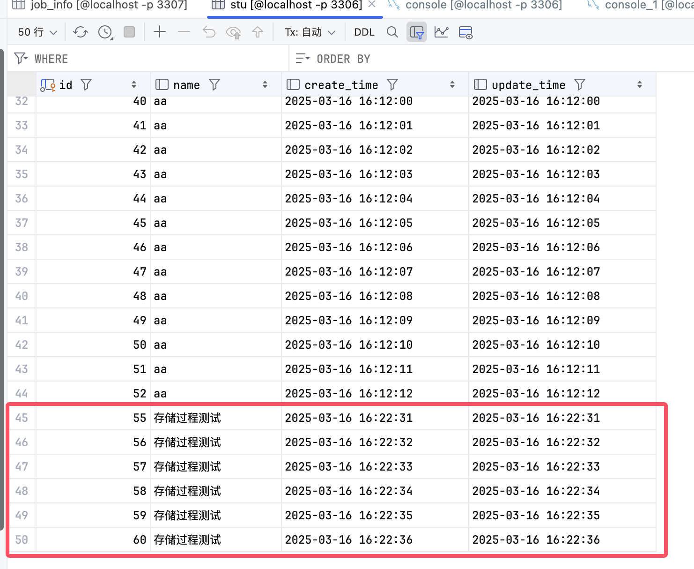 |      |
   | ----------------------------------------------- | ---- |

# API定时任务

模拟定式调用api接口

1. 创建api任务，支持设置请求头和请求体

   | 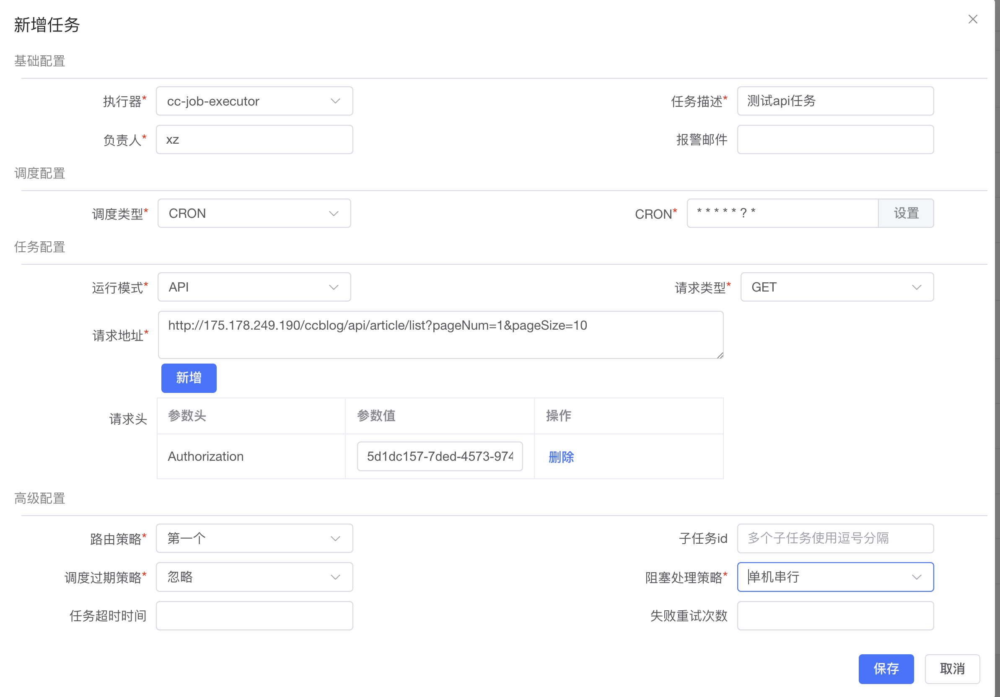 |      |
   | ----------------------------------------------- | ---- |

2. 运行观察结果

   | 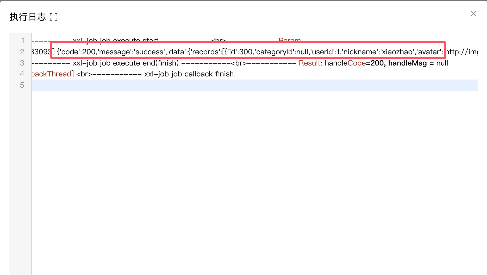 |      |
   | ----------------------------------------------- | ---- |

# GLUE模式介绍

模拟每天0点同步数据库数据

1. 创建shell任务

   | 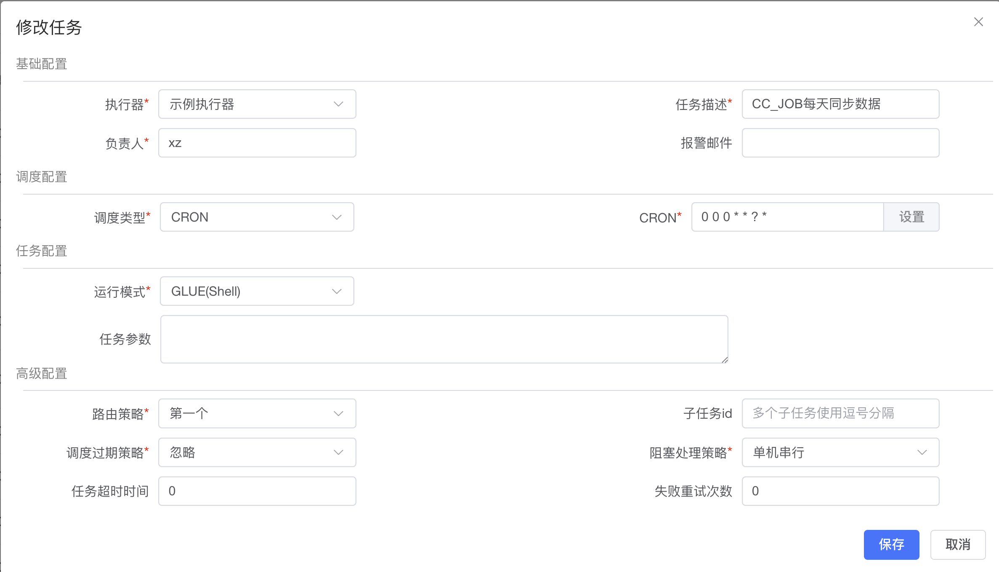 |      |
   | ----------------------------------------------- | ---- |

2. 编写shell脚本

   | 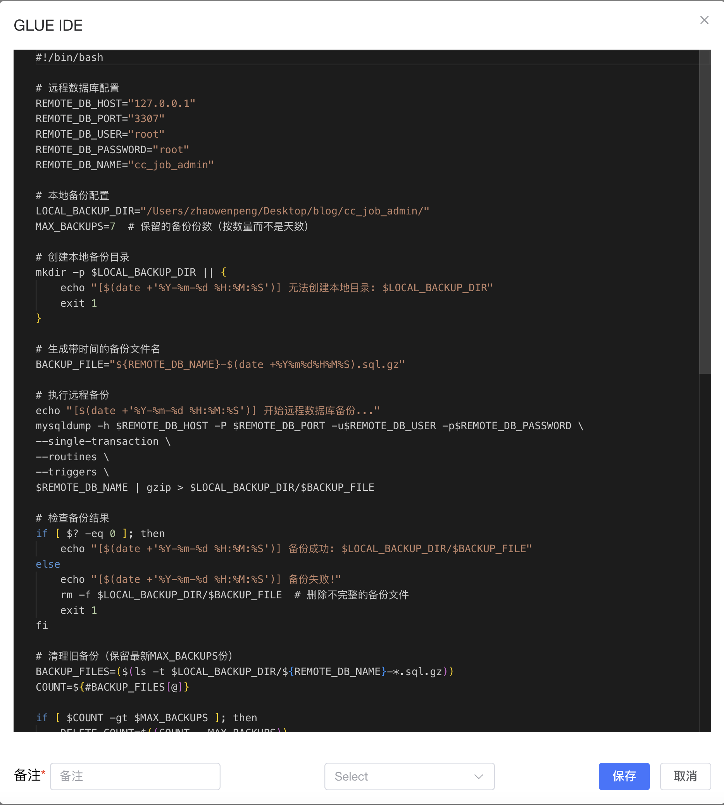 |      |
   | ----------------------------------------------- | ---- |

3. 观察实验结果

| 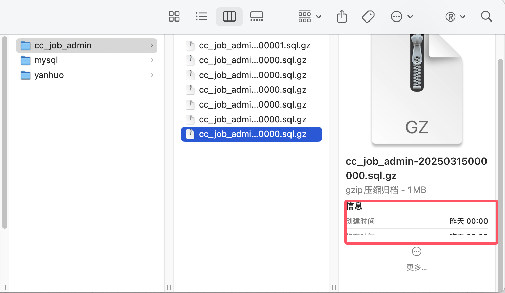 | 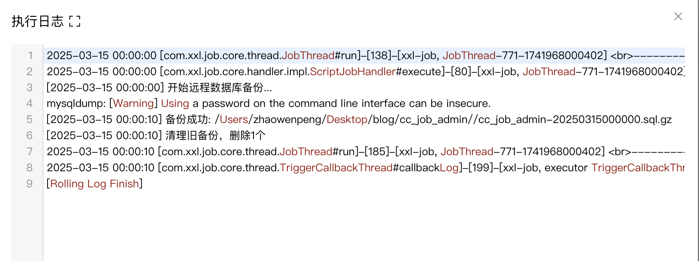 |
| ----------------------------------------------- | ----------------------------------------------- |

